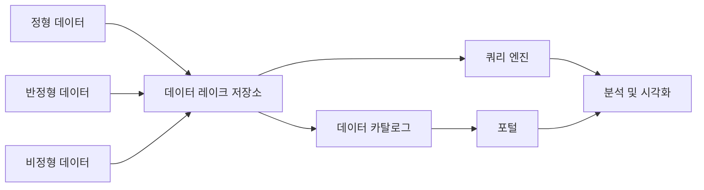

# 데이터 레이크 소개

## 한눈에 보기

데이터 레이크는 여러 시스템에 흩어진 데이터를 한곳에 모아 보관하고, 사용자가 필요한 데이터를 찾아 분석할 수 있게 하는 플랫폼이다. 정형 데이터뿐 아니라 JSON, 로그, 이미지처럼 구조가 일정하지 않은 데이터도 수용할 수 있다.

핵심은 단순히 파일을 많이 저장하는 것이 아니다. 데이터를 발견하고, 접근 권한을 얻고, SQL로 조회하고, 품질과 출처를 확인할 수 있는 환경까지 함께 제공해야 한다.

## 왜 필요한가?

기업의 데이터는 업무 시스템마다 분산되어 있다. 분석가가 원천 시스템에 직접 접근하면 다음과 같은 문제가 생길 수 있다.

- 시스템마다 별도의 접근 권한이 필요하다.
- 분석 요청이 늘어날수록 운영 시스템에 부하가 커진다.
- 데이터의 위치와 의미를 찾는 데 많은 시간이 든다.
- 민감 정보에 대한 일관된 통제가 어렵다.

데이터 레이크는 원천 시스템과 분석 사용자 사이에 별도의 데이터 활용 환경을 둔다. 사용자는 운영 시스템을 직접 조회하지 않고도 포털과 카탈로그에서 데이터를 찾고, 허용된 범위 안에서 분석할 수 있다.

## 데이터 웨어하우스와의 차이

| 비교 기준 | 데이터 레이크 | 데이터 웨어하우스 |
| --- | --- | --- |
| 주된 목적 | 다양한 데이터를 탐색하고 새로운 분석에 활용 | 미리 정의된 지표와 보고서 제공 |
| 데이터 형태 | 정형, 반정형, 비정형 | 주로 정형 데이터 |
| 스키마 적용 시점 | 읽을 때 구조를 해석하는 `Schema on Read` | 적재 전에 구조를 확정하는 `Schema on Write` |
| 처리 흐름 | 원천 데이터를 먼저 적재한 뒤 필요할 때 변환하는 ELT에 적합 | 정제와 변환을 거친 뒤 적재하는 ETL에 적합 |
| 변경 대응 | 새로운 데이터와 분석 요구를 비교적 유연하게 수용 | 사전에 정의된 구조 변경에 상대적으로 많은 비용 필요 |
| 데이터 품질 | 활용 단계와 목적에 따라 품질을 높여 갈 수 있음 | 정해진 보고 기준에 맞춘 높은 정합성 요구 |

둘은 서로를 완전히 대체하는 관계가 아니다. 데이터를 수집하고 품질을 관리하며 분석에 제공한다는 공통점이 있고, 조직의 목적에 따라 함께 사용될 수 있다.

## 주요 구성 요소

### 1. 포털

사용자가 데이터 레이크에 접근하는 관문이다. 조직의 요구사항에 따라 다음 기능을 제공한다.

- 업무 용어 또는 기술 정보로 데이터 검색
- 데이터 이용 및 신규 수집 요청
- 분석 환경과 BI 도구 사용 신청
- 사용자와 조직에 따른 접근 권한 관리
- 데이터 품질과 흐름 확인

좋은 포털은 데이터를 저장한 위치보다 사용자가 원하는 데이터를 쉽게 발견하고 안전하게 사용할 수 있는지에 초점을 둔다.

### 2. 저장소

원천에서 수집한 데이터를 보관하는 공간이다. 과거에는 HDFS가 널리 사용됐고, 클라우드 환경에서는 S3 같은 객체 저장소를 주로 사용한다.

저장소 자체는 파일 보관에 집중하므로, 데이터를 검색하고 SQL로 읽기 위해 카탈로그와 쿼리 엔진의 연동이 필요하다.

### 3. 데이터 카탈로그

어떤 데이터가 어디에 있고 무엇을 의미하는지 설명하는 메타데이터 저장소다.

- 기술 메타데이터: 테이블명, 컬럼명, 데이터 타입, 저장 위치
- 비즈니스 메타데이터: 업무 용어, 데이터의 의미, 담당 조직

카탈로그가 제대로 관리되지 않으면 데이터는 존재하지만 찾거나 신뢰하기 어려운 `데이터 늪`이 될 수 있다.

### 4. 쿼리 엔진

저장소의 파일을 읽고 SQL로 처리하는 계층이다. 저장소와 계산 자원을 분리할 수 있어 같은 데이터를 여러 처리 도구에서 활용할 수 있다.

예를 들어 S3에 파일을 저장하고 Athena나 Spark로 조회할 수 있다. 실제 도구는 데이터 규모, 응답 속도, 비용, 동시 사용자 수를 고려해 선택한다.

### 5. 분석 환경과 BI

사용자가 데이터를 탐색하거나 결과를 시각화하는 영역이다.

- 샌드박스: 분석가가 데이터를 자유롭게 실험하는 독립 환경
- Self-Service BI: 사용자가 직접 지표와 대시보드를 구성하는 환경
- BI/OLAP: 데이터를 집계하고 다양한 관점에서 분석하는 도구

### 6. 데이터 거버넌스

데이터를 신뢰할 수 있고 안전한 상태로 유지하기 위한 공통 관리 체계다.

| 영역 | 역할 |
| --- | --- |
| 데이터 표준 | 용어, 단어, 코드, 도메인의 기준 통일 |
| 데이터 품질 | 결측값, 중복, 범위, 형식 등 점검 |
| 데이터 카탈로그 | 기술 및 비즈니스 메타데이터 관리 |
| 데이터 리니지 | 데이터가 어디에서 와서 어떻게 변했는지 추적 |
| 데이터 보안 | 인증, 인가, 암호화, 마스킹 적용 |

## 데이터 레이크하우스

데이터 레이크는 유연하고 저렴하지만, 데이터 정합성과 테이블 변경 관리가 어려울 수 있다. 데이터 레이크하우스는 객체 저장소의 유연성을 유지하면서 다음과 같은 데이터베이스 기능을 보완하려는 접근 방식이다.

- ACID 트랜잭션
- 스키마 검증과 변경
- 데이터 버전 및 시점 조회
- 안정적인 테이블 관리

대표적인 오픈 테이블 형식 또는 관련 기술로 Delta Lake, Apache Iceberg, Apache Hudi 등이 있다.

## 핵심 정리

- 데이터 레이크는 저장소 하나가 아니라 데이터 검색부터 분석까지 연결하는 플랫폼이다.
- 원천 데이터를 유연하게 보관하되 카탈로그와 거버넌스로 발견 가능성과 신뢰성을 확보해야 한다.
- 데이터 웨어하우스와 데이터 레이크는 목적과 스키마 적용 방식이 다르며 함께 사용할 수 있다.
- 도구를 먼저 정하기보다 데이터 사용자와 활용 목적을 먼저 파악해야 한다.

## 스스로 확인하기

- `Schema on Read`가 새로운 분석 요구에 유연한 이유는 무엇인가?
- 객체 저장소만 구축했을 때 데이터 레이크라고 부르기 어려운 이유는 무엇인가?
- 데이터 카탈로그와 데이터 리니지는 각각 어떤 질문에 답하는가?
- 데이터 레이크와 데이터 웨어하우스를 함께 사용해야 하는 상황은 언제인가?
