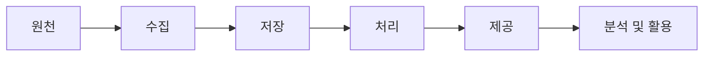
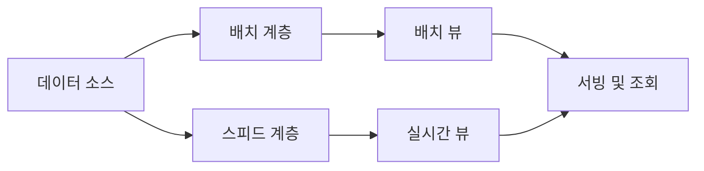
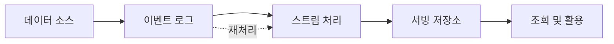

# 데이터 레이크 아키텍처 설계

## 설계의 출발점

데이터 엔지니어 관점에서 아키텍처 설계의 중심은 원천에서 활용 영역까지 데이터를 안정적으로 전달하는 파이프라인이다. 특정 제품을 먼저 고르기보다 데이터의 활용 시점, 처리량, 정확성, 장애 대응, 운영 비용을 먼저 확인해야 한다.

각 단계의 역할은 다음과 같다.

| 단계 | 확인할 내용 |
| --- | --- |
| 원천 | DB, 파일, API 등 데이터가 생성되는 위치와 변경 방식 |
| 수집 | 배치 또는 스트림 방식, 수집 주기, 재처리 가능 여부 |
| 저장 | 데이터 형식, 보존 기간, 용량, 접근 패턴 |
| 처리 | 정제, 조인, 집계에 필요한 처리량과 지연 시간 |
| 제공 | SQL, 데이터베이스, 메시지 큐 등 소비자가 원하는 인터페이스 |
| 활용 | 분석, 대시보드, 다른 시스템 연계 등 최종 사용 목적 |

## 처리 방식 선택하기

실시간이라는 표현만으로 스트림 처리를 선택해서는 안 된다. 데이터가 언제까지 제공되어야 하는지 구체적인 지연 허용 범위를 정해야 한다.

| 방식 | 적합한 상황 | 특징 |
| --- | --- | --- |
| 배치 | 일 또는 시간 단위 결과로 충분한 경우 | 구현과 운영이 비교적 단순하고 대량 재처리에 유리 |
| 스트림 | 수초 또는 수분 내 반응이 필요한 경우 | 낮은 지연 시간을 제공하지만 상태와 장애 관리가 복잡 |
| 혼합 | 기준 정보는 배치, 이벤트는 실시간으로 필요한 경우 | 각 방식의 장점을 활용하지만 파이프라인이 이원화될 수 있음 |

## 람다 아키텍처

람다 아키텍처는 동일한 원천 데이터를 배치 경로와 실시간 경로로 처리한 뒤 조회 단계에서 결과를 결합하는 방식이다.

### 계층별 역할

- 배치 계층: 전체 또는 일정 기간의 데이터를 정제하고 정확한 집계 결과를 만든다.
- 스피드 계층: 아직 배치 결과에 포함되지 않은 최신 데이터를 낮은 지연 시간으로 처리한다.
- 서빙 계층: 배치 뷰와 실시간 뷰를 사용자가 조회할 수 있는 형태로 제공한다.

예를 들어 전일까지 집계된 고객 정보는 배치 뷰에서, 오늘 발생한 고객 행동은 실시간 뷰에서 읽어 하나의 화면에 제공할 수 있다.

### 장점과 주의점

| 장점 | 주의점 |
| --- | --- |
| 정확한 배치 결과와 빠른 실시간 결과를 함께 제공 | 같은 비즈니스 규칙을 두 처리 경로에 구현할 수 있음 |
| 전체 데이터를 이용한 재계산이 쉬움 | 코드, 인프라, 모니터링의 운영 부담 증가 |
| 배치 데이터와 실시간 이벤트의 결합에 적합 | 두 결과의 시점과 의미를 일관되게 맞춰야 함 |

모든 파이프라인에 람다 구조가 필요한 것은 아니다. 실시간 요구가 없으면 배치 경로만으로 충분하며, 최신 이벤트만 중요하다면 스트림 경로만 사용할 수도 있다.

## 카파 아키텍처

카파 아키텍처는 배치와 실시간 처리 경로를 별도로 유지하지 않고, 이벤트 스트림을 하나의 처리 경로로 다루는 방식이다.

이벤트 로그를 충분한 기간 보존하면 처리 로직이 바뀌거나 장애가 발생했을 때 과거 이벤트를 다시 읽어 결과를 만들 수 있다. Kafka는 이처럼 순서가 있는 이벤트를 보존하고 다시 소비할 수 있어 카파 구조의 기반으로 자주 사용된다.

### 장점과 주의점

| 장점 | 주의점 |
| --- | --- |
| 처리 경로와 비즈니스 로직을 하나로 단순화 | 모든 원천을 이벤트 형태로 수집하기 어려울 수 있음 |
| 실시간 처리와 재처리에 같은 코드를 활용 가능 | 긴 기간의 이벤트 보존에 저장 비용이 필요 |
| 낮은 지연 시간이 핵심인 서비스에 적합 | 대규모 재처리가 운영 중인 실시간 처리에 영향을 줄 수 있음 |

## 람다와 카파 비교

| 비교 기준 | 람다 아키텍처 | 카파 아키텍처 |
| --- | --- | --- |
| 처리 경로 | 배치와 스트림 경로를 함께 운영 | 스트림 경로로 통합 |
| 최신성 | 스피드 계층으로 보완 | 스트림 처리 결과를 바로 제공 |
| 재처리 | 배치 계층에서 전체 데이터를 다시 계산 | 보존된 이벤트를 다시 소비 |
| 구현 복잡도 | 두 경로의 코드와 결과를 관리 | 경로는 단순하지만 스트림 운영 역량 필요 |
| 적합한 상황 | 배치 기준 정보와 실시간 이벤트를 함께 사용 | 대부분의 입력과 처리를 이벤트로 표현 가능 |

두 아키텍처는 반드시 그대로 구현해야 하는 규칙이 아니라 설계를 돕는 참조 모델이다. 실제 환경에서는 파이프라인별 요구사항에 따라 배치, 스트림 또는 혼합 방식을 선택한다.

## 아키텍처 선택 기준

다음 질문에 답하면 불필요한 복잡도를 줄일 수 있다.

1. 데이터가 생성된 후 언제까지 사용자에게 제공되어야 하는가?
2. 원천 데이터는 변경 로그나 이벤트 형태로 수집할 수 있는가?
3. 처리 로직이 변경되었을 때 과거 데이터를 다시 계산해야 하는가?
4. 배치와 스트림에서 동일한 계산 결과를 보장할 수 있는가?
5. 이벤트를 얼마나 오래 보관할 수 있으며 재처리 비용은 감당 가능한가?
6. 팀이 스트림 처리 시스템을 운영하고 장애를 분석할 역량이 있는가?

## 기술 선정 원칙

각 단계에는 다양한 기술을 사용할 수 있다. 기능 목록만 비교하기보다 작은 규모의 PoC를 통해 실제 워크로드를 검증하는 것이 중요하다.

- 수집: 처리량, 순서 보장, 전달 보장, 원천 커넥터
- 저장: 비용, 내구성, 확장성, 데이터 형식
- 처리: 지연 시간, 상태 관리, 재처리, 확장 방식
- 제공: 조회 패턴, 응답 시간, 동시 사용자 수
- 운영: 모니터링, 장애 복구, 배포 자동화, 팀의 기술 역량

이 학습에서는 Kafka로 이벤트를 수집하고 Spark Streaming으로 처리한 뒤, S3에 저장하고 Athena 또는 대시보드에서 결과를 확인하는 흐름을 중심으로 실습한다.

## 핵심 정리

- 아키텍처에는 하나의 정답이 없으며 데이터 활용 요구사항이 설계의 기준이다.
- 실시간 처리는 필요성이 분명할 때 선택하고 구체적인 지연 허용 시간을 정의해야 한다.
- 람다는 배치와 스트림을 결합하고, 카파는 이벤트 스트림 중심으로 처리 경로를 통합한다.
- 전체 시스템을 하나의 유형으로 고정하지 않고 파이프라인마다 적절한 방식을 선택할 수 있다.
- 기술 선정 전에는 처리량, 정확성, 재처리, 비용과 운영 복잡도를 함께 검토해야 한다.

## 스스로 확인하기

- 어제까지의 고객 등급과 오늘 발생한 주문을 결합하려면 어떤 구조가 적합한가?
- 카파 아키텍처에서 이벤트 보존 기간이 중요한 이유는 무엇인가?
- 배치와 스트림 경로에서 같은 계산을 구현할 때 어떤 문제가 발생할 수 있는가?
- 실시간 요구사항을 판단하기 위해 사용자에게 어떤 질문을 해야 하는가?
