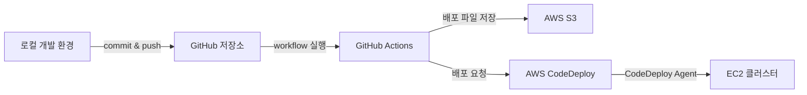

# 개발 환경 설정

## 구성 목표

로컬에서 Python 애플리케이션을 개발하고 GitHub에 저장한 뒤, 이후 GitHub Actions와 AWS CodeDeploy를 통해 EC2에 배포할 수 있는 기반을 준비한다.



## 필요한 도구

| 도구 | 역할 | 확인 명령 |
| --- | --- | --- |
| Git | 코드 변경 이력과 원격 저장소 관리 | `git --version` |
| Python 3.10 | Producer, Consumer, Spark 애플리케이션 개발 | `python --version` |
| venv | 프로젝트별 Python 의존성 격리 | `python -m venv --help` |
| PyCharm | Python 코드 작성과 실행 | IDE에서 인터프리터 확인 |
| GitHub | 소스 코드 보관과 CI/CD 실행 | 원격 저장소 접속 확인 |

강의 실습은 Python 3.10.11을 기준으로 한다. 같은 결과를 재현하려면 프로젝트의 Python 버전과 패키지 버전을 명시적으로 고정하는 편이 좋다.

## 1. Git 준비

### 설치 확인

Git을 설치한 뒤 터미널에서 다음 명령이 정상적으로 실행되는지 확인한다.

```bash
git --version
```

사용자 정보는 커밋 작성자를 식별하는 데 사용된다.

```bash
git config --global user.name "사용자 이름"
git config --global user.email "GitHub 이메일"
git config --global --list
```

운영체제별 설치 방식은 다르지만, 설치 결과로 `git` 명령을 사용할 수 있으면 된다.

## 2. Python 가상환경

가상환경을 사용하면 프로젝트마다 서로 다른 Python 패키지 버전을 유지할 수 있다. 전역 Python 환경을 직접 변경하지 않아 충돌을 줄일 수 있다.

### macOS 또는 Linux

```bash
python3.10 -m venv .venv
source .venv/bin/activate
python --version
```

### Windows PowerShell

```powershell
python -m venv .venv
.\.venv\Scripts\Activate.ps1
python --version
```

가상환경에서 나오려면 운영체제와 관계없이 다음 명령을 사용한다.

```bash
deactivate
```

가상환경 디렉터리는 저장소에 올리지 않도록 `.gitignore`에 `.venv/`를 추가한다. 다른 환경에서 같은 패키지를 설치할 수 있도록 의존성 목록만 관리한다.

## 3. PyCharm 프로젝트

프로젝트를 생성하거나 열 때 앞에서 만든 `.venv`의 Python 인터프리터를 선택한다. IDE 터미널에서 다음 두 항목을 확인하면 잘 연결됐는지 판단할 수 있다.

```bash
python --version
python -c "import sys; print(sys.executable)"
```

두 번째 명령의 경로가 프로젝트 가상환경을 가리켜야 한다.

## 4. GitHub 저장소 연결

로컬 프로젝트를 초기화하고 첫 커밋을 만든다.

```bash
git init
git add .
git commit -m "chore: initialize project"
git branch -M main
git remote add origin <원격-저장소-주소>
git push -u origin main
```

`origin`이 올바르게 등록됐는지는 다음 명령으로 확인한다.

```bash
git remote -v
```

### 인증 정보 관리

GitHub 비밀번호로 Git 작업을 인증하지 않는다. HTTPS를 사용한다면 Personal Access Token 또는 Git Credential Manager를 사용하고, SSH 방식이라면 SSH 키를 등록한다.

- 토큰에는 필요한 저장소와 작업 범위만 허용한다.
- 만료 기간을 설정하고 사용하지 않는 토큰은 폐기한다.
- 토큰을 코드, 설정 파일, 셸 기록에 남기지 않는다.
- 평문으로 자격 증명을 저장하는 방식은 피한다.

## 권장 프로젝트 구조

```text
kafka-producer/
├── .github/
│   └── workflows/
├── producers/
├── tests/
├── .gitignore
├── README.md
└── requirements.txt
```

프로젝트가 늘어나면 Producer, Consumer, Spark 애플리케이션을 별도 저장소나 명확한 하위 디렉터리로 분리할 수 있다. 중요한 것은 각 애플리케이션의 실행 환경과 배포 단위를 구분하는 것이다.

## 체크리스트

- [ ] `git --version`이 정상적으로 출력된다.
- [ ] Git 작성자 이름과 이메일을 설정했다.
- [ ] 프로젝트 전용 가상환경을 만들었다.
- [ ] PyCharm이 해당 가상환경을 사용한다.
- [ ] `.venv/`와 비밀 정보가 Git 추적 대상에서 제외됐다.
- [ ] GitHub 원격 저장소에 `main` 브랜치를 push했다.
- [ ] 토큰이나 비밀번호가 저장소에 포함되지 않았다.

## 핵심 정리

- Git은 코드 이력을, GitHub는 원격 협업과 자동화 실행 환경을 담당한다.
- Python 가상환경은 프로젝트 간 의존성 충돌을 방지한다.
- IDE에서 선택한 인터프리터와 터미널에서 실행되는 Python이 같은지 확인해야 한다.
- 인증 정보는 코드와 분리하고 필요한 최소 권한만 부여한다.
