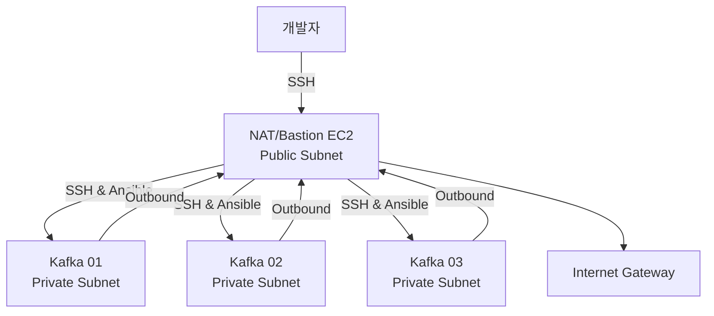
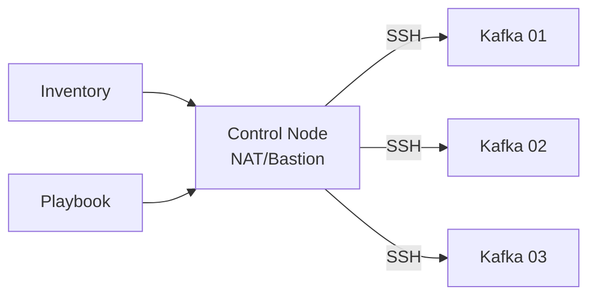
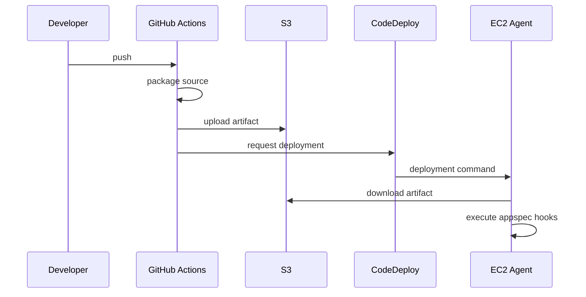

# AWS 실습 인프라 구성

## 구성 목표

퍼블릭 서브넷의 NAT 인스턴스를 접속 경유지와 인터넷 출구로 사용하고, 프라이빗 서브넷 세 곳에 Kafka 브로커를 배치한다. Ansible로 서버 설정을 자동화하고 GitHub Actions와 CodeDeploy로 애플리케이션을 배포한다.

> 이 구성은 학습용이다. NAT 인스턴스 한 대에 접속 경유와 인터넷 출구 역할을 모으면 장애 지점이 하나가 된다. 운영 환경에서는 가용성, 보안, 관리 비용을 별도로 검토해야 한다.

## 1. 계정과 권한

### 기본 원칙

- 루트 사용자는 계정에만 필요한 작업에 제한한다.
- 루트 사용자와 관리 사용자 모두 MFA를 설정한다.
- 리전은 자원 생성 전에 확인하고 실습 전체에서 통일한다.
- 사람과 애플리케이션에 필요한 권한만 부여한다.
- 자격 증명은 저장소에 커밋하지 않는다.

강의에서는 실습 편의를 위해 관리자 또는 서비스 전체 권한을 사용하지만, 실제 환경에서는 리소스와 작업 범위를 제한한 최소 권한 정책이 필요하다. AWS도 사람과 워크로드에 장기 액세스 키보다 역할 기반의 임시 자격 증명을 권장한다. 자세한 기준은 [AWS IAM 보안 모범 사례](https://docs.aws.amazon.com/IAM/latest/UserGuide/best-practices.html)에서 확인할 수 있다.

## 2. 네트워크 구조

### NAT의 역할

프라이빗 IP를 사용하는 여러 인스턴스가 하나의 공인 IP를 통해 외부 인터넷으로 요청을 보낼 수 있게 한다. 외부에서 프라이빗 인스턴스로 임의의 연결을 시작하는 통로가 되는 것은 아니다.

### NAT Gateway와 NAT Instance

| 비교 기준 | NAT Gateway | NAT Instance |
| --- | --- | --- |
| 관리 | AWS 관리형 서비스 | EC2와 OS를 직접 관리 |
| 확장 및 가용성 | 서비스가 처리 | 인스턴스 크기와 배치에 의존 |
| 설정 | 비교적 단순 | IP 포워딩과 방화벽 설정 필요 |
| 비용 | 시간 및 처리량 기반 비용 | EC2, EBS, 네트워크 비용 |
| 적합한 용도 | 운영 환경에서 관리 부담 감소 | 학습, 특수 설정, 비용 비교 실험 |

### NAT Instance 설정 원리

1. 퍼블릭 서브넷에 NAT EC2를 둔다.
2. 인터넷 게이트웨이로 향하는 경로를 연결한다.
3. NAT 인스턴스의 Source/Destination Check를 끈다.
4. 프라이빗 서브넷의 기본 경로 `0.0.0.0/0`을 NAT 인스턴스로 지정한다.
5. OS에서 IPv4 포워딩과 NAT masquerading을 활성화한다.
6. 보안 그룹과 네트워크 ACL이 필요한 트래픽만 허용하는지 확인한다.

NAT 인스턴스는 자신이 출발지나 목적지가 아닌 패킷을 전달해야 하므로 Source/Destination Check를 비활성화해야 한다. 세부 절차는 [AWS NAT Instance 공식 문서](https://docs.aws.amazon.com/vpc/latest/userguide/work-with-nat-instances.html)를 기준으로 확인한다.

## 3. EC2 클러스터

학습 환경은 Kafka 브로커 세 대를 서로 다른 서브넷 또는 가용 영역에 배치한다.

| 항목 | 구성 의도 |
| --- | --- |
| NAT/Bastion EC2 | 외부 SSH 진입점, 프라이빗 서버의 인터넷 출구, Ansible Control Node |
| Kafka EC2 3대 | 브로커와 복제본 분산, 노드 장애 실습 |
| Private IP | 클러스터 내부 통신과 호스트 식별 |
| Security Group | SSH와 Kafka 등 필요한 포트만 허용 |
| Key Pair | 초기 SSH 인증 |

브로커에 공인 IP를 직접 부여하지 않고 프라이빗 서브넷에 두면 외부 노출 범위를 줄일 수 있다. 강의에서는 개인 키를 경유 서버에 복사하지만, 실제 환경에서는 키 파일 유출 위험을 줄이기 위해 SSH agent forwarding, ProxyJump 또는 AWS Systems Manager Session Manager 같은 방식을 검토한다.

## 4. Elastic IP

Elastic IP는 인스턴스에 연결할 수 있는 고정 공인 IPv4 주소다. NAT/Bastion 주소가 재시작할 때 바뀌면 SSH와 라우팅 관리가 번거로우므로 고정 주소를 연결한다.

EIP는 할당 상태와 연결 상태에 따라 비용이 발생할 수 있으므로 실습 종료 후 불필요한 주소가 남아 있지 않은지 확인한다.

## 5. Ansible 자동화

Ansible은 Control Node에서 SSH를 통해 여러 Managed Node의 상태를 동일하게 구성하는 도구다. 대상 서버마다 Ansible을 설치할 필요는 없지만 SSH 접속과 필요한 Python 실행 환경이 준비되어야 한다.

### 핵심 구성

- Inventory: 관리 대상 호스트와 그룹, 접속 변수를 정의한다.
- Module: 파일 복사, 패키지 설치, 명령 실행 같은 단일 작업이다.
- Playbook: 여러 작업을 YAML로 묶어 원하는 서버 상태를 선언한다.
- Idempotency: 같은 Playbook을 반복 실행해도 최종 상태가 동일해야 한다.

연결은 `ansible <group> -m ping`으로 먼저 확인하고, 작은 작업부터 실행한 뒤 전체 설치 Playbook으로 확장한다. 호스트 키 검사를 끄거나 임시 파일 권한을 넓히는 설정은 학습 편의용일 수 있으므로 운영 환경에 그대로 적용하지 않는다.

## 6. GitHub Actions와 CodeDeploy

### 구성 요소

| 구성 요소 | 역할 |
| --- | --- |
| Workflow | push를 감지해 패키징, S3 업로드, 배포 요청 수행 |
| GitHub Runner | Workflow가 실제로 실행되는 계산 환경 |
| S3 Bucket | 배포할 압축 파일 보관 |
| CodeDeploy Application | 배포 대상 애플리케이션의 논리 단위 |
| Deployment Group | 태그 등으로 배포 대상 EC2 선택 |
| EC2 IAM Role | EC2 Agent가 S3 등 AWS 자원에 접근할 권한 |
| CodeDeploy Service Role | CodeDeploy가 대상 인스턴스를 관리할 권한 |
| CodeDeploy Agent | EC2에서 배포 파일을 받고 작업 수행 |
| `appspec.yml` | 파일 배치와 생명주기 Hook 정의 |

Workflow 파일은 `.github/workflows/` 아래에 두고, EC2 배포용 `appspec.yml`은 배포 번들의 루트에 포함한다.

### 자격 증명 권장 방식

강의의 장기 액세스 키와 GitHub Secret 방식은 동작 원리를 익히는 실습으로 이해한다. 실제 저장소에서는 GitHub Actions가 AWS 역할을 일시적으로 맡도록 OIDC를 사용하는 편이 안전하다. 이 방식은 장기 AWS 키를 GitHub에 저장할 필요가 없다. 구성 원리는 [GitHub의 AWS OIDC 가이드](https://docs.github.com/en/actions/how-tos/secure-your-work/security-harden-deployments/oidc-in-aws)에서 확인할 수 있다.

## 7. 비용 관리

실습을 끝낸 뒤 인스턴스를 중지하는 것만으로 모든 비용이 사라지는 것은 아니다.

- EC2 인스턴스 실행 시간
- 중지된 인스턴스에 연결된 EBS 볼륨
- Elastic IP와 공인 IPv4
- NAT Gateway 또는 NAT Instance
- S3 객체와 버전
- 네트워크 전송량

Billing과 Cost Explorer에서 비용을 확인하고, 예산 알림을 미리 설정한다. 실습을 완전히 종료할 때는 자원 간 연결 관계를 확인한 뒤 더 이상 필요 없는 자원을 정리한다.

## 구축 확인 체크리스트

- [ ] 루트 계정과 관리 사용자에 MFA를 적용했다.
- [ ] 리전과 네트워크 대역을 확인했다.
- [ ] Kafka 브로커는 프라이빗 네트워크에 위치한다.
- [ ] NAT 인스턴스의 Source/Destination Check가 꺼져 있다.
- [ ] 프라이빗 서브넷의 기본 경로가 NAT를 가리킨다.
- [ ] 브로커에서 외부 통신이 가능하다.
- [ ] Ansible이 세 브로커에 연결된다.
- [ ] CodeDeploy Agent가 실행 중이다.
- [ ] Workflow, S3 업로드, CodeDeploy 배포가 순서대로 성공한다.
- [ ] 비밀 키와 PEM 파일이 저장소에 포함되지 않았다.
- [ ] 실습 종료 후 비용 발생 자원을 확인했다.

## 핵심 정리

- 퍼블릭 진입점과 프라이빗 브로커를 분리해 외부 노출을 줄인다.
- NAT 구성에는 라우팅, Source/Destination Check, IP 포워딩이 함께 필요하다.
- Ansible로 세 서버의 설정 차이를 줄이고 반복 가능한 환경을 만든다.
- GitHub Actions는 배포를 시작하고 CodeDeploy Agent는 EC2 내부 작업을 수행한다.
- 학습용 전체 권한과 장기 키를 실제 운영 방식으로 받아들이지 않는다.
