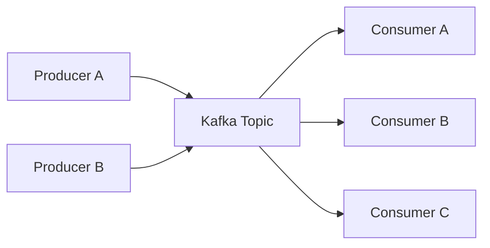
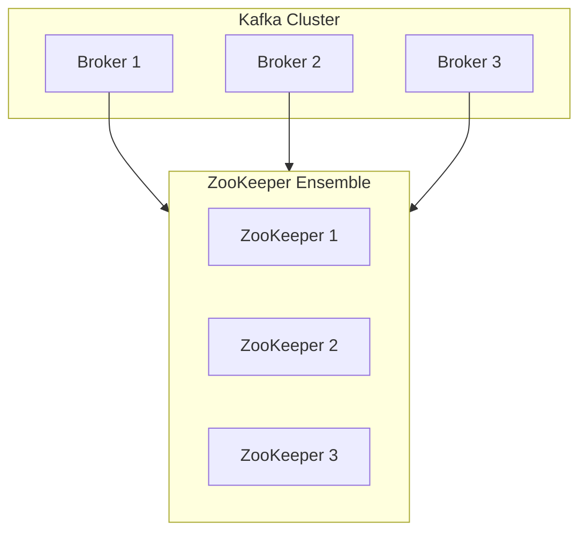
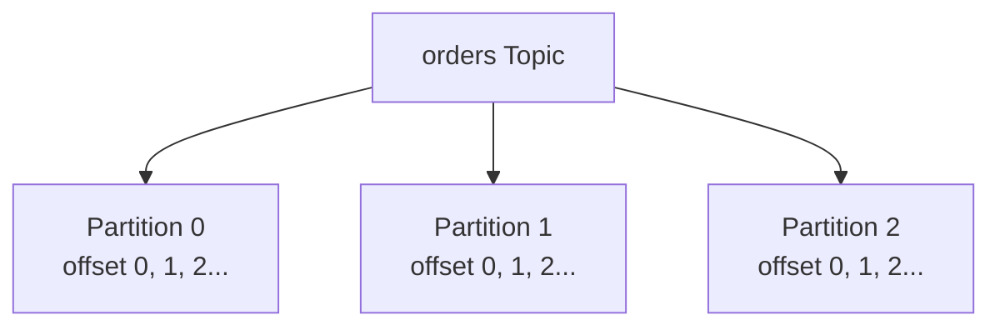
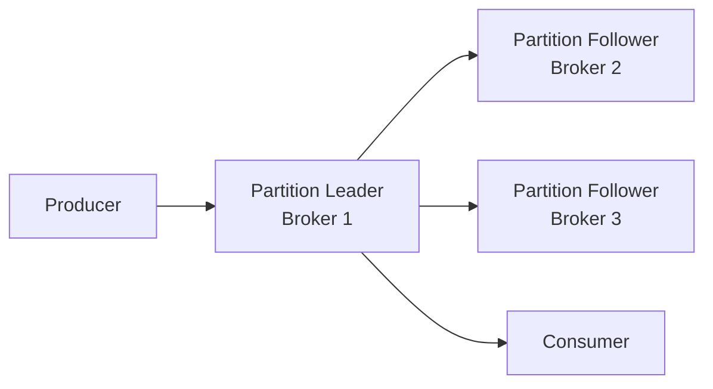

# Kafka 클러스터 구성과 핵심 개념

## Kafka가 필요한 이유

시스템이 서로 직접 데이터를 주고받으면 연결 대상이 늘어날수록 인터페이스 수와 결합도가 증가한다. Kafka를 중간 이벤트 저장소로 사용하면 생산자와 소비자가 서로의 위치와 처리 속도를 직접 알 필요가 없다.



- Producer는 레코드를 토픽으로 보낸다.
- Broker는 레코드를 파티션에 순서대로 저장한다.
- Consumer는 필요한 시점에 Broker에서 레코드를 가져간다.
- 새로운 Consumer를 추가해도 Producer 코드를 직접 변경할 필요가 줄어든다.

## 실습 환경의 버전 범위

강의 실습은 Confluent Platform 6.2.14와 ZooKeeper 기반 Kafka 클러스터를 사용한다. 따라서 ZooKeeper 설치와 설정은 해당 버전을 재현하기 위한 과정이다.

최신 Kafka 아키텍처와는 구분해야 한다. Apache Kafka 4.0부터 ZooKeeper 모드가 제거되고 KRaft만 지원된다. 새 클러스터를 설계할 때는 사용하는 Kafka 버전의 공식 문서를 먼저 확인한다. 자세한 차이는 [Apache Kafka의 KRaft와 ZooKeeper 비교](https://kafka.apache.org/41/getting-started/zk2kraft/)에서 확인할 수 있다.

## 클러스터 구성 요소

| 구성 요소 | 역할 |
| --- | --- |
| Broker | 레코드 저장, 읽기 및 쓰기 요청 처리 |
| Producer | 레코드를 토픽에 전송 |
| Consumer | 토픽의 레코드를 가져와 처리 |
| Topic | 같은 목적의 레코드를 묶는 논리적 이름 |
| Partition | 토픽을 분할한 실제 저장 및 병렬 처리 단위 |
| ZooKeeper | 실습 버전에서 클러스터 메타데이터와 조정 기능 담당 |

## ZooKeeper 기반 실습 구성

세 브로커에 Java, Kafka, ZooKeeper를 설치하고 ZooKeeper Ensemble을 먼저 시작한 뒤 Kafka Broker를 실행한다.



### 저장 경로 구분

```text
/data/
├── kafka-logs/    # Kafka 파티션 로그
└── zookeeper/     # ZooKeeper 상태 데이터
```

애플리케이션 파일과 상태 데이터를 분리하면 용량, 권한, 백업 정책을 각각 관리하기 쉽다.

### 실행 순서

1. 세 노드에 Java와 Kafka를 설치한다.
2. ZooKeeper 설정과 각 노드 ID를 배포한다.
3. ZooKeeper Ensemble을 시작하고 Leader와 Follower 상태를 확인한다.
4. Broker별 ID, Listener, 로그 경로, ZooKeeper 주소를 설정한다.
5. 세 Kafka Broker를 시작한다.
6. 토픽을 생성하고 메시지 생산·소비로 연결을 검증한다.

Ansible Playbook으로 설치와 서비스 등록을 자동화하면 세 노드의 설정 차이를 줄일 수 있다.

## 토픽과 파티션

토픽은 하나 이상의 파티션으로 나뉜다. 레코드는 선택된 파티션 하나에 기록되고, 같은 파티션 안에서 오프셋 순서가 유지된다.



### 파티션 수가 의미하는 것

- 여러 Consumer가 병렬로 처리할 수 있는 단위가 된다.
- 여러 Broker에 읽기와 쓰기 부하를 분산할 수 있다.
- 파티션 내부에서만 레코드 순서를 보장한다.
- 생성 후 늘릴 수 있지만 일반적으로 줄일 수 없다.
- 파티션을 늘리면 Key가 매핑되는 파티션이 달라질 수 있다.

브로커 수와 파티션 수가 같아야 하는 것은 아니다. 처리량, Consumer 병렬성, 키 순서 보장, 장애 복구 시간과 메타데이터 부하를 함께 고려해 정한다.

## 복제와 리더

각 파티션은 여러 Broker에 복제할 수 있다. 복제본 중 하나가 Leader가 되고 나머지는 Follower가 된다.



- Producer와 Consumer 요청은 기본적으로 Leader가 처리한다.
- Follower는 Leader의 데이터를 복제한다.
- Leader 장애 시 동기화된 Follower가 새 Leader가 될 수 있다.
- Replication Factor는 현재 Broker 수보다 클 수 없다.

복제본이 많으면 더 많은 장애에 대응할 수 있지만 저장 공간과 네트워크 복제 비용도 증가한다. 학습 환경에서는 브로커 3대와 복제본 3개로 노드 장애 상황을 확인한다.

## 기본 명령

Confluent 배포판의 실행 파일 위치와 이름은 Apache Kafka 배포판과 다를 수 있으므로 `$KAFKA_HOME`을 환경에 맞게 지정한다.

### 토픽 생성과 확인

```bash
kafka-topics --bootstrap-server kafka01:9092,kafka02:9092,kafka03:9092 \
  --create \
  --topic test.hello \
  --partitions 3 \
  --replication-factor 3

kafka-topics --bootstrap-server kafka01:9092,kafka02:9092,kafka03:9092 \
  --describe \
  --topic test.hello
```

`--describe` 결과에서 파티션별 Leader, Replicas, ISR을 확인한다.

### 메시지 생산과 소비

```bash
kafka-console-producer \
  --bootstrap-server kafka01:9092,kafka02:9092,kafka03:9092 \
  --topic test.hello
```

```bash
kafka-console-consumer \
  --bootstrap-server kafka01:9092,kafka02:9092,kafka03:9092 \
  --topic test.hello \
  --from-beginning
```

## 오프셋과 로그 세그먼트

Offset은 파티션 안에서 레코드의 위치를 나타내는 증가하는 번호다. 따라서 레코드는 보통 `Topic + Partition + Offset`으로 위치를 식별할 수 있다.

Broker의 저장소에는 `토픽명-파티션번호` 형식의 디렉터리가 만들어진다.

| 파일 | 역할 |
| --- | --- |
| `.log` | 레코드와 메타데이터가 저장되는 바이너리 로그 |
| `.index` | Offset과 로그 파일 내 물리적 위치 매핑 |
| `.timeindex` | Timestamp와 Offset 매핑 |
| `leader-epoch-checkpoint` | Leader 변경에 따른 Epoch와 Offset 관리 |

로그 파일명은 해당 세그먼트가 시작하는 Base Offset을 나타낸다. `.log`는 바이너리이므로 텍스트 편집기로 해석하지 않고 Consumer 또는 Kafka 로그 분석 도구를 사용한다.

`__consumer_offsets`는 Consumer Group이 어디까지 읽었는지 관리하기 위해 Kafka가 사용하는 내부 토픽이다.

## Broker와 Topic 설정

Broker 기본값은 `server.properties`에서 정의하고, 토픽별 설정이 존재하면 해당 토픽 설정이 우선한다.

### 가용성과 토픽 관리

| 설정 | 의미 | 판단 기준 |
| --- | --- | --- |
| `auto.create.topics.enable` | 존재하지 않는 토픽의 자동 생성 여부 | 오타에 의한 토픽 생성을 막을지 결정 |
| `delete.topic.enable` | 토픽 삭제 허용 여부 | 운영 삭제 절차와 함께 관리 |
| `default.replication.factor` | 토픽의 기본 복제본 수 | 허용할 Broker 장애 수와 저장 비용 |
| `num.partitions` | 자동 생성 토픽의 기본 파티션 수 | 예상 처리량과 Consumer 병렬성 |
| `min.insync.replicas` | 쓰기 성공에 필요한 최소 동기 복제본 수 | Producer의 `acks=all`과 함께 판단 |

예를 들어 복제본이 3개이고 `min.insync.replicas=2`, Producer가 `acks=all`을 사용하면 동기화된 복제본이 2개 미만일 때 쓰기를 실패시켜 데이터 내구성을 우선할 수 있다.

### 보관과 세그먼트

| Broker 설정 | Topic 설정 | 역할 |
| --- | --- | --- |
| `log.cleanup.policy` | `cleanup.policy` | `delete` 또는 `compact` 보관 정책 |
| `log.retention.ms` | `retention.ms` | 시간 기준 보관 기간 |
| `log.retention.bytes` | `retention.bytes` | 파티션 용량 기준 보관 한도 |
| `log.segment.bytes` | `segment.bytes` | 로그 세그먼트 최대 크기 |
| `log.roll.hours` | `segment.ms` | 시간 기준 세그먼트 교체 |

`cleanup.policy=delete`에서 삭제는 개별 레코드가 아니라 닫힌 세그먼트 단위로 진행된다. 따라서 설정한 보관 시간이 지났더라도 활성 세그먼트가 아직 닫히지 않았다면 레코드가 더 오래 남을 수 있다.

`cleanup.policy=compact`는 같은 Key의 레코드 중 최신 값을 중심으로 유지한다. 상태 변경 이력을 최신 상태로 축약해야 하는 토픽에 적합하지만, 삭제 정책과 동작 방식이 다르므로 목적을 명확히 해야 한다.

### 메시지 크기와 처리 스레드

| 설정 | 역할 |
| --- | --- |
| `message.max.bytes` | Broker가 허용하는 최대 레코드 배치 크기 |
| `replica.fetch.max.bytes` | Follower가 복제 요청으로 가져올 수 있는 최대 크기 |
| `fetch.max.bytes` | Consumer Fetch 응답의 최대 크기 |
| `num.network.threads` | 네트워크 요청을 처리하는 스레드 수 |
| `num.io.threads` | 디스크 I/O 요청을 처리하는 스레드 수 |

메시지 크기를 변경할 때 Producer, Broker, 복제, Consumer의 관련 제한을 함께 확인해야 한다. 한 설정만 늘리면 생산은 성공하지만 복제나 소비가 실패할 수 있다.

## 장애 확인 실습

1. 토픽을 파티션 3개, 복제본 3개로 생성한다.
2. `--describe`로 각 파티션의 Leader와 ISR을 기록한다.
3. 메시지를 지속해서 생산하고 소비한다.
4. Leader를 보유한 Broker 한 대를 중지한다.
5. 새 Leader 선출과 ISR 변화를 확인한다.
6. 생산과 소비가 계속되는지 확인한다.
7. Broker를 다시 시작하고 ISR에 복귀하는 시간을 확인한다.

장애 실습에서는 단순히 서비스가 살아 있는지만 보지 않고 데이터 손실, 처리 지연, 재시도, 복구 시간을 함께 기록한다.

## 핵심 정리

- Kafka는 생산자와 소비자를 분리하고 이벤트를 재사용할 수 있게 한다.
- 파티션은 저장, 순서 보장, 병렬 처리의 기본 단위다.
- 복제본 중 Leader가 요청을 처리하고 Follower가 데이터를 동기화한다.
- 처리량을 위해 파티션을 무조건 늘리면 순서, 운영 부담, 복구 시간에 영향을 준다.
- 보관 정책은 레코드가 아니라 세그먼트 단위로 동작한다는 점을 이해해야 한다.
- 실습의 ZooKeeper 구성은 특정 구버전 Kafka를 위한 것이며 최신 KRaft 구성과 구분해야 한다.

## 스스로 확인하기

- 브로커가 3대일 때 Replication Factor를 5로 설정할 수 없는 이유는 무엇인가?
- 파티션 수를 늘리면 Consumer 처리량과 레코드 순서에 어떤 영향이 있는가?
- `acks=all`과 `min.insync.replicas`는 함께 어떻게 동작하는가?
- `retention.ms`가 지났는데도 레코드가 남아 있을 수 있는 이유는 무엇인가?
- ZooKeeper 기반 클러스터와 KRaft 기반 클러스터의 가장 큰 구조적 차이는 무엇인가?
