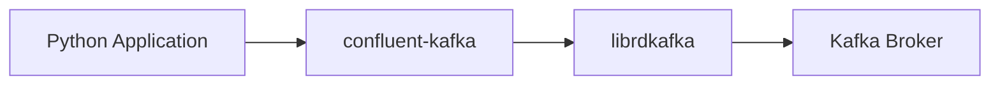
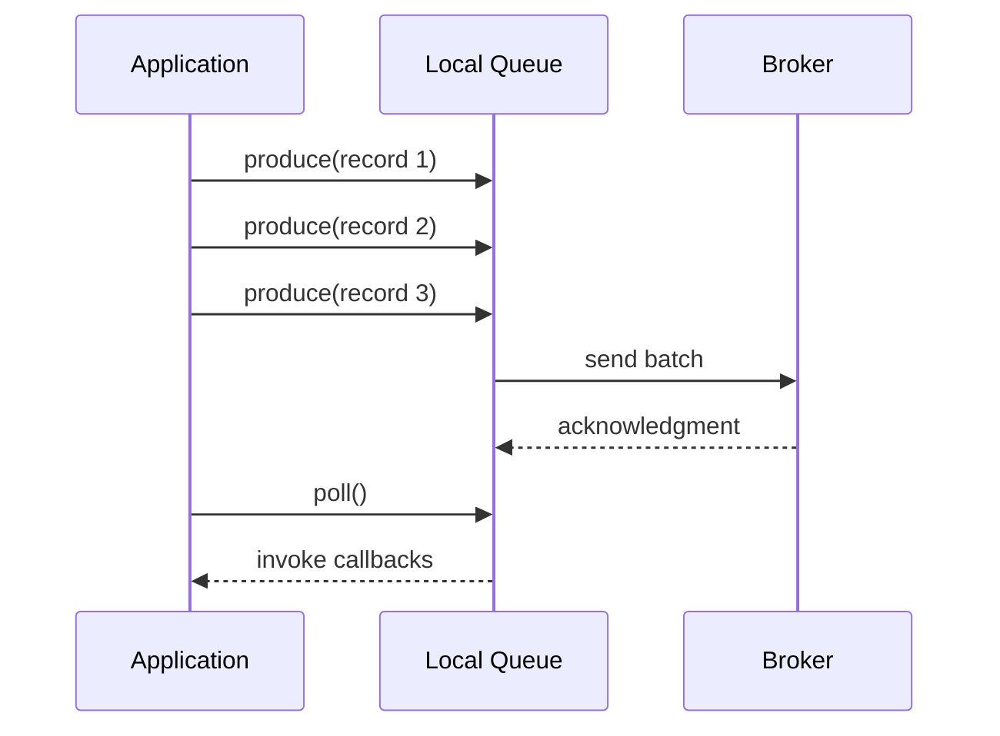
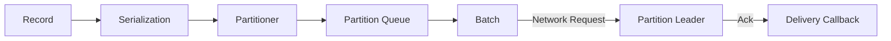

# Kafka Producer 구현과 성능

## 학습 목표

Python으로 Kafka Producer를 구현하고, 레코드가 애플리케이션에서 Broker까지 전달되는 과정을 이해한다. 단순히 옵션 값을 외우기보다 처리량, 지연 시간, 내구성 사이의 관계를 설명하고 요구사항에 맞는 설정을 선택하는 것이 목표다.

## Python Kafka 클라이언트

Kafka Broker는 특정 프로그래밍 언어에 종속되지 않는다. 클라이언트가 Kafka Protocol을 구현하면 Java 이외의 언어에서도 Producer와 Consumer를 만들 수 있다.

이 학습에서는 `confluent-kafka`를 사용한다. Python API 아래에서 C/C++ 기반의 `librdkafka`가 네트워크 통신, 배치 처리, 압축, 재시도 등을 수행한다.



Java Client와 librdkafka 기반 Client는 개념은 비슷하지만 설정 이름과 기본값이 다를 수 있다. 사용하는 `confluent-kafka` 버전과 [librdkafka 설정 문서](https://github.com/confluentinc/librdkafka/blob/master/CONFIGURATION.md)를 기준으로 확인해야 한다.

## 기본 Producer 구현

```python
from confluent_kafka import Producer


def delivery_report(error, message):
    if error is not None:
        print(f"delivery failed: {error}")
        return

    print(
        f"delivered: topic={message.topic()}, "
        f"partition={message.partition()}, "
        f"offset={message.offset()}"
    )


producer = Producer(
    {
        "bootstrap.servers": "kafka01:9092,kafka02:9092,kafka03:9092",
        "client.id": "simple-producer",
    }
)

try:
    for number in range(10):
        producer.produce(
            topic="lesson.simple-producer",
            key=f"key-{number}",
            value=f"message-{number}",
            callback=delivery_report,
        )
        producer.poll(0)
finally:
    remaining = producer.flush(timeout=10)
    if remaining > 0:
        raise RuntimeError(f"전송되지 않은 메시지 수: {remaining}")
```

### 코드의 핵심

| 요소 | 역할 |
| --- | --- |
| `bootstrap.servers` | 초기 클러스터 메타데이터를 가져올 Broker 목록 |
| `client.id` | 로그와 지표에서 Producer를 식별할 이름 |
| `key` | 파티션 선택과 같은 Key의 순서 유지에 활용 |
| `value` | 실제 전송할 레코드 내용 |
| `callback` | 최종 전송 성공 또는 실패 확인 |
| `poll()` | 전달 결과 이벤트를 처리하고 Callback 실행 |
| `flush()` | 종료 전 대기 중인 레코드의 전송 완료를 기다림 |

`produce()`는 일반적으로 레코드를 로컬 Queue에 넣고 빠르게 반환한다. Broker의 최종 응답은 Callback으로 확인해야 하며, Callback은 `poll()` 또는 `flush()`가 이벤트를 처리할 때 실행된다. 이 동작은 [Confluent Python Client 문서](https://docs.confluent.io/kafka-clients/python/current/overview.html)에 설명되어 있다.

## 비동기 전송과 종료 처리

레코드마다 Broker 응답을 기다리는 동기 방식은 이해하기 쉽지만 네트워크 왕복 시간만큼 처리량이 제한될 수 있다. 비동기 방식은 여러 레코드를 Queue에 모아 배치로 전송하므로 일반적인 Producer에 더 적합하다.



### `poll()`

- 전달 성공과 실패 Callback을 실행한다.
- 애플리케이션이 실행되는 동안 주기적으로 호출한다.
- Queue가 가득 차 `BufferError`가 발생하면 잠시 Poll한 뒤 재시도할 수 있다.
- Callback 내부에서 오래 걸리는 작업을 수행하면 Producer 이벤트 처리를 방해할 수 있다.

### `flush()`

- Queue와 전송 중인 레코드가 처리될 때까지 기다린다.
- 일반적으로 정상 종료 직전에 호출한다.
- 반환값이 0이 아니면 제한 시간 안에 전송되지 않은 레코드가 남았다는 뜻이다.
- 매 레코드마다 호출하면 비동기 배치 처리의 장점을 잃는다.

프로세스가 강제로 종료되면 `finally`조차 실행되지 않을 수 있다. 중요한 이벤트는 종료 신호 처리, 실패 저장소, 재처리 전략까지 함께 설계해야 한다.

## Producer 내부 동작



1. Key와 Value를 Byte 형태로 직렬화한다.
2. 명시된 파티션 또는 Key를 기준으로 파티션을 선택한다.
3. 파티션별 로컬 Queue에 레코드를 저장한다.
4. 크기 또는 대기 시간 조건을 만족하면 배치를 만든다.
5. 해당 파티션의 Leader Broker로 전송한다.
6. 응답 결과에 따라 완료 처리하거나 재시도한다.

## Key와 파티셔닝

### Key가 있는 경우

Key를 해시해 파티션을 선택하므로 동일한 Key는 일반적으로 동일한 파티션으로 전달된다. 같은 파티션 안에서 순서가 유지되므로 사용자, 장비, 주문처럼 동일한 개체의 이벤트 순서가 중요할 때 활용한다.

### Key가 없는 경우

클라이언트의 기본 Partitioner에 따라 파티션을 선택한다. Java와 librdkafka의 기본 알고리즘이 같다고 가정해서는 안 되며, 언어가 다른 Producer가 같은 Key를 같은 파티션으로 보내야 한다면 명시적으로 호환되는 Partitioner를 선택해야 한다.

### 파티션을 직접 지정하는 경우

특별한 라우팅 목적이 아니라면 Producer 코드에 파티션 번호를 고정하지 않는 편이 좋다. 토픽의 파티션 수가 바뀌면 특정 파티션에 의존한 코드가 확장과 운영을 어렵게 만들 수 있다.

## 배치 처리와 성능

Producer는 레코드를 건별로 보내지 않고 같은 파티션의 레코드를 배치로 묶어 전송한다.

| 설정 | 의미 | 값을 키울 때의 영향 |
| --- | --- | --- |
| `linger.ms` | 배치를 더 모으기 위해 기다리는 최대 시간 | 처리량과 압축률이 좋아질 수 있지만 대기 지연 증가 |
| `batch.size` | 파티션별 배치 크기 한도 | 큰 배치를 만들 수 있지만 메모리 사용 증가 |
| `batch.num.messages` | librdkafka 배치의 레코드 수 한도 | 많은 레코드를 묶지만 큰 레코드에서는 크기 한도도 확인 |
| `queue.buffering.max.kbytes` | Producer 전체 로컬 Queue 크기 | 순간 부하 흡수 가능, 메모리 사용과 실패 인지 지연 증가 |
| `compression.type` | 배치 압축 방식 | 네트워크와 저장 공간 절약, CPU 비용 발생 |

높은 처리량에는 큰 배치가 유리하지만, 낮은 트래픽에서는 `linger.ms`만큼 기다릴 수 있다. 좋은 설정은 고정값이 아니라 메시지 크기, 유입 속도, 허용 지연 시간을 측정해 결정한다. librdkafka 역시 배치와 `linger.ms`를 주요 성능 조절 지점으로 설명한다. [librdkafka Producer 동작 문서](https://github.com/confluentinc/librdkafka/blob/master/INTRODUCTION.md)

### 압축

압축은 개별 레코드가 아니라 배치에 적용되므로 배치가 충분히 클수록 효율이 좋아질 수 있다.

- 네트워크 전송량과 Broker 저장 공간을 줄인다.
- Producer의 압축과 Consumer의 해제 과정에 CPU가 필요하다.
- 데이터 형태에 따라 압축률이 크게 달라진다.
- 알고리즘은 Broker와 Consumer의 호환성을 확인해 선택한다.

압축 전후의 레코드당 크기만 비교하지 말고 초당 처리량, p95/p99 지연 시간, CPU, 네트워크, Broker 디스크 사용량을 함께 측정한다.

## 내구성과 오류 처리

### `acks`

| 값 | 성공 판단 | 특성 |
| --- | --- | --- |
| `0` | Broker 응답을 기다리지 않음 | 지연은 낮지만 실패 확인과 재시도에 제약 |
| `1` | Leader가 로컬 로그에 기록 | Leader 장애 시 아직 복제되지 않은 레코드 손실 가능 |
| `all` 또는 `-1` | Broker의 ISR 조건을 만족 | 내구성이 높지만 응답 대기 증가 가능 |

`acks=all`의 실제 내구성은 토픽 또는 Broker의 `min.insync.replicas`와 함께 결정된다.

### 재시도와 제한 시간

| 설정 | 역할 |
| --- | --- |
| `retries` | 재시도 가능 횟수 |
| `retry.backoff.ms` | 재시도 사이의 초기 대기 시간 |
| `retry.backoff.max.ms` | 증가하는 재시도 대기 시간의 상한 |
| `request.timeout.ms` | 개별 Broker 요청 응답 제한 시간 |
| `delivery.timeout.ms` 또는 `message.timeout.ms` | 최초 Produce부터 최종 성공·실패까지의 전체 제한 |
| `max.in.flight.requests.per.connection` | 응답 없이 동시에 보낼 수 있는 요청 수 |

재시도는 일시적인 장애를 견디게 하지만 전체 처리 시간이 길어지고, 멱등성을 사용하지 않으면 중복이나 순서 변경이 발생할 수 있다. 최종 실패한 레코드를 로그만 남기고 버리지 말고 별도 저장, 경고, 재처리 중 어떤 정책을 사용할지 정해야 한다.

## 멱등적 Producer

네트워크 오류로 Broker가 레코드를 저장했지만 Producer가 응답을 받지 못하면 같은 레코드를 재전송할 수 있다. 멱등적 Producer는 Producer ID와 파티션별 Sequence Number를 이용해 Broker가 중복 재시도를 식별하도록 한다.

```python
producer = Producer(
    {
        "bootstrap.servers": "kafka01:9092,kafka02:9092,kafka03:9092",
        "enable.idempotence": True,
        "acks": "all",
        "compression.type": "lz4",
    }
)
```

멱등성에는 다음 설정 제약이 있다.

- `acks=all`
- `retries > 0`
- `max.in.flight.requests.per.connection <= 5`

최근 Client는 멱등성을 켜면 호환되는 값을 자동 설정하거나 충돌하는 설정을 오류로 처리할 수 있다. 정확한 기본값과 자동 조정 범위는 사용 중인 버전의 설정 문서를 확인한다. [Confluent Producer 설정](https://docs.confluent.io/platform/current/installation/configuration/producer-configs.html)

> 멱등적 Producer는 한 Producer 세션이 Kafka 파티션에 재시도하면서 만드는 중복을 방지한다. 외부 API 호출부터 Consumer의 데이터베이스 저장까지 전체 파이프라인을 자동으로 Exactly Once로 만드는 기능은 아니다.

## 공공자전거 파이프라인

### 요구사항

- 대여소별 자전거 대여와 반납 추정 건수를 시각화한다.
- 당일 데이터를 낮은 지연 시간으로 확인한다.
- 과거 날짜도 선택해 조회할 수 있도록 저장한다.

원천 API가 이벤트 내역이 아니라 현재 잔여 대수만 제공한다면 이전 관측값과 현재 관측값의 차이를 이벤트로 해석할 수 있다.

```text
잔여 대수 15 → 13 : 대여 2건으로 추정
잔여 대수 13 → 14 : 반납 1건으로 추정
```

그러나 관측 사이에 대여와 반납이 함께 발생하면 변화량이 상쇄된다. 따라서 이 결과는 실제 거래 건수가 아닌 샘플링을 이용한 추정치다.


### Producer 설계 시 확인할 점

- API 호출 간격과 제공자의 Rate Limit
- 연결 및 응답 Timeout
- 429, 5xx, 네트워크 오류에 대한 Backoff
- 중복 응답을 구분할 Event ID 또는 관측 시각
- API 응답 스키마 검증
- 일부 대여소 데이터 누락 처리
- Kafka 전송 실패 시 재처리 방법
- 로그 보관 기간과 민감정보 마스킹

### 이벤트 예시

```json
{
  "station_id": "ST-001",
  "observed_at": "2026-07-20T12:00:00+09:00",
  "available_bikes": 13,
  "source": "seoul-open-api"
}
```

Producer는 가능하면 원천 관측값을 손실 없이 전달하고, 이전 값과 비교해 대여·반납을 추정하는 상태 기반 계산은 Spark Streaming 같은 처리 계층에서 수행한다. 그러면 추정 로직이 바뀌어도 원천 이벤트를 다시 처리할 수 있다.

## 민감정보 관리

API 키를 소스 코드나 빌드 결과물에 직접 치환하면 저장소에는 없더라도 S3 배포 파일과 EC2 파일에 평문으로 남을 수 있다. 실행 시점에 환경 변수나 비밀 관리 서비스에서 읽는 방식을 우선한다.

```python
import os


auth_key = os.environ["SEOUL_DATA_API_KEY"]
```

권장 원칙은 다음과 같다.

- 로컬에서는 Git에 포함하지 않는 `.env` 또는 OS 환경 변수를 사용한다.
- GitHub Actions에서는 Secret을 로그에 출력하거나 일반 파일로 패키징하지 않는다.
- AWS에서는 IAM Role과 Secrets Manager 또는 Parameter Store 사용을 검토한다.
- 키가 노출되면 코드에서 지우는 것으로 끝내지 않고 즉시 폐기하고 재발급한다.
- API 응답과 오류 로그에 인증키가 포함되지 않도록 URL과 Header를 마스킹한다.

## 서비스 운영과 배포

학습 환경에서는 Producer를 systemd 서비스로 등록하고 CodeDeploy의 생명주기 Hook으로 재시작한다.

| 단계 | 작업 예시 |
| --- | --- |
| `AfterInstall` | 가상환경과 의존성 준비, 파일 권한 설정 |
| `ApplicationStart` | Producer 서비스 시작 또는 재시작 |
| `ValidateService` | 서비스 상태와 Kafka 연결 확인 |

배포할 때 기존 프로세스를 즉시 종료하면 Queue의 레코드가 남을 수 있다. 종료 신호를 받아 API 호출을 멈추고 `flush()`가 끝난 뒤 종료하는 Graceful Shutdown이 필요하다.

## 검증 명령

특정 파티션과 Offset의 레코드 한 건을 확인할 수 있다.

```bash
kafka-console-consumer \
  --bootstrap-server kafka01:9092,kafka02:9092,kafka03:9092 \
  --topic apis.seouldata.rt-bicycle \
  --partition 2 \
  --offset 3000 \
  --max-messages 1
```

Key, 파티션, Offset을 함께 출력하면 파티셔닝 결과를 확인하기 쉽다.

```bash
kafka-console-consumer \
  --bootstrap-server kafka01:9092,kafka02:9092,kafka03:9092 \
  --topic apis.seouldata.rt-bicycle \
  --property print.key=true \
  --property print.partition=true \
  --property print.offset=true
```

## 튜닝 순서

1. 처리량, 최대 허용 지연, 허용 가능한 데이터 손실을 정의한다.
2. 기본 설정으로 처리량과 지연 시간 분포를 측정한다.
3. Key 분포와 파티션별 레코드 수로 데이터 쏠림을 확인한다.
4. `linger.ms`, 배치 크기, 압축을 한 번에 하나씩 변경한다.
5. `acks`, ISR, 멱등성 설정으로 내구성을 검증한다.
6. Broker 장애와 네트워크 지연 상황에서 재시도와 순서를 확인한다.
7. 변경 전후의 Producer, Broker, Consumer 지표를 함께 비교한다.

## 핵심 정리

- `produce()`의 반환은 Broker 저장 성공을 의미하지 않으므로 Callback을 확인해야 한다.
- 실행 중에는 `poll()`, 종료 전에는 제한 시간을 둔 `flush()`가 필요하다.
- 같은 Key는 같은 파티션으로 보내 순서를 유지할 수 있지만 클라이언트 간 Partitioner 호환성을 확인해야 한다.
- 큰 배치와 압축은 처리량을 높일 수 있지만 지연과 CPU 사용량에 영향을 준다.
- `acks`, `min.insync.replicas`, 재시도, 멱등성은 함께 설계해야 한다.
- API의 현재 상태 차이로 계산한 대여·반납 건수는 정확한 이벤트가 아니라 추정치다.
- 비밀 정보는 빌드 결과물에 치환하기보다 실행 시 안전한 저장소에서 주입한다.

## 스스로 확인하기

- `produce()` 호출이 성공했는데도 메시지 전달이 실패할 수 있는 이유는 무엇인가?
- 모든 레코드 뒤에 `flush()`를 호출하면 처리량이 낮아지는 이유는 무엇인가?
- Key가 없는 레코드와 있는 레코드는 파티셔닝과 순서 보장에서 어떻게 다른가?
- `acks=all`만 설정해도 데이터가 절대 유실되지 않는다고 말할 수 없는 이유는 무엇인가?
- 멱등적 Producer가 파이프라인 전체의 Exactly Once를 보장하지 않는 이유는 무엇인가?
- 자전거 잔여 대수 차이로 대여와 반납을 계산할 때 어떤 오차가 생길 수 있는가?
