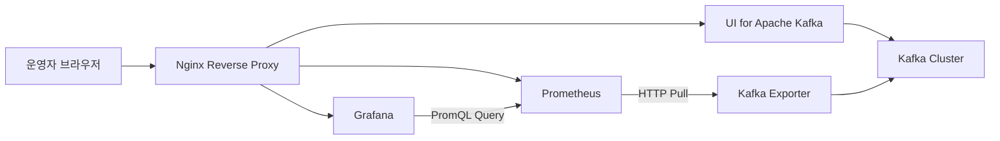
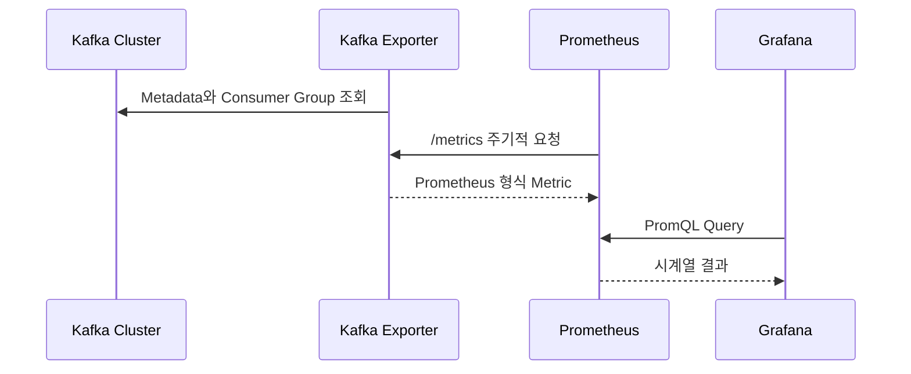

# Kafka UI와 모니터링

## 학습 목표

Kafka 클러스터를 웹 UI로 확인하고, Kafka Exporter가 제공하는 지표를 Prometheus로 수집해 Grafana 대시보드에서 시각화한다. 도구 설치 자체보다 각 구성 요소의 역할, 네트워크 경로, 지표 해석 방법을 이해하는 것이 목표다.

## 전체 구성



| 구성 요소 | 역할 | 강의 환경 포트 |
| --- | --- | --- |
| UI for Apache Kafka | 브로커, 토픽, 파티션, 컨슈머 그룹을 웹에서 조회·관리 | `8081` |
| Kafka Exporter | Kafka 상태를 Prometheus 형식의 HTTP Metric으로 변환 | `9308` |
| Prometheus | Exporter의 Metric을 주기적으로 수집하고 시계열로 저장 | `9090` |
| Grafana | Prometheus를 조회해 Dashboard와 Panel로 시각화 | `3000` |
| Nginx | Public 서버에서 Private 서버의 웹 서비스로 요청 전달 | 환경에 따라 매핑 |

강의에서는 Kafka UI를 한 브로커 호스트에, Kafka Exporter·Prometheus·Grafana를 다른 브로커 호스트에 Docker Compose로 배치한다. 학습 환경을 단순화한 구성일 뿐이며, 운영 환경에서는 모니터링 부하와 장애 영역을 고려해 Kafka Broker와 관측 도구를 분리하는 편이 안전하다.

## Kafka UI

Kafka CLI는 자동화와 정밀한 작업에 유리하지만 클러스터 상태를 빠르게 탐색하기에는 불편할 수 있다. Kafka UI를 사용하면 다음 정보를 한 화면에서 확인할 수 있다.

- Broker 연결 상태
- Topic과 Partition 구성
- Partition별 Leader와 Replica
- 메시지 Key, Value, Header
- Consumer Group과 Lag
- Topic 생성·변경·삭제

> 웹 UI의 관리 기능은 편리한 만큼 위험하다. 운영 환경에서는 읽기 전용 권한, 인증, TLS, 감사 로그를 우선 검토하고 인터넷에 직접 노출하지 않는다.

### Docker Compose 예시

아래는 구조를 이해하기 위한 일반화된 예시다. 이미지 버전과 환경 변수 이름은 사용하는 Kafka UI 버전의 문서를 기준으로 확인한다.

```yaml
services:
  kafka-ui:
    image: provectuslabs/kafka-ui:<version>
    restart: unless-stopped
    ports:
      - "8081:8080"
    environment:
      KAFKA_CLUSTERS_0_NAME: study-cluster
      KAFKA_CLUSTERS_0_BOOTSTRAPSERVERS: kafka01:9092,kafka02:9092,kafka03:9092
```

호스트에서 노출하는 `8081`과 컨테이너가 수신하는 `8080`을 구분해야 한다. Kafka Broker 주소는 컨테이너 내부에서 해석되고 접근 가능한 주소여야 한다.

### 설치 흐름

1. Kafka UI를 실행할 서버에 Docker Engine과 Compose Plugin을 준비한다.
2. Compose 파일에 Kafka Bootstrap Server를 설정한다.
3. `docker compose up -d`로 컨테이너를 시작한다.
4. 컨테이너 상태와 로그를 확인한다.
5. 브라우저에서 UI에 접속해 Broker와 Topic 정보를 검증한다.

```bash
docker compose up -d
docker compose ps
docker compose logs --tail=100 kafka-ui
```

`docker compose up`만 성공했다고 설치가 끝난 것은 아니다. UI가 Broker Metadata를 가져오지 못하면 화면은 열려도 클러스터 정보가 나타나지 않는다.

### 연결 문제 점검

```bash
# Kafka UI 컨테이너에서 Broker 이름이 해석되는지 확인
docker compose exec kafka-ui getent hosts kafka01

# Broker 포트까지 연결 가능한지 확인
docker compose exec kafka-ui sh -c "nc -vz kafka01 9092"
```

Docker 이미지에 `nc`가 없다면 같은 Docker Network에 임시 진단 컨테이너를 실행하거나 호스트에서 연결을 확인한다.

Kafka UI 연결 실패의 주요 원인은 다음과 같다.

- `bootstrap.servers`의 호스트명 오타
- Docker Network 또는 DNS 문제
- 보안 그룹이나 호스트 방화벽 차단
- Kafka `advertised.listeners`가 클라이언트에서 접근할 수 없는 주소를 반환
- SASL 또는 TLS 설정 누락

## Private 서버의 웹 서비스 접근

강의 환경의 Kafka 서버는 Private Subnet에 있으므로 외부 브라우저가 직접 접근할 수 없다. Public Subnet의 서버에서 Nginx를 실행하고, 허용된 요청을 Private 서버로 전달한다.


### Nginx 리버스 프록시 예시

```nginx
server {
    listen 8081;

    location / {
        proxy_pass http://kafka02:8081;
        proxy_http_version 1.1;
        proxy_set_header Host $host;
        proxy_set_header X-Real-IP $remote_addr;
        proxy_set_header X-Forwarded-For $proxy_add_x_forwarded_for;
        proxy_set_header X-Forwarded-Proto $scheme;
    }
}
```

설정 변경 후에는 문법을 검사한 뒤 Reload한다.

```bash
sudo nginx -t
sudo systemctl reload nginx
```

### 이름 해석

강의에서는 학습 편의를 위해 `/etc/hosts`에 `kafka01`부터 `kafka03`까지 등록한다. 규모가 커지거나 IP가 바뀌는 환경에서는 수동 Hosts 파일 대신 Route 53 Private Hosted Zone 같은 내부 DNS를 사용하는 편이 관리하기 쉽다.

### 보안 그룹

외부에 열어야 하는 포트는 사용자의 현재 공인 IP로 제한한다.

- `8081`: Kafka UI
- `3000`: Grafana
- `9090`: Prometheus

`0.0.0.0/0`으로 관리 화면을 공개하지 않는다. Prometheus는 운영 지표와 내부 호스트 정보를 노출할 수 있으며, Kafka UI는 데이터 조회·변경 기능을 가질 수 있다. 가능하면 VPN, SSH Tunnel, SSM Session Manager 또는 인증 프록시를 사용한다.

## Kafka Exporter, Prometheus, Grafana

세 도구는 서로 다른 책임을 가진다.



### Kafka Exporter

Kafka Exporter는 Kafka에서 Topic, Partition, Offset, Consumer Group 정보를 읽어 `/metrics` HTTP Endpoint로 제공한다. Exporter는 Metric을 장기간 저장하지 않는다.

대표적으로 관찰할 수 있는 정보는 다음과 같다.

- Topic별 Partition 수
- Partition별 현재 Offset
- Partition Leader 정보
- Consumer Group의 현재 Offset
- Consumer Group Lag

Exporter의 `9308` 포트는 Prometheus가 접근할 수 있으면 충분하다. 외부 브라우저에 공개할 필요가 없다.

### Prometheus

Prometheus는 설정된 Target의 `/metrics`를 일정 주기로 Pull해 시계열 데이터베이스에 저장한다. PromQL을 사용해 현재 값, 변화율, 합계, 분위수 등을 계산한다.

```yaml
global:
  scrape_interval: 15s

scrape_configs:
  - job_name: kafka-exporter
    static_configs:
      - targets:
          - kafka-exporter:9308
```

컨테이너 환경에서는 `localhost:9308`이 다른 컨테이너를 의미하지 않는다. 같은 Compose Network에 있다면 서비스 이름인 `kafka-exporter:9308`을 사용한다.

### Grafana

Grafana는 Metric을 직접 수집하지 않고 Data Source에 Query를 전송해 결과를 시각화한다. 이 실습에서는 Prometheus를 Data Source로 등록한다.

```text
Grafana Data Source URL: http://prometheus:9090
```

Grafana 컨테이너 내부에서 Prometheus를 호출하므로 브라우저에서 접속하는 Public 주소가 아니라 Docker Network의 서비스 이름을 사용한다.

### Compose 구성 예시

```yaml
services:
  kafka-exporter:
    image: danielqsj/kafka-exporter:<version>
    restart: unless-stopped
    command:
      - --kafka.server=kafka01:9092
      - --kafka.server=kafka02:9092
      - --kafka.server=kafka03:9092

  prometheus:
    image: prom/prometheus:<version>
    restart: unless-stopped
    ports:
      - "9090:9090"
    volumes:
      - ./prometheus.yml:/etc/prometheus/prometheus.yml:ro
      - prometheus-data:/prometheus
    depends_on:
      - kafka-exporter

  grafana:
    image: grafana/grafana:<version>
    restart: unless-stopped
    ports:
      - "3000:3000"
    volumes:
      - grafana-data:/var/lib/grafana
    depends_on:
      - prometheus

volumes:
  prometheus-data:
  grafana-data:
```

고정 버전을 사용하면 재배포 시 예기치 않은 변경을 줄일 수 있다. 데이터 Volume이 없으면 컨테이너를 다시 만들 때 Prometheus 기록과 Grafana Dashboard가 사라질 수 있다.

## 설치 검증 순서

### 1. 컨테이너 상태

```bash
docker compose ps
docker compose logs --tail=100 kafka-exporter
docker compose logs --tail=100 prometheus
docker compose logs --tail=100 grafana
```

### 2. Exporter Metric

```bash
curl -fsS http://localhost:9308/metrics | head
```

Metric이 없거나 요청이 실패하면 Kafka 연결과 Exporter 인자를 먼저 확인한다.

### 3. Prometheus Target

Prometheus의 `Status > Targets`에서 Kafka Exporter가 `UP`인지 확인한다. `DOWN`이면 오류 메시지와 마지막 Scrape 시간을 함께 본다.

```bash
curl -fsS http://localhost:9090/-/ready
```

### 4. Grafana Data Source

Grafana에서 Prometheus Data Source를 등록하고 `Save & test`가 성공하는지 확인한다. 이후 Explore 화면에서 Kafka Metric 이름을 조회한다.

### 5. 데이터 흐름

테스트 메시지를 Produce하고 Consume한 뒤 다음 변화를 확인한다.

- Partition의 Current Offset 증가
- Consumer Group Offset 증가
- Consumer Lag 발생 후 감소
- Dashboard Panel의 변화

## Grafana Dashboard 만들기

Dashboard는 직접 Panel을 만들거나 Grafana Dashboard Catalog의 JSON을 가져와 시작할 수 있다. 강의에서는 Kafka Exporter용 Dashboard를 Import한 뒤 환경에 맞게 Data Source와 Variable을 수정한다.

### Import 절차

1. 사용할 Dashboard의 JSON 또는 Dashboard ID를 준비한다.
2. Grafana에서 `Dashboards > New > Import`로 이동한다.
3. JSON 파일을 Upload하거나 ID를 입력한다.
4. Prometheus Data Source를 선택한다.
5. Import 후 각 Panel의 Query와 Variable을 현재 Metric Label에 맞게 검증한다.

공개 Dashboard는 예시일 뿐이다. Exporter 버전, Metric 이름, Label 구성이 다르면 Panel이 비어 있거나 잘못된 값을 표시할 수 있다.

### Variable 수정

Dashboard Variable은 Cluster, Topic, Partition, Consumer Group 등을 선택하는 필터다. Dashboard가 특정 Consumer Group이 반드시 존재한다고 가정하면 Producer만 실행한 환경에서는 선택값이 없어 전체 Panel이 비어 보일 수 있다.

이때는 다음을 확인한다.

- Variable Query가 실제 존재하는 Metric을 사용하는가?
- `job`, `instance`, `topic`, `consumergroup` Label 이름이 일치하는가?
- 불필요한 Label Filter가 모든 시계열을 제외하고 있지 않은가?
- `Include All`과 Multi-value 설정이 Panel Query와 호환되는가?
- Variable 간 의존 순서가 올바른가?

변수를 무조건 삭제하기보다 Dashboard가 답하려는 질문에 필요한 필터인지 판단한 뒤 수정한다.

## 초당 Produce·Consume 속도 해석

Partition의 Current Offset은 누적값에 가깝다. 현재 Offset 자체를 그래프로 그리면 지금까지 쌓인 전체 위치를 보여줄 뿐 초당 처리량을 직접 나타내지 않는다.

초당 증가량은 일정 구간의 변화율로 계산한다.

```promql
sum(rate(kafka_topic_partition_current_offset[1m]))
```

Consumer 처리 속도 역시 Consumer Group Offset의 변화율을 기준으로 계산할 수 있다. 정확한 Metric 이름과 Label은 설치한 Kafka Exporter의 `/metrics` 출력에서 확인한다.

### `rate()`를 해석할 때 주의할 점

- `[1m]`은 최근 1분간의 Sample로 평균 변화율을 계산한다.
- Scrape 주기가 15초라면 1분 구간에는 대략 네 개 정도의 Sample만 들어간다.
- 짧은 구간은 변화에 빠르게 반응하지만 그래프가 흔들릴 수 있다.
- 긴 구간은 부드럽지만 순간적인 급증을 감춘다.
- Producer가 짧게 대량 전송하면 실제 전송 순간보다 낮은 평균값으로 보일 수 있다.
- Partition 재생성이나 Offset 변화가 있으면 비정상적인 값이 나타날 수 있다.

예를 들어 15초 동안 2,700개가 추가되고 나머지 45초 동안 변화가 없다면, 1분 평균은 약 45개/초로 보일 수 있다. 전송 중 순간 속도와 Dashboard 구간 평균은 서로 다른 값이다.

### Lag과 처리 속도를 함께 보기

Consume 속도가 높아도 Produce 속도보다 낮으면 Lag은 계속 증가한다. 따라서 다음 세 값을 함께 관찰해야 한다.

```text
생산 속도 > 소비 속도  → Lag 증가
생산 속도 = 소비 속도  → Lag 유지
생산 속도 < 소비 속도  → Lag 감소
```

단, Consumer Lag은 Group이 Commit한 Offset을 기준으로 하므로 실제 처리 완료 시점과 차이가 날 수 있다. 자동 Commit 주기와 처리 실패 정책도 함께 확인한다.

## 운영 환경 보완 사항

강의 실습 환경을 운영에 적용할 때는 다음 항목을 추가로 설계한다.

- Kafka UI와 Grafana에 SSO 또는 강력한 인증 적용
- Nginx에서 TLS 종료 및 HTTP를 HTTPS로 전환
- Prometheus와 Exporter 포트를 Private Network에만 공개
- 기본 관리자 계정과 비밀번호 즉시 변경
- Grafana Dashboard와 Data Source를 Provisioning 파일로 형상 관리
- Prometheus Retention과 디스크 용량 설정
- Alertmanager를 연결해 Lag, Broker 장애, Scrape 실패 알림 구성
- 컨테이너 이미지 버전 고정과 정기적인 보안 업데이트
- 모니터링 시스템 자체의 CPU, 메모리, 디스크 상태 관찰

## 장애 점검표

| 증상 | 우선 확인할 항목 |
| --- | --- |
| Kafka UI 화면은 열리지만 Cluster가 보이지 않음 | Bootstrap Server, DNS, `advertised.listeners`, 인증 설정 |
| Exporter `/metrics`에 Kafka 지표가 없음 | Broker 연결, Exporter 실행 인자, ACL |
| Prometheus Target이 `DOWN` | Target 주소, Docker Network, 포트, `/metrics` 응답 |
| Grafana Data Source 연결 실패 | URL에 `localhost` 사용 여부, Prometheus 상태, Network |
| Dashboard가 `No data` 표시 | 시간 범위, Data Source, Metric 이름, Label, Variable |
| Lag이 계속 증가 | Produce/Consume 속도, Consumer 오류, Partition 할당 |
| 재배포 후 Dashboard가 사라짐 | Grafana Volume과 Provisioning 설정 |

## 핵심 정리

- Kafka UI는 클러스터를 탐색하고 관리하는 도구이며 Metric 저장소가 아니다.
- Kafka Exporter는 Kafka 상태를 Prometheus 형식으로 노출하지만 장기간 저장하지 않는다.
- Prometheus는 Exporter를 Pull해 시계열로 저장하고 PromQL로 계산한다.
- Grafana는 Prometheus를 조회해 Dashboard를 구성한다.
- 컨테이너 간 연결에는 Public IP나 `localhost` 대신 Docker 서비스 이름을 사용한다.
- 누적 Offset과 초당 처리량은 다르며 `rate()`의 계산 구간을 함께 해석해야 한다.
- 공개 Dashboard는 현재 Metric과 Label에 맞게 Variable과 Query를 검증해야 한다.
- 관리 UI와 Prometheus를 인터넷에 직접 공개하지 않고 인증과 접근 제어를 적용한다.

## 스스로 확인하기

- Kafka UI와 Grafana는 각각 어떤 데이터를 직접 저장하는가?
- Prometheus가 Kafka Broker가 아니라 Exporter를 Scrape하는 이유는 무엇인가?
- Grafana 컨테이너에서 `http://localhost:9090`이 동작하지 않는 이유는 무엇인가?
- Dashboard가 `No data`일 때 어떤 순서로 원인을 좁힐 수 있는가?
- Current Offset과 초당 Produce 속도는 어떻게 다른가?
- Produce 속도와 Consume 속도가 같아도 Lag이 0이 아닐 수 있는 이유는 무엇인가?
- 운영 환경에서 Kafka UI와 Prometheus를 외부에 직접 노출하면 어떤 위험이 있는가?
