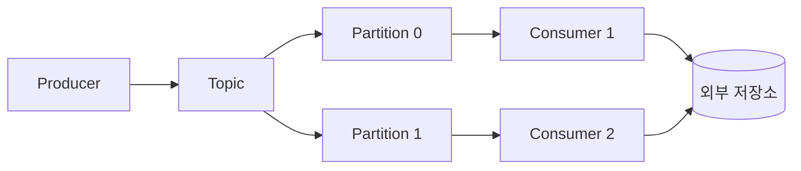
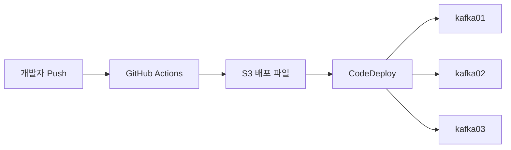
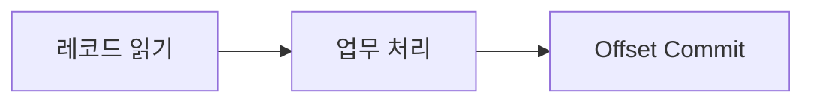
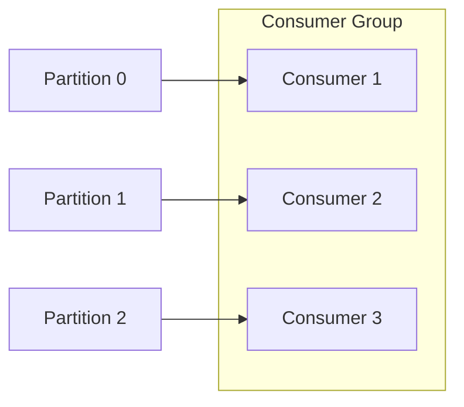
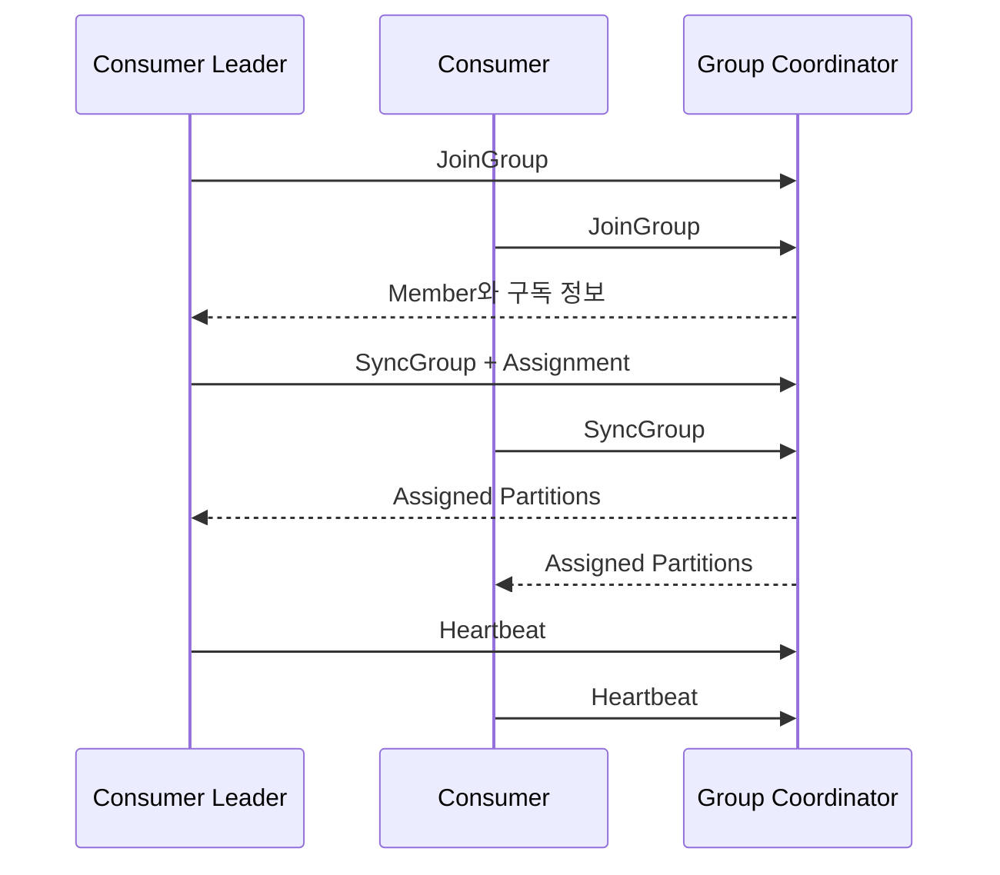
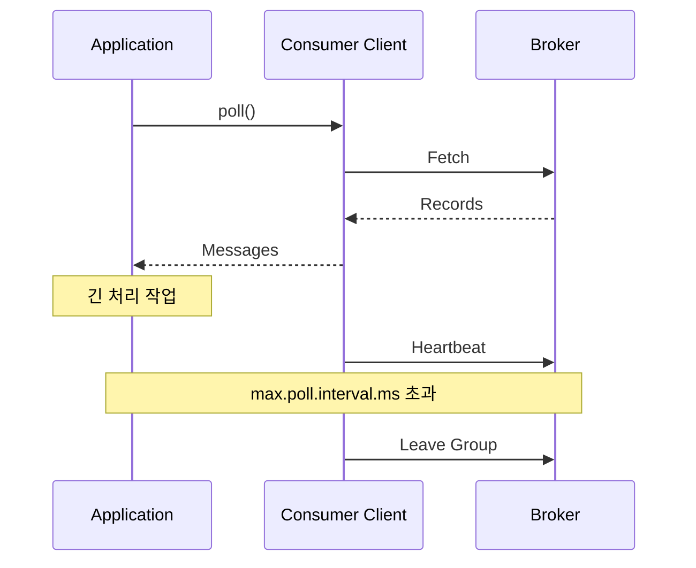

# Kafka Consumer 만들기

## 학습 목표

Python으로 Kafka Consumer를 구현하고, 레코드를 읽은 위치인 Offset을 안전하게 관리하는 방법을 이해한다. Consumer Group이 Partition을 나누는 과정과 Rebalance의 원인을 파악하고, 처리량과 안정성 요구사항에 맞게 Commit 방식과 주요 옵션을 선택하는 것이 목표다.

## Consumer의 역할

Kafka Consumer는 Topic의 Partition에서 레코드를 순서대로 가져와 애플리케이션 로직으로 전달한다.



Consumer를 운영할 때는 단순히 메시지를 가져오는 것보다 다음 질문이 중요하다.

- 어느 Topic과 Partition을 읽을 것인가?
- 장애 후 어디서부터 다시 읽을 것인가?
- 처리 완료 전후 중 언제 Offset을 Commit할 것인가?
- 여러 Consumer가 Partition을 어떻게 나눌 것인가?
- 처리 지연과 장애를 Kafka가 어떻게 감지할 것인가?

## 배포 환경 구성

강의 환경에서는 Producer와 별도의 Consumer 저장소를 만들고 GitHub Actions, S3, CodeDeploy를 이용해 Kafka 서버에 배포한다.



### 별도 배포 단위를 사용하는 이유

Producer와 Consumer는 실행 주기, 확장 방식, 장애 영향 범위가 다르다. 같은 EC2에서 실행하더라도 CodeDeploy Application과 Deployment Group을 분리하면 한 애플리케이션의 배포가 다른 프로세스의 파일을 삭제하거나 서비스를 중단하는 위험을 줄일 수 있다.

### 배포 파일 예시

```text
kafka-consumer/
├── .github/
│   └── workflows/
├── consumers/
├── deploy/
│   └── after_install.sh
├── appspec.yml
└── requirements.txt
```

`appspec.yml`의 대상 경로와 Hook Script는 Consumer 전용 디렉터리와 서비스만 변경해야 한다.

### 자격 증명 주의

강의 실습에서는 GitHub Actions Secret에 AWS Access Key를 등록하지만, CSV 파일이나 Key 값을 저장소에 포함하면 안 된다.

- 가능하면 GitHub Actions의 OIDC와 짧은 수명의 AWS Role을 사용한다.
- 장기 Access Key를 사용한다면 최소 권한만 부여하고 주기적으로 교체한다.
- Secret 값을 Workflow 로그에 출력하지 않는다.
- Key가 노출되면 파일만 삭제하지 말고 즉시 폐기한다.

## Python Consumer 기본 구현

`confluent-kafka`는 C/C++ 기반 `librdkafka`를 사용하는 Python Client다. Java Client와 개념은 비슷하지만 설정 이름, 기본값, 지원 기능이 다를 수 있으므로 사용하는 버전의 문서를 기준으로 확인한다.

```python
from confluent_kafka import Consumer, KafkaError


consumer = Consumer(
    {
        "bootstrap.servers": "kafka01:9092,kafka02:9092,kafka03:9092",
        "group.id": "bicycle-consumer",
        "auto.offset.reset": "earliest",
        "enable.auto.commit": False,
    }
)

consumer.subscribe(["apis.seouldata.rt-bicycle"])

try:
    while True:
        message = consumer.poll(timeout=1.0)

        if message is None:
            continue

        if message.error():
            if message.error().code() == KafkaError._PARTITION_EOF:
                continue
            raise RuntimeError(message.error())

        process(message.key(), message.value())
        consumer.commit(message=message, asynchronous=False)
finally:
    consumer.close()
```

### 핵심 요소

| 요소 | 역할 |
| --- | --- |
| `bootstrap.servers` | 초기 Cluster Metadata를 가져올 Broker 목록 |
| `group.id` | Consumer가 참여할 Consumer Group |
| `subscribe()` | 읽을 Topic을 구독하고 Group Assignment에 참여 |
| `poll()` | 레코드 또는 Event 한 건을 가져오고 Client 상태를 진행 |
| `message.error()` | Partition EOF 또는 실제 오류 확인 |
| `commit()` | 다음에 읽을 Offset 저장 |
| `close()` | Group에서 정상적으로 나가고 자원 정리 |

`poll()`이 `None`을 반환하는 것은 지정한 시간 동안 레코드가 없었다는 의미이지 오류가 아니다. 종료 시 `close()`를 호출해야 Group Leave와 Partition 재할당이 빠르게 진행될 수 있다.

## `poll()`과 `consume()`

`confluent-kafka`는 한 건을 가져오는 `poll()`과 여러 건을 목록으로 가져오는 `consume()`을 제공한다.

```python
messages = consumer.consume(num_messages=100, timeout=1.0)

for message in messages:
    if message.error():
        continue
    process(message.key(), message.value())
```

| 방식 | 특징 | 적합한 경우 |
| --- | --- | --- |
| `poll()` | 한 번에 한 Event를 반환해 흐름이 단순하다 | 건별 처리, 학습, 낮은 트래픽 |
| `consume()` | 여러 레코드를 목록으로 반환한다 | Batch 처리, 외부 저장소 Bulk Write |

두 방식 모두 내부적으로 Consumer Client의 Polling 동작을 이용한다. `consume()`을 쓴다고 Broker에서 항상 정확히 지정한 수만큼 가져오는 것은 아니다.

## Offset과 Commit

Partition의 Offset은 레코드 위치를 나타낸다. Consumer가 Offset을 Commit하면 Kafka는 Consumer Group이 **다음에 읽을 위치**를 내부 Topic인 `__consumer_offsets`에 저장한다.

```text
마지막으로 처리한 Offset: 42
Commit할 다음 Offset:     43
```

Commit은 데이터 처리 자체를 보장하지 않는다. Commit 시점과 실제 처리 완료 시점의 순서에 따라 중복 처리 또는 메시지 유실 가능성이 달라진다.

### 처리와 Commit 순서



처리 후 Commit하면 장애 발생 시 일부 레코드를 다시 읽을 수 있지만, 처리하지 않은 레코드를 건너뛰는 위험은 줄어든다. 일반적인 Consumer는 이 순서를 바탕으로 **At-least-once** 처리를 구성한다.

반대로 처리 전에 Commit하면 장애 시 아직 처리하지 않은 레코드를 다시 가져오지 못할 수 있다.

## Sync Commit과 Async Commit

### Sync Commit

동기 Commit은 Broker의 응답이 올 때까지 기다린다.

```python
consumer.commit(message=message, asynchronous=False)
```

- 성공과 실패를 즉시 확인하기 쉽다.
- Commit 요청의 Network 왕복 시간만큼 처리 흐름이 멈춘다.
- 중요한 처리 경계나 종료 직전에 사용하기 적합하다.

### Async Commit

비동기 Commit은 요청을 보낸 뒤 처리 흐름을 계속 진행한다.

```python
def on_commit(error, partitions):
    if error is not None:
        print(f"commit failed: {error}")


consumer = Consumer(
    {
        "bootstrap.servers": "kafka01:9092,kafka02:9092,kafka03:9092",
        "group.id": "async-consumer",
        "enable.auto.commit": False,
        "on_commit": on_commit,
    }
)

consumer.commit(asynchronous=True)
```

- Commit 대기 시간이 처리량에 미치는 영향을 줄인다.
- 결과는 Callback과 로그로 확인해야 한다.
- 이전 Commit 실패 뒤 더 최신 Offset의 Commit이 성공할 수 있어 단순 재시도는 Offset을 뒤로 되돌릴 위험이 있다.

실무에서는 처리 중에는 주기적으로 Async Commit하고, 종료 또는 Rebalance 직전에는 Sync Commit으로 마지막 성공 위치를 확정하는 방식을 사용할 수 있다.

| 기준 | Sync Commit | Async Commit |
| --- | --- | --- |
| 응답 대기 | 기다림 | 기다리지 않음 |
| 오류 확인 | 호출 위치에서 즉시 확인 | Callback 또는 후속 상태로 확인 |
| 처리량 | Commit 빈도가 높으면 감소 가능 | 상대적으로 유리 |
| 구현 난도 | 단순 | 실패와 순서 관리 필요 |

## Auto Commit

`enable.auto.commit=true`이면 Client가 `auto.commit.interval.ms` 주기에 따라 저장된 Offset을 Commit한다.

```python
consumer = Consumer(
    {
        "bootstrap.servers": "kafka01:9092",
        "group.id": "auto-commit-consumer",
        "enable.auto.commit": True,
        "auto.commit.interval.ms": 5000,
    }
)
```

기본 동작에서는 레코드를 애플리케이션에 전달한 위치가 처리 완료 여부와 무관하게 저장 대상이 될 수 있다. 처리 중 Auto Commit이 실행되고 그 직후 프로세스가 종료되면, 실제로 완료하지 못한 레코드를 다음 실행에서 건너뛸 수 있다.

이를 제어하려면 다음 방법을 검토한다.

- Auto Commit을 끄고 처리 성공 후 직접 Commit한다.
- `enable.auto.offset.store=false`로 두고 처리 성공 후 `store_offsets()`를 호출한다.
- 외부 저장 작업이 멱등성을 갖도록 Event ID와 Unique Constraint를 사용한다.

Commit을 늦추면 유실 가능성은 줄지만 장애 후 중복 처리 범위가 커진다. 정확성 요구사항에 따라 범위를 결정해야 한다.

## Consumer Group

같은 `group.id`를 사용하는 Consumer들은 하나의 Consumer Group을 구성한다. Group 안에서는 하나의 Partition이 동시에 한 Consumer에게만 할당된다.



### 확장 한계

- Partition 6개와 Consumer 3개라면 각 Consumer가 여러 Partition을 처리할 수 있다.
- Partition 3개와 Consumer 6개라면 3개 Consumer는 할당받을 Partition이 없어 대기한다.
- 한 Group 안에서 하나의 Partition을 여러 Consumer가 동시에 처리할 수 없다.

따라서 Consumer 병렬 처리량의 최대 단위는 Partition 수다. Consumer 수만 늘려도 처리량이 계속 증가하지 않는다.

### 여러 Topic 구독

같은 Group이 여러 Topic을 구독하면 모든 대상 Partition을 Group Member 사이에 나눈다. Topic별 Partition 분포와 Assignment Strategy에 따라 특정 Consumer가 쉬거나 부하가 불균형해질 수 있다.

### 하나의 프로세스와 여러 Consumer

하나의 Consumer 객체는 일반적으로 한 Thread에서 사용한다. 병렬성이 필요하면 다음 중 하나를 선택할 수 있다.

- 프로세스나 컨테이너를 여러 개 실행한다.
- 한 프로세스 안에서 Consumer별 Thread를 구성한다.
- Consumer Thread는 읽기만 하고 Worker Pool에 작업을 전달한다.

Worker Pool을 사용하면 작업 완료 순서와 Offset Commit 순서가 달라질 수 있으므로 Partition별 완료 위치를 추적해야 한다. 단순히 가장 큰 Offset을 Commit하면 앞선 작업이 끝나지 않았는데 건너뛸 수 있다.

## Rebalance

Group의 Member 또는 구독 대상 Partition이 변하면 Kafka는 Partition Assignment를 다시 계산한다.

### 주요 발생 조건

- Consumer가 Group에 참여하거나 정상적으로 떠남
- Consumer 장애 또는 Network 단절
- `max.poll.interval.ms` 초과
- Topic의 Partition 수 변경
- 구독 Topic 변경
- Assignment Strategy 변경

Rebalance 중에는 일부 또는 전체 Consumer의 읽기가 잠시 멈출 수 있다. 잦은 Rebalance는 처리량과 지연 시간에 직접 영향을 준다.

## Group Coordinator와 Group Leader

### Group Coordinator

Group Coordinator는 특정 Consumer Group을 관리하는 Kafka Broker다. Group마다 담당 Broker가 정해지며 서로 다른 Group은 다른 Coordinator를 가질 수 있다.

Coordinator의 주요 역할은 다음과 같다.

1. Consumer의 Join 요청을 받는다.
2. Group Member 목록과 상태를 관리한다.
3. Heartbeat로 Member 생존 여부를 확인한다.
4. Rebalance를 시작하고 Assignment 결과를 전달한다.
5. Commit Offset을 `__consumer_offsets`에 저장한다.

### Consumer Group Leader

Group에 참여한 Consumer 중 하나가 Group Leader가 된다. 일반적인 Client Group Protocol에서는 Leader가 Member의 구독 정보와 Assignment Strategy를 이용해 Partition 배치안을 만들고 Coordinator에 전달한다.



Broker의 Partition Leader와 Consumer Group Leader는 다른 개념이다.

| 역할 | 위치 | 책임 |
| --- | --- | --- |
| Partition Leader | Kafka Broker | Partition 읽기·쓰기 요청 처리와 Replica 복제 |
| Group Coordinator | Kafka Broker | Consumer Group 상태, Heartbeat, Commit 관리 |
| Consumer Group Leader | Consumer Client | Group의 Partition Assignment 계산 |

## Partition Assignment Strategy

Assignment Strategy는 Group 안의 Consumer에게 Partition을 어떻게 나눌지 결정한다. 지원 전략과 기본값은 Java Client와 `librdkafka` 버전에 따라 다를 수 있으므로 실제 설정을 확인한다.

### Range

Topic별로 Partition을 정렬하고 Consumer에게 연속된 범위를 나눈다.

- 같은 Topic의 연속된 Partition을 묶기 쉽다.
- 여러 Topic의 Partition 수가 비슷하면 앞쪽 Consumer에 할당이 몰릴 수 있다.
- Topic별 계산 때문에 일부 Consumer가 유휴 상태가 될 수 있다.

### Round Robin

구독 대상 Partition 전체를 순서대로 Consumer에게 번갈아 배정한다.

- 전체 Partition 수 기준으로 비교적 균등하게 분배한다.
- Consumer의 구독 Topic이 다르면 예상한 만큼 균등하지 않을 수 있다.
- Rebalance 때 기존 할당이 크게 바뀔 수 있다.

### Sticky

가능한 한 균등하게 분배하면서 기존 Partition과 Consumer의 연결을 유지한다.

- Rebalance 후 이동하는 Partition 수를 줄인다.
- 상태 Cache를 다시 구성하는 비용을 낮출 수 있다.
- Eager Rebalance를 사용하면 최종 배치가 비슷해도 일시적으로 전체 Partition을 반납한다.

### Cooperative Sticky

기존 배치를 최대한 유지하고 이동이 필요한 Partition만 단계적으로 반납하고 재할당한다.

- 전체 Consumer가 동시에 모든 Partition을 반납하는 중단 시간을 줄인다.
- Rebalance가 여러 단계로 진행될 수 있다.
- Group의 모든 Consumer가 호환되는 Cooperative Strategy를 사용해야 한다.

| 전략 | 분배 기준 | 기존 할당 유지 | Rebalance 특성 |
| --- | --- | --- | --- |
| Range | Topic별 연속 범위 | 낮음 | Eager |
| Round Robin | 전체 Partition 순환 | 낮음 | Eager |
| Sticky | 균등 분배 + 기존 연결 | 높음 | 주로 Eager |
| Cooperative Sticky | 필요한 Partition만 이동 | 높음 | Incremental Cooperative |

전략을 바꿀 때는 Group의 모든 Consumer를 한 번에 호환되지 않는 방식으로 전환하지 않는다. Client 문서의 Migration 절차를 확인하고 단계적으로 변경한다.

## 주요 Consumer 옵션

### Partition과 Commit

| 옵션 | 역할 | 조정 시 고려사항 |
| --- | --- | --- |
| `partition.assignment.strategy` | Partition 배정 알고리즘 | Group 전체의 호환성과 Rebalance 방식 |
| `enable.auto.commit` | Offset 자동 Commit 여부 | 처리 전 Commit으로 인한 유실 가능성 |
| `auto.commit.interval.ms` | Auto Commit 확인 주기 | 짧으면 Commit 부하, 길면 중복 처리 범위 증가 |
| `auto.offset.reset` | 유효한 Commit Offset이 없을 때 시작 위치 | `earliest`, `latest`, `error`의 의미 확인 |

`auto.offset.reset`은 Consumer를 시작할 때마다 적용되는 옵션이 아니다. 해당 Group에 유효한 Commit Offset이 없거나 Offset이 Retention 범위를 벗어났을 때만 사용된다.

### Fetch

| 옵션 | 역할 | 값을 키울 때의 영향 |
| --- | --- | --- |
| `max.partition.fetch.bytes` | Partition 하나에서 가져올 최대 Byte | 큰 레코드 수용, 메모리 증가 |
| `fetch.min.bytes` | Broker가 응답하기 전에 모을 최소 Byte | 처리량 증가 가능, 낮은 트래픽에서 지연 증가 |
| `fetch.max.bytes` | Fetch 응답 전체의 최대 크기 | 한 번에 더 많이 수신, 메모리와 Network Burst 증가 |
| `fetch.wait.max.ms` | 최소 Byte를 기다릴 최대 시간 | 큰 Batch 가능, 응답 지연 증가 |
| `max.poll.records` | Java `poll()`이 반환할 최대 레코드 수 | `confluent-kafka`에는 동일 옵션이 없을 수 있음 |

Producer와 Broker의 최대 Message 크기를 늘렸다면 Consumer의 Fetch 크기도 함께 검토해야 한다. 그렇지 않으면 Broker에 저장된 큰 레코드를 Consumer가 읽지 못할 수 있다.

### 상태 확인과 Timeout

| 옵션 | 역할 | 잘못 설정했을 때 |
| --- | --- | --- |
| `heartbeat.interval.ms` | Group Coordinator에 Heartbeat를 보내는 간격 | 너무 길면 장애 감지가 느려질 수 있음 |
| `session.timeout.ms` | Heartbeat가 없을 때 Member를 제거하는 시간 | 너무 짧으면 일시적 지연에도 Rebalance |
| `max.poll.interval.ms` | 애플리케이션 Poll 호출 사이의 최대 시간 | 긴 처리 작업에서 Group 이탈 |
| `request.timeout.ms` | Broker 요청을 기다리는 시간 | Network 지연 시 불필요한 실패 또는 긴 대기 |

일반적으로 `heartbeat.interval.ms`는 `session.timeout.ms`보다 충분히 짧아야 한다. Broker의 허용 범위와 Client 구현도 함께 확인한다.

## Heartbeat와 Polling

`librdkafka` 기반 Consumer는 Heartbeat 처리와 애플리케이션 Polling이 분리되어 있다. 하지만 애플리케이션이 레코드를 너무 오래 처리해 `max.poll.interval.ms` 안에 Poll하지 못하면 정상 Heartbeat가 있더라도 Group에서 제외될 수 있다.



긴 작업을 처리할 때는 다음 방법을 검토한다.

- 한 번에 가져오는 작업량을 줄인다.
- `max.poll.interval.ms`를 실제 최악 처리 시간보다 크게 조정한다.
- Consumer Thread와 Worker Thread를 분리한다.
- `pause()`와 `resume()`으로 새 레코드 유입을 제어한다.
- 작업을 더 작은 단위로 나누고 외부 저장 작업을 최적화한다.

Timeout을 무조건 크게 설정하면 장애 감지와 복구가 느려진다. 실제 처리 시간의 p95와 p99를 측정한 뒤 여유를 두고 결정한다.

## Consumer Group 확인

CLI를 사용하면 Group 상태, Partition Assignment, Offset과 Lag을 확인할 수 있다.

```bash
kafka-consumer-groups \
  --bootstrap-server kafka01:9092,kafka02:9092,kafka03:9092 \
  --describe \
  --group bicycle-consumer
```

주요 출력 항목은 다음과 같다.

| 항목 | 의미 |
| --- | --- |
| `TOPIC` | 구독 Topic |
| `PARTITION` | 할당된 Partition |
| `CURRENT-OFFSET` | Group이 Commit한 다음 읽기 위치 |
| `LOG-END-OFFSET` | Partition Log의 끝 위치 |
| `LAG` | Log End와 Commit Offset의 차이 |
| `CONSUMER-ID` | 현재 담당 Consumer |
| `HOST` | Consumer가 실행 중인 Host |

```text
Lag = Log End Offset - Current Offset
```

Lag이 0이라고 업무 처리가 성공했다는 의미는 아니다. 처리 전에 Offset을 Commit했다면 실패한 작업이 있어도 Lag은 낮게 보일 수 있다.

## 운영 검증 시나리오

1. Consumer 하나를 실행하고 모든 Partition Assignment를 기록한다.
2. 같은 Group의 Consumer를 추가해 Rebalance와 분배 변화를 확인한다.
3. Consumer 하나를 정상 종료해 Leave Group 이후 재할당 시간을 측정한다.
4. 프로세스를 강제 종료해 Session Timeout 기반 복구 시간을 측정한다.
5. 처리 시간을 `max.poll.interval.ms`보다 길게 만들어 Group 이탈을 확인한다.
6. Sync와 Async Commit의 처리량과 중복 범위를 비교한다.
7. Producer 속도를 높여 Lag 증가와 회복 속도를 관찰한다.

Kafka UI, CLI, Grafana를 함께 사용하면 Assignment, Commit Offset, Lag, 처리량을 서로 대조할 수 있다.

## 장애 점검표

| 증상 | 우선 확인할 항목 |
| --- | --- |
| 메시지를 받지 못함 | Topic 이름, `group.id`, `auto.offset.reset`, Commit Offset |
| 같은 메시지가 반복 처리됨 | 처리 후 Commit 실패, 비정상 종료, Rebalance |
| 일부 메시지가 누락됨 | 처리 전 Commit, Auto Commit 시점, 오류 처리 |
| Consumer를 늘려도 처리량이 동일함 | Partition 수, 외부 저장소 병목, Assignment |
| 특정 Consumer만 과부하 | Key 쏠림, Partition별 유입량, Assignor |
| Rebalance가 반복됨 | Poll 처리 시간, Session Timeout, Network, 종료 처리 |
| Lag이 계속 증가함 | Produce/Consume 속도, 처리 오류, Partition 수 |
| 종료한 Consumer가 오래 남음 | `close()` 호출 여부, Session Timeout |

## 핵심 정리

- Consumer는 Group 단위로 Commit Offset을 저장하며 Commit 값은 다음에 읽을 위치다.
- 처리 후 Commit은 중복 가능성을 허용하는 대신 처리하지 않은 메시지를 건너뛸 위험을 줄인다.
- Sync Commit은 확인이 쉽고 Async Commit은 처리량에 유리하지만 실패와 순서를 관리해야 한다.
- Auto Commit은 애플리케이션의 실제 처리 완료를 자동으로 보장하지 않는다.
- 한 Group의 Consumer 병렬 처리 한계는 Topic Partition 수다.
- Coordinator는 Group 상태를 관리하고 Consumer Group Leader는 Assignment를 계산한다.
- Cooperative Sticky는 필요한 Partition만 이동해 Rebalance 중단 범위를 줄인다.
- Heartbeat가 정상이어도 Poll 간격이 너무 길면 `max.poll.interval.ms`에 의해 Group에서 제외될 수 있다.
- Lag은 중요한 운영 지표지만 업무 처리 성공 여부까지 보여주지는 않는다.

## 스스로 확인하기

- Commit Offset이 마지막으로 읽은 Offset이 아니라 다음에 읽을 Offset인 이유는 무엇인가?
- 처리 전에 Commit하면 어떤 상황에서 메시지가 유실되는가?
- Async Commit 실패를 단순 재시도하면 Offset이 뒤로 이동할 수 있는 이유는 무엇인가?
- Partition보다 Consumer가 많을 때 일부 Consumer가 쉬는 이유는 무엇인가?
- Group Coordinator와 Partition Leader는 어떻게 다른가?
- Range Assignor가 여러 Topic 구독에서 불균형을 만들 수 있는 이유는 무엇인가?
- Heartbeat가 계속 전송되는데도 Consumer가 Group에서 제외될 수 있는 조건은 무엇인가?
- Lag이 0인데도 실제 데이터 처리가 누락될 수 있는 이유는 무엇인가?
