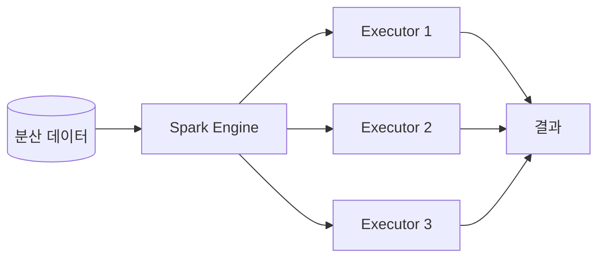
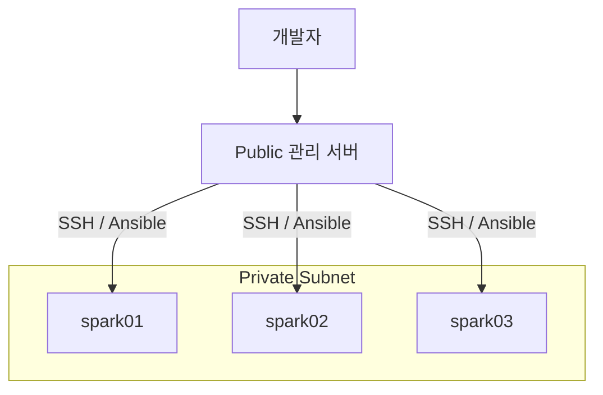
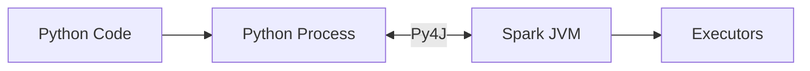
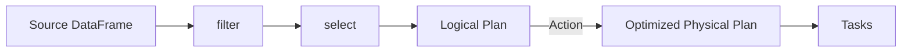
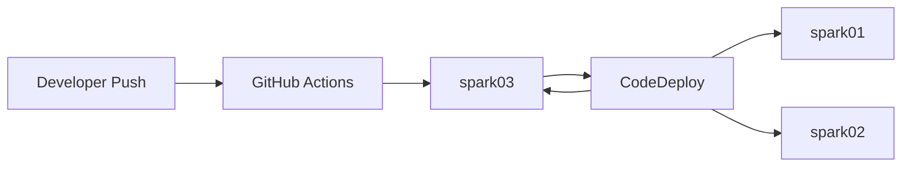
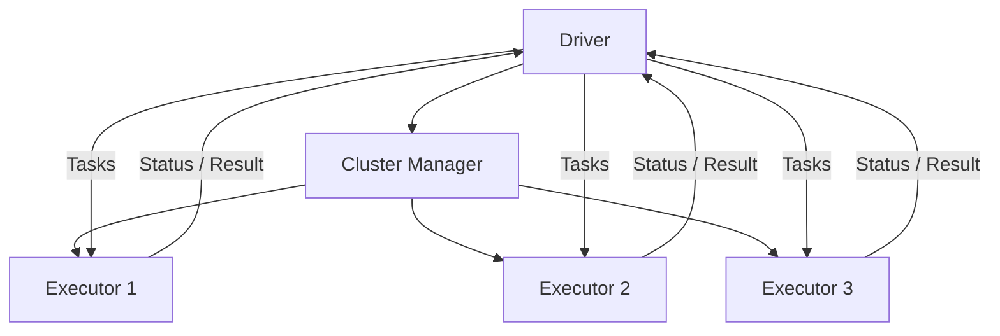
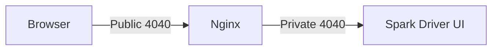

# Spark 셋업과 기초

## 학습 목표

Spark를 실행할 서버와 배포 환경을 구성하고, PySpark DataFrame으로 데이터를 표현하는 방법을 익힌다. 단순 설치를 넘어 Spark Application이 Driver에서 계획되고 Executor에서 병렬 실행되는 과정을 이해하며, `spark-submit`과 Spark UI를 이용해 실행 상태를 검증하는 것이 목표다.

## Spark란?

Apache Spark는 여러 노드의 CPU와 Memory를 이용해 데이터를 병렬 처리하는 분산 처리 Framework다.

초기 Hadoop MapReduce는 Stage 사이의 중간 결과를 Disk에 기록하는 방식이 많아 반복 연산에서 I/O 비용이 컸다. Spark는 중간 데이터를 Memory에 유지하고 DAG 기반으로 실행 계획을 구성해 반복 처리와 대화형 분석을 효율화한다.



### 주요 특징

| 특징 | 의미 |
| --- | --- |
| 분산 처리 | 데이터를 Partition으로 나눠 여러 Executor에서 병렬 처리한다 |
| 지연 실행 | Transformation을 즉시 실행하지 않고 Action 시점에 최적화된 계획을 실행한다 |
| 통합 API | Batch, SQL, Streaming, Machine Learning, Graph 처리를 같은 기반에서 제공한다 |
| 다중 언어 | Scala, Java, Python, R API를 제공한다 |
| 저장소 연동 | HDFS, Object Storage, RDBMS, Kafka 등 다양한 Source와 연결한다 |

Spark가 모든 작업을 Memory에서만 처리하는 것은 아니다. Shuffle, Spill, Cache 부족, 입력 및 출력 과정에서는 Disk와 Network I/O가 발생한다.

## Spark를 사용하는 방법

Spark 환경은 직접 구축하거나 관리형 서비스를 사용할 수 있다.

- On-premise 또는 EC2에 직접 설치
- AWS EMR
- Google Cloud Dataproc
- Azure HDInsight
- Databricks
- Kubernetes 기반 Spark

직접 설치하면 Network와 Resource 설정을 세밀하게 제어할 수 있지만 설치, Upgrade, Monitoring, 장애 복구를 직접 담당해야 한다. 관리형 서비스는 운영 부담을 줄이지만 비용 구조와 Platform 종속성을 검토해야 한다.

## 실습 아키텍처

강의에서는 Private Subnet의 EC2 세 대를 `spark01`, `spark02`, `spark03`으로 구성한다. Public Subnet의 관리 서버를 Bastion 및 Ansible 실행 지점으로 사용한다.



강의 예시는 `t3.large`, Ubuntu 24.04, 노드별 추가 20GB Volume을 사용한다. 이는 학습용 기준이며 운영 환경의 Instance Type과 Storage는 데이터 크기, 동시 Job, Executor Memory, Shuffle 양을 측정해 결정한다.

## AWS 서버 구성

### 1. EC2와 Network

세 Spark 노드를 서로 다른 Availability Zone에 배치할 수 있다. 다음 항목을 확인한다.

- 같은 VPC와 Private Network에서 노드 간 통신이 가능한가?
- Security Group은 필요한 Source와 Port만 허용하는가?
- Spark 노드에 Public IP 없이 관리 서버를 통해 접근하는가?
- IAM Role은 필요한 AWS Resource에만 접근하는가?
- Hostname과 Private DNS가 노드별로 안정적으로 해석되는가?

학습 환경에서 노드 간 모든 TCP를 열 수 있지만 운영 환경에서는 Spark RPC, Block Manager, UI, SSH 등 실제 사용 Port를 식별해 범위를 제한한다.

### 2. SSH Key

개인 Key를 관리 서버에 전송해야 한다면 권한을 제한한다.

```bash
chmod 400 private-spark.pem
ssh -i private-spark.pem ubuntu@<spark-private-ip>
```

Key 파일을 Git 저장소나 배포 Artifact에 포함하지 않는다. 운영 환경에서는 SSM Session Manager나 단기 인증 방식도 검토한다.

### 3. Ansible Inventory

```ini
[spark]
spark01 spark_no=1
spark02 spark_no=2
spark03 spark_no=3

[spark:vars]
ansible_user=ubuntu
ansible_ssh_private_key_file=/home/ec2-user/private-spark.pem
```

Inventory의 Hostname은 관리 서버에서 해석 가능해야 한다. `/etc/hosts`를 사용할 수 있지만 규모가 커지면 Private DNS를 이용하는 편이 관리하기 쉽다.

### 4. Volume과 File System

추가 Volume을 File System으로 만들고 `/data01` 같은 경로에 Mount한다.

```bash
df -h
mount | grep data01
```

Ansible Playbook은 반복 실행해도 기존 File System을 다시 만들거나 데이터를 지우지 않도록 Idempotent하게 작성해야 한다. `/etc/fstab`에는 Device 이름보다 UUID를 사용하면 재부팅 후 Device 순서 변화에 안전하다.

### 5. 공통 설정

- Hostname: `spark01`부터 `spark03`
- Timezone 통일
- `/etc/hosts` 또는 Private DNS 설정
- Java Runtime 설치 및 `JAVA_HOME` 설정
- 동일한 Spark Version과 설정 배포
- File Descriptor와 Process 제한 검토

시간대는 표시 편의를 위한 설정이고, 분산 시스템의 Clock 동기화는 별도로 NTP 상태를 확인해야 한다.

## Spark 설치

강의 실습은 Spark 3.5.1과 Hadoop 3 계열용 Binary Package를 사용한다. 아래 Version은 강의 환경을 재현하기 위한 예시이며 새 환경에서는 Java, Python, Connector의 호환성을 함께 확인한다.

```bash
curl -fLO https://archive.apache.org/dist/spark/spark-3.5.1/spark-3.5.1-bin-hadoop3.tgz
tar -xzf spark-3.5.1-bin-hadoop3.tgz
```

세 노드에 같은 경로와 Version으로 설치하고 다음 환경 변수를 설정한다.

```bash
export SPARK_HOME=/opt/spark
export PATH="$SPARK_HOME/bin:$SPARK_HOME/sbin:$PATH"
export PYSPARK_PYTHON=/usr/bin/python3
```

실제 설치 경로에 맞춰 값을 변경한다. Login Shell, systemd, CodeDeploy에서 동일한 환경 변수가 적용되는지도 확인해야 한다.

## Spark 디렉터리 구조

| 디렉터리 | 용도 |
| --- | --- |
| `bin/` | `pyspark`, `spark-shell`, `spark-sql`, `spark-submit` 등 사용자 명령 |
| `sbin/` | Standalone Master와 Worker 등 Service 관리 Script |
| `conf/` | Spark 기본 설정, Log 설정, Worker 환경 설정 |
| `jars/` | Spark Runtime과 기본 Connector JAR |
| `python/` | PySpark Python Package |
| `examples/` | 언어별 예제 Application |
| `data/` | 예제와 Test 데이터 |
| `kubernetes/` | Kubernetes 실행용 Template과 Docker 관련 파일 |
| `yarn/` | YARN 환경 지원 파일 |

`jars/`에 임의 Connector를 직접 추가하면 모든 Application에 영향을 준다. Application별 `--packages`, `--jars` 사용과 Cluster 공통 설치 중 어느 방식이 적절한지 결정한다.

## 주요 Shell 명령

| 명령 | 역할 |
| --- | --- |
| `pyspark` | Python 대화형 Shell |
| `spark-shell` | Scala 대화형 Shell |
| `spark-sql` | SQL 대화형 Interface |
| `sparkR` | R 대화형 Shell |
| `spark-submit` | 작성한 Application 제출 |
| `run-example` | 포함된 Example 실행 |

설치 확인:

```bash
spark-submit --version
pyspark
```

`pyspark` Shell에서는 `SparkContext`와 `SparkSession`이 자동 생성된다. Script를 `spark-submit`으로 실행할 때는 Application 코드에서 직접 `SparkSession`을 생성한다.

## 언어 선택

Spark Core는 Scala로 작성되고 JVM에서 실행된다. Scala와 Java Application은 Bytecode로 Compile돼 JVM에서 동작한다.

PySpark Application은 Python Process와 JVM 사이를 Py4J로 연결한다.



### Python

- 문법과 학습 곡선이 비교적 낮다.
- Pandas, NumPy, scikit-learn 등 Python 생태계와 연결하기 쉽다.
- 일반 Python UDF는 JVM과 Python 사이 직렬화 비용이 발생할 수 있다.

### Scala

- Spark의 JVM API와 직접 연결된다.
- Dataset의 Compile-time Type을 활용할 수 있다.
- Spark 내부 API와 최신 기능 접근이 빠른 경우가 있다.
- Python보다 학습 곡선이 높을 수 있다.

DataFrame의 내장 함수만 사용하는 경우 대부분의 실행 계획은 JVM의 Spark Engine에서 처리된다. 따라서 언어 이름만으로 성능을 단정하지 말고 Python UDF, Serialization, Library 요구사항을 기준으로 선택한다.

## DataFrame

Spark DataFrame은 이름과 Type을 가진 Column으로 구성된 분산 데이터다. Row는 Partition에 나뉘어 Executor에서 처리된다.

```python
from pyspark.sql import SparkSession


spark = (
    SparkSession.builder
    .appName("dataframe-example")
    .getOrCreate()
)

rows = [
    ("hong", 28, False),
    ("kim", 33, True),
]

df = spark.createDataFrame(
    rows,
    schema="name STRING, age INT, married BOOLEAN",
)

df.show()
df.printSchema()
```

### 생성 방법

- Python List, Tuple, Dictionary
- 기존 RDD
- Pandas DataFrame
- CSV, JSON, Parquet, ORC 파일
- JDBC Table
- Kafka, Elasticsearch 등 Connector

작은 Local 객체를 `createDataFrame()`에 전달하는 방식은 Test와 예제에 적합하다. 대규모 데이터를 Driver Memory에 모아 전달하면 안 된다.

## Schema 정의

### StructType

```python
from pyspark.sql.types import (
    BooleanType,
    IntegerType,
    StringType,
    StructField,
    StructType,
)


schema = StructType(
    [
        StructField("name", StringType(), nullable=False),
        StructField("age", IntegerType(), nullable=True),
        StructField("married", BooleanType(), nullable=True),
    ]
)

df = spark.createDataFrame(rows, schema=schema)
```

### DDL 문자열

```python
schema = "name STRING, age INT, married BOOLEAN"
df = spark.createDataFrame(rows, schema=schema)
```

StructType은 복잡한 중첩 Schema와 Metadata를 코드로 다루기 좋고, DDL 문자열은 짧고 읽기 쉽다. 어느 방식이든 이름, Type, Null 허용 여부를 명시하면 자동 추론보다 오류를 일찍 발견하고 일관된 결과를 얻을 수 있다.

기존 DataFrame의 Schema도 재사용할 수 있다.

```python
new_df = spark.createDataFrame(new_rows, schema=df.schema)
```

## DataFrame은 지연 실행된다

Transformation은 새로운 DataFrame의 실행 계획을 만들 뿐 즉시 전체 데이터를 계산하지 않는다.

```python
adults = df.filter(df.age >= 20).select("name", "age")
```

`filter()`와 `select()`는 Transformation이다. `show()`, `count()`, `collect()`, 파일 쓰기 같은 Action이 호출되면 실제 Job이 시작된다.



지연 실행 덕분에 Spark는 Column Pruning, Predicate Pushdown, 연산 결합 등 전체 계획을 최적화할 수 있다.

## RDD, DataFrame, Dataset

| 항목 | RDD | DataFrame | Dataset |
| --- | --- | --- | --- |
| 추상화 | 분산 객체 Collection | Schema가 있는 Row | Type이 있는 분산 객체 |
| 최적화 | 사용자가 세부 연산 관리 | Catalyst/Tungsten 최적화 | DataFrame 최적화 + Type |
| API 수준 | 저수준 | 고수준 | 고수준 |
| 주요 언어 | Scala, Java, Python | Scala, Java, Python, R | Scala, Java |

DataFrame과 Dataset은 내부적으로 RDD 위에 구축되지만 대부분의 일반적인 ETL과 분석은 DataFrame API를 우선한다. RDD는 Custom Partition 처리처럼 고수준 API로 표현하기 어려운 경우에 제한적으로 사용한다.

Python에서는 별도의 Typed Dataset API 없이 DataFrame을 사용한다.

## Pandas DataFrame과 Spark DataFrame

| 기준 | Pandas | Spark |
| --- | --- | --- |
| 실행 위치 | 일반적으로 단일 Process Memory | 여러 Executor에 분산 |
| 실행 방식 | 대부분 즉시 실행 | 지연 실행 |
| 변경 | 일부 In-place 작업 가능 | Transformation마다 새 DataFrame 반환 |
| Index | 명시적 Index 제공 | Pandas와 같은 Row Index 없음 |
| SQL 최적화 | 제한적 | Catalyst Optimizer 사용 |
| 적합한 데이터 | 한 Machine Memory에 맞는 데이터 | 대규모 분산 데이터 |

`toPandas()`는 Spark 데이터를 Driver로 모두 가져오므로 결과가 Driver Memory에 들어갈 때만 사용한다.

```python
sample = df.limit(1000).toPandas()
```

## Application 배포 환경

강의에서는 별도 `pyspark-apps` 저장소의 변경을 GitHub Actions로 Packaging하고, S3와 CodeDeploy를 이용해 Spark 세 노드에 배포한다.



### 배포 구성 요소

- GitHub Repository와 Workflow
- Artifact를 저장할 S3 Prefix
- CodeDeploy Application과 Deployment Group
- Spark EC2의 IAM Instance Profile
- CodeDeploy Agent
- `appspec.yml`과 Lifecycle Hook Script

### 권장 Repository 구조

```text
pyspark-apps/
├── .github/
│   └── workflows/
│       └── deploy.yml
├── deploy/
│   └── after_install.sh
├── lessons/
│   └── ch8_6/
│       └── simple_pyspark.py
├── appspec.yml
└── requirements.txt
```

### 배포 흐름

1. Workflow가 Source와 배포 파일을 Archive한다.
2. Artifact를 S3의 Spark Application 전용 경로에 업로드한다.
3. CodeDeploy Deployment를 생성한다.
4. 각 EC2의 Agent가 Artifact를 내려받는다.
5. `appspec.yml`에 따라 파일을 배치하고 Hook을 실행한다.
6. 배포 결과와 Application 실행 여부를 검증한다.

Producer, Consumer, Spark Application은 배포 경로와 CodeDeploy Deployment Group을 분리한다. 하나의 배포가 다른 Application 파일을 삭제하거나 재시작하지 않도록 소유 경계를 명확히 한다.

## AWS 권한과 Secret

강의 실습에서는 GitHub Secret에 Access Key를 등록하지만 운영 환경에서는 GitHub OIDC로 단기 AWS Role을 사용하는 방식을 우선한다.

- Spark EC2 Role: S3 Artifact 읽기와 CodeDeploy 작업에 필요한 최소 권한
- GitHub Role: 지정된 S3 Prefix Upload와 Deployment 생성 권한
- CodeDeploy Service Role: 대상 Instance에 배포를 조정할 권한

Access Key CSV, PEM Key, Secret 값을 저장소나 Artifact에 넣지 않는다. 노출된 Key는 코드에서 삭제하는 것만으로 부족하며 즉시 폐기하고 재발급해야 한다.

## CodeDeploy Agent 검증

```bash
sudo systemctl status codedeploy-agent
sudo tail -n 100 /var/log/aws/codedeploy-agent/codedeploy-agent.log
```

배포별 상세 Log는 CodeDeploy Agent의 Deployment Root 아래에서 확인한다. 정확한 경로는 Agent Version과 OS 설정에 따라 달라질 수 있다.

### 배포 실패 점검 순서

1. GitHub Actions Packaging과 S3 Upload 성공 여부
2. S3 Bucket 및 Key 경로
3. CodeDeploy Deployment Event
4. EC2 Tag와 Deployment Group 대상 일치 여부
5. CodeDeploy Agent 상태
6. IAM Role과 S3 권한
7. `appspec.yml` 경로와 YAML 문법
8. Hook Script 실행 권한과 Exit Code
9. EC2의 Agent 및 Application Log

## Local 개발 환경

Application 전용 Virtual Environment를 만든다.

```bash
python -m venv spark_venv

# Linux/macOS
source spark_venv/bin/activate

# Windows PowerShell
spark_venv\Scripts\Activate.ps1
```

Local Machine에 Spark가 설치돼 있지 않다면 개발과 Test를 위해 같은 Version의 PySpark를 설치한다.

```bash
python -m pip install pyspark==3.5.1
```

Server에서는 `$SPARK_HOME/python`과 필요한 Py4J Library가 `spark-submit` 실행 시 Python Path에 추가된다. 실행 방식이 다르면 `pyspark` Package가 보이지 않을 수 있으므로 일반 `python app.py`와 `spark-submit app.py`를 구분한다.

## Spark Application 작성

```python
from pyspark.sql import SparkSession


def main():
    spark = (
        SparkSession.builder
        .appName("simple-pyspark")
        .getOrCreate()
    )

    try:
        schema = "name STRING, age INT, married BOOLEAN"
        df = spark.createDataFrame(
            [("hong", 28, False), ("kim", 33, True)],
            schema=schema,
        )
        df.show()
    finally:
        spark.stop()


if __name__ == "__main__":
    main()
```

`SparkSession`은 DataFrame 생성과 파일·Kafka·JDBC Source 접근의 시작점이다. 내부적으로 SparkContext와 SQL 관련 기능에 접근한다.

## `spark-submit`

작성한 Script는 다음과 같이 제출한다.

```bash
spark-submit lessons/ch8_6/simple_pyspark.py
```

명시하지 않은 설정은 `spark-defaults.conf`, 환경 변수, Cluster Manager 기본값에서 결정된다.

```bash
spark-submit \
  --master local[*] \
  --name simple-pyspark \
  --driver-memory 1g \
  lessons/ch8_6/simple_pyspark.py
```

실제 Cluster에서는 `--master`에 Standalone, YARN, Kubernetes 등의 주소를 사용한다. Application 코드에 Master URL과 Resource 값을 고정하지 않고 제출 환경에서 주입하는 편이 재사용하기 쉽다.

## Driver

Driver는 Spark Application의 중심 Process다. Python Application에서도 Spark 실행을 조정하는 JVM Driver가 생성되고 Python Process와 통신한다.

### 주요 역할

1. 사용자 코드와 SparkSession을 실행한다.
2. DataFrame Transformation으로 Logical Plan을 만든다.
3. Action이 호출되면 Job을 생성한다.
4. Job을 Stage와 Task로 나눈다.
5. Cluster Manager에 Executor Resource를 요청한다.
6. Task를 Executor에 배정하고 진행 상황을 추적한다.
7. 결과와 Metric을 수집한다.

Driver가 중단되면 일반적으로 Application 전체가 종료된다. Driver Memory에는 실행 계획, Task Metadata, Broadcast 변수, `collect()` 결과 등이 들어가므로 모든 데이터를 Driver로 가져오는 코드를 피한다.

## Executor

Executor는 Worker Node에서 Application의 Task를 실행하는 Process다.

- Partition 단위 Task 실행
- Shuffle 데이터 읽기와 쓰기
- Cache/Persist 데이터 보관
- 실행 결과와 Metric을 Driver에 보고

Executor는 Application별로 생성된다. 다른 Spark Application의 Executor와 Process 및 Memory를 공유하지 않는다.



## Job, Stage, Task

```text
Application
└── Job               Action마다 생성 가능
    ├── Stage         Shuffle 경계로 분리
    │   ├── Task      Partition 하나를 처리
    │   └── Task
    └── Stage
        ├── Task
        └── Task
```

- **Application:** 하나의 Driver와 여러 Executor로 이루어진 전체 실행
- **Job:** `count()`, `show()`, Write 같은 Action이 촉발한 계산
- **Stage:** 서로 이어서 실행할 수 있는 Task 묶음
- **Task:** Partition 하나에 적용되는 최소 실행 단위

Task 수는 일반적으로 처리 대상 Partition 수와 연관된다. CPU Core보다 Task가 너무 적으면 병렬성을 활용하지 못하고, 지나치게 많은 작은 Task는 Scheduling Overhead를 늘린다.

## Spark UI

Spark UI는 Application별 Job, Stage, Task, Storage, SQL, Executor 상태를 보여준다.

기본적으로 Driver Host의 `4040`에서 시작하며 이미 사용 중이면 `4041`, `4042`처럼 다음 Port를 선택할 수 있다.

| 화면 | 확인 내용 |
| --- | --- |
| Jobs | Job 상태와 Action별 실행 시간 |
| Stages | Shuffle, Task 분포, 실패와 재시도 |
| Storage | Cache된 RDD/DataFrame과 Memory 사용량 |
| SQL/DataFrame | Query Plan과 Operator별 Metric |
| Executors | Executor별 Task, Memory, GC, Shuffle I/O |
| Environment | 적용된 Spark 설정과 Classpath |

Spark UI는 실행 중인 Driver가 제공하므로 Application이 종료되면 사라진다. 종료된 Application의 기록을 보려면 Event Log와 Spark History Server를 구성해야 한다.

### UI 접근 보안

강의 환경에서는 Public 관리 서버의 Nginx가 Private Spark Driver의 UI를 Proxy한다.



운영 환경에서는 `4040-4044`를 인터넷 전체에 공개하지 않는다. Spark UI에는 Query, File 경로, 환경 변수, Host 정보가 노출될 수 있다. VPN, SSM Port Forwarding, SSH Tunnel 또는 인증 Proxy를 사용한다.

Port 번호는 Application 시작 순서에 따라 바뀔 수 있으므로 고정된 Job과 Port 매핑으로 간주하지 않는다.

## 실행 모드

### Local Mode

Driver와 실행 Thread가 한 Machine에서 동작한다.

```bash
spark-submit --master local[*] app.py
```

- 개발과 기능 Test에 적합하다.
- 실제 Cluster의 Network, Shuffle, Executor 장애를 재현하지 못한다.

### Cluster Mode

Cluster Manager가 여러 Worker Node의 Resource를 할당하고 Executor를 실행한다.

- 병렬 처리와 수평 확장이 가능하다.
- Executor 장애 시 Task를 다른 Executor에서 재시도할 수 있다.
- Resource, Network, Dependency 배포를 함께 관리해야 한다.

## Cluster Manager

Spark는 계산 Engine이며 Resource 할당은 Cluster Manager가 담당한다.

| Cluster Manager | 특징 |
| --- | --- |
| Standalone | Spark에 포함된 단순한 전용 Cluster Manager |
| YARN | Hadoop 생태계의 Resource Manager |
| Kubernetes | Pod와 Container 단위로 Driver와 Executor 실행 |

강의 자료에는 Mesos도 비교 대상으로 등장하지만 지원 여부는 사용하는 Spark Version의 공식 문서를 확인해야 한다. 새로운 환경에서는 현재 Version이 지원하는 Manager를 기준으로 선택한다.

### Driver와 Cluster Manager의 관계

1. Driver가 Application에 필요한 Executor Resource를 요청한다.
2. Cluster Manager가 사용 가능한 Worker에 Executor를 배치한다.
3. Executor가 Driver에 등록한다.
4. Driver가 Executor에 Task를 직접 전달한다.

Cluster Manager가 DataFrame Query를 실행하는 것은 아니다. Resource 배치가 끝나면 Task Scheduling과 실행 조정은 Driver가 담당한다.

## Cluster 환경의 장점과 한계

### 장점

- 여러 Executor를 이용한 병렬 처리
- 데이터와 부하 증가에 따른 수평 확장
- Executor 실패 시 Task 재실행
- 대규모 데이터의 분산 Cache와 Shuffle

### 고려사항

- Driver는 여전히 Application의 단일 조정 지점이다.
- Network Shuffle은 주요 병목이 될 수 있다.
- 데이터 쏠림은 일부 Task만 오래 실행되게 한다.
- Python Package와 JAR을 모든 Executor에서 사용할 수 있어야 한다.
- Executor Memory와 CPU를 크게 설정한다고 항상 성능이 좋아지지는 않는다.

## 단계별 검증

### 1. 서버

```bash
hostname
java -version
python3 --version
df -h /data01
```

### 2. Spark 설치

```bash
spark-submit --version
pyspark --version
```

### 3. DataFrame

```python
df.show()
df.printSchema()
df.explain(mode="formatted")
```

### 4. Application

```bash
spark-submit lessons/ch8_6/simple_pyspark.py
```

### 5. UI

- Jobs에 Action이 나타나는가?
- Stage와 Task 수가 예상한 Partition 수와 맞는가?
- Executor가 정상 등록됐는가?
- 실패한 Task와 Shuffle Read/Write가 있는가?

### 6. 배포

- 세 Spark 노드에 같은 Revision이 배포됐는가?
- Artifact에 Secret과 불필요한 Virtual Environment가 포함되지 않았는가?
- CodeDeploy Hook이 재실행돼도 안전한가?

## 장애 점검표

| 증상 | 우선 확인할 항목 |
| --- | --- |
| `pyspark` 명령을 찾지 못함 | `SPARK_HOME`, `PATH`, 설치 경로 |
| `JAVA_HOME` 오류 | Java 설치와 지원 Version, 환경 변수 |
| Python에서 `pyspark` Import 실패 | `spark-submit` 사용 여부, Virtual Environment Package |
| Spark UI 접속 불가 | Driver 실행 여부, 실제 UI Port, Security Group, Nginx |
| Executor가 등록되지 않음 | Cluster Manager, Driver 주소, Network와 DNS |
| Job이 한 Node에서만 실행 | `--master` 값, Local Mode 여부 |
| `collect()`에서 Driver 종료 | 결과 크기와 Driver Memory |
| 일부 Task만 오래 실행 | Partition 크기, Data Skew, Shuffle |
| CodeDeploy 실패 | Agent, IAM, S3, EC2 Tag, Hook Log |
| 노드별 결과가 다름 | Spark/Python/JAR Version과 설정 불일치 |

## 운영 환경 보완 사항

- Spark 설치와 설정을 Ansible 또는 Image로 Version 관리한다.
- Spark Event Log와 History Server를 구성한다.
- Metric을 Prometheus 등 Monitoring 시스템으로 수집한다.
- Application별 Driver 및 Executor Resource 한도를 정한다.
- Dynamic Allocation 사용 시 Shuffle Service 또는 지원 방식을 검토한다.
- S3, Kafka, JDBC 인증 정보를 Secret Manager에서 실행 시 주입한다.
- UI와 Cluster 관리 Port를 Private Network에 제한한다.
- 배포 전 작은 데이터로 Smoke Test를 실행한다.
- DataFrame Schema와 입력 데이터 품질을 검증한다.
- Driver와 Executor Log를 중앙 저장소에 모은다.

## 핵심 정리

- Spark는 DAG와 지연 실행을 이용해 분산 데이터 처리를 계획하고 최적화한다.
- Spark DataFrame은 Schema를 가진 분산 데이터이며 Pandas DataFrame과 실행 방식이 다르다.
- PySpark의 DataFrame 내장 연산은 JVM Spark Engine에서 실행되며 Python UDF는 별도 비용이 발생할 수 있다.
- 대화형 `pyspark`는 Session을 자동 생성하지만 `spark-submit` Script는 직접 생성해야 한다.
- Driver는 실행 계획과 Task를 조정하고 Executor는 Partition 단위 Task를 수행한다.
- Cluster Manager는 Resource를 할당하며 Query를 직접 실행하지 않는다.
- Spark UI의 4040번대 Port는 Application마다 동적으로 정해질 수 있다.
- 배포 자동화는 Source 전달뿐 아니라 IAM, Agent, Hook, Version 일치를 함께 검증해야 한다.

## 스스로 확인하기

- Spark가 MapReduce보다 반복 연산에 유리한 이유는 무엇인가?
- PySpark DataFrame 내장 함수와 일반 Python UDF의 실행 경로는 어떻게 다른가?
- DataFrame Transformation을 호출해도 즉시 Job이 실행되지 않는 이유는 무엇인가?
- Pandas DataFrame을 Spark DataFrame처럼 사용하면 어떤 문제가 생길 수 있는가?
- Driver와 Executor는 각각 어떤 책임을 가지는가?
- `spark-submit`에서 `--master local[*]`를 사용하면 세 EC2 Cluster가 사용되는가?
- Spark UI가 4040이 아닌 4041에서 열릴 수 있는 이유는 무엇인가?
- Cluster Manager와 Driver의 Task Scheduling 역할은 어떻게 다른가?
