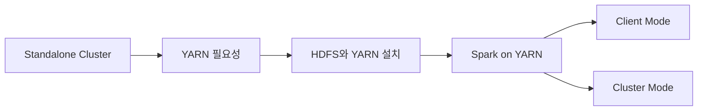
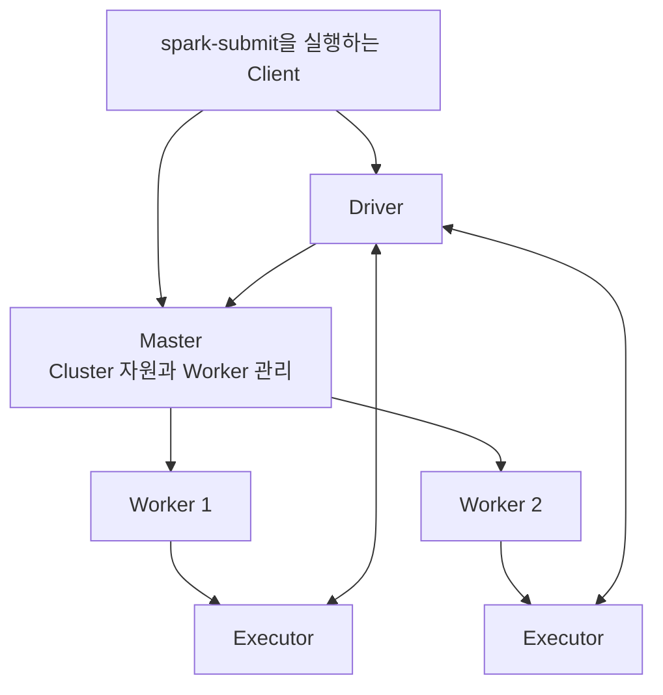
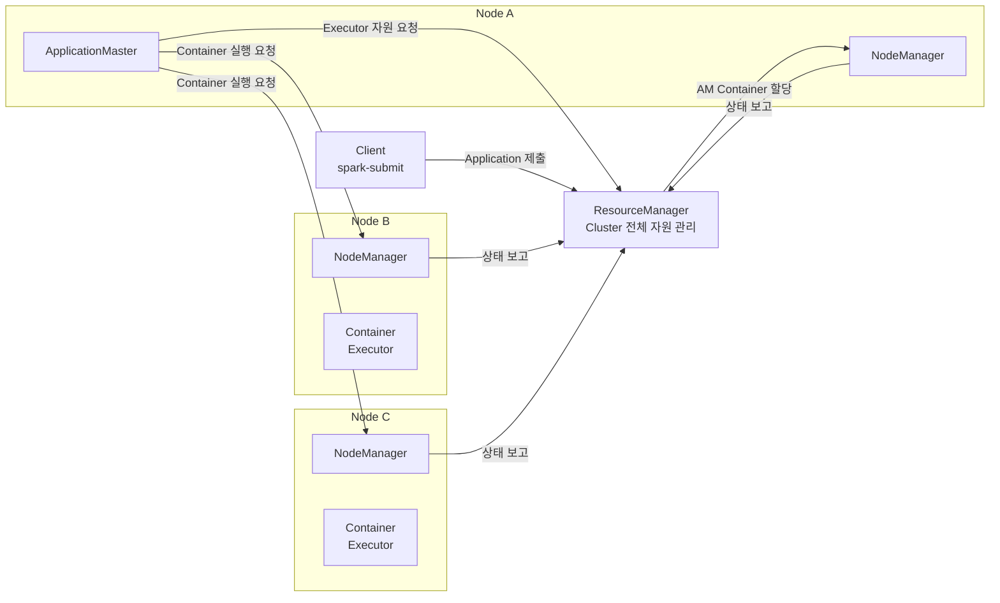
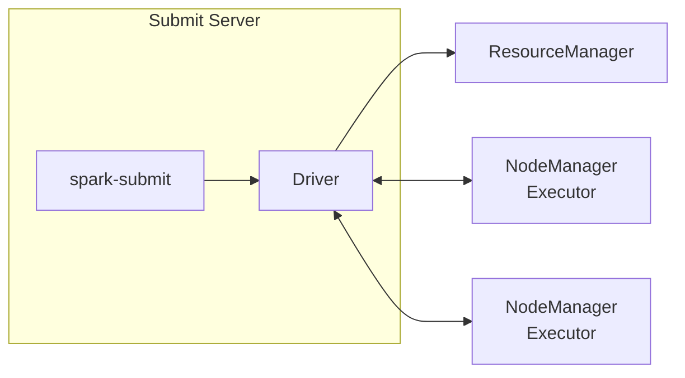
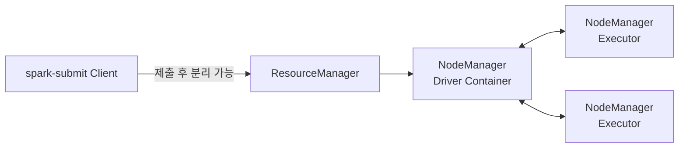

# 🧩 Spark Cluster 구성

## 🎯 학습 목표

이번 장에서는 Spark Application을 여러 서버에서 실행하기 위한 Cluster 환경을 구성한다. Spark 자체 Cluster Manager인 **Standalone**을 먼저 사용해 기본 구조를 이해하고, 이어서 **Hadoop YARN**이 자원을 배분하는 방식과 Spark on YARN의 실행 흐름을 학습한다.

학습이 끝나면 다음 내용을 설명할 수 있어야 한다.

- Spark Master, Worker, Driver, Executor의 역할과 관계
- Standalone Cluster의 구성 방법과 한계
- YARN의 ResourceManager, NodeManager, ApplicationMaster, Container 역할
- HDFS HA와 YARN HA를 구성하는 주요 프로세스
- Spark Application을 YARN에 제출하고 상태를 확인하는 방법
- Client Mode와 Cluster Mode의 차이 및 선택 기준
- Executor 수와 Memory 같은 Spark 설정의 적용 우선순위

---

## 🗺️ 전체 학습 흐름



| 단계 | 핵심 질문 |
| --- | --- |
| Standalone | Spark 자체 기능만으로 Cluster를 어떻게 구성하는가? |
| YARN 이해 | 여러 종류의 Application이 Cluster 자원을 어떻게 공유하는가? |
| Hadoop/YARN 설치 | ResourceManager와 HDFS를 어떻게 안정적으로 운영하는가? |
| Spark on YARN | Spark의 Driver와 Executor가 YARN 위에서 어떻게 실행되는가? |
| 배포 모드 | Driver를 제출 서버와 Cluster 중 어디에서 실행할 것인가? |

---

## 1. Spark Standalone Cluster

### Standalone의 의미

Standalone은 Spark를 서버 한 대에서 실행한다는 뜻이 아니다. Spark에 내장된 전용 Cluster Manager를 사용한다는 의미다. 별도의 YARN이나 Kubernetes 없이 Spark만으로 Master와 Worker를 구성할 수 있다.



| 구성 요소 | 역할 |
| --- | --- |
| Master | Worker와 Application의 자원 사용 현황을 관리한다. 실제 데이터 연산을 직접 수행하는 프로세스는 아니다. |
| Worker | CPU와 Memory를 Cluster에 제공하고 Executor 또는 Driver 프로세스를 실행한다. |
| Driver | Application의 진입점이다. 실행 계획을 만들고 Task를 Executor에 전달한다. |
| Executor | 할당된 Task를 수행하고 필요하면 데이터를 Cache한다. Application별로 생성된다. |

Master/Worker를 시작했다고 Driver와 Executor가 즉시 생기지는 않는다. 두 프로세스는 Application을 제출했을 때 생성된다.

### 실습 구조

| 서버 | Standalone 역할 |
| --- | --- |
| `spark01` | Master, Application 제출 노드 |
| `spark02` | Worker |
| `spark03` | Worker |

Master와 Worker는 논리적인 역할이다. 자원이 충분하다면 한 서버에서 두 역할을 함께 수행할 수도 있지만, 운영 환경에서는 Master의 안정성과 Worker의 연산 부하를 고려해 분리 여부를 결정한다.

### Master 시작

`spark01`에서 다음 스크립트를 실행한다.

```bash
cd "$SPARK_HOME/sbin"
./start-master.sh
```

별도의 Host 옵션을 주지 않으면 명령을 실행한 서버가 Master가 된다. 시작 후 다음 정보를 확인한다.

- Master Web UI: `http://spark01:8080`
- Application이 접속할 Master URL: `spark://spark01:7077`

`8080`은 사람이 상태를 확인하는 HTTP 포트이고, `7077`은 Spark Client와 Worker가 Master에 연결하는 포트다. 용도가 다르므로 혼동하지 않는다.

### Worker 시작

`spark02`, `spark03`에서 Master URL을 인자로 Worker를 실행한다.

```bash
cd "$SPARK_HOME/sbin"
./start-worker.sh spark://spark01:7077
```

실행 후 Master UI의 Workers 목록에서 두 Worker가 등록되었는지 확인한다. 목록에 없다면 다음 항목을 점검한다.

1. Worker가 `spark01` Hostname을 해석할 수 있는가?
2. Worker에서 Master의 `7077` 포트에 접근할 수 있는가?
3. Master와 Worker의 Spark 버전 및 Java 환경이 호환되는가?
4. Worker 로그에 등록 실패 메시지가 있는가?

### Application 제출

```bash
cd /src/pyspark-apps/lesson/ch8_6
spark-submit \
  --master spark://spark01:7077 \
  simple_pyspark.py
```

`--master`는 자원을 요청할 Cluster Manager를 지정한다. 이 값이 없거나 `local[*]`로 설정되어 있으면 Standalone Cluster를 만들었더라도 Local Mode로 실행될 수 있다.

### 두 가지 Web UI 구분

| 기본 포트 | UI | 수명 | 확인 내용 |
| --- | --- | --- | --- |
| `8080` | Standalone Master UI | Master가 실행되는 동안 유지 | Worker, CPU·Memory, 실행/완료 Application |
| `4040` | Spark Application UI | Driver가 실행되는 동안 유지 | Job, Stage, Task, Executor, Storage, SQL |

Application이 동시에 여러 개 실행되면 Driver UI는 `4040`, `4041`, `4042`처럼 사용 가능한 다음 포트를 선택한다. Application이 종료되면 Driver 프로세스와 해당 UI도 종료된다. 반면 Master UI에는 완료된 Application 기록이 남을 수 있다.

### Resource 옵션 예시

```bash
spark-submit \
  --master spark://spark03:7077 \
  --driver-cores 1 \
  --total-executor-cores 2 \
  standalone.py
```

- `--driver-cores`: Driver가 사용할 CPU Core 수
- `--total-executor-cores`: Standalone Application 전체 Executor가 사용할 총 Core 수
- Executor가 어느 Worker에 배치될지는 가용 자원과 Scheduler의 판단에 따라 달라진다.

같은 명령을 반복해도 Executor의 배치 서버가 항상 같다는 보장은 없다. 서버 위치를 예측하는 것보다 필요한 자원이 확보됐는지, Task가 고르게 처리되는지를 UI에서 확인하는 것이 중요하다.

### Standalone의 장점과 한계

**장점**

- 외부 Cluster Manager 없이 빠르게 구성할 수 있다.
- Spark만 사용하는 소규모 환경이나 기능 검증에 적합하다.
- Master와 Worker 구조를 이해하기 쉽다.

**한계**

- Spark 외의 분산 Application과 자원을 통합 관리하기 어렵다.
- 대규모 운영에 필요한 정책과 생태계 통합 측면에서 YARN이나 Kubernetes보다 선택지가 적다.
- Standalone에서는 Python Application의 Cluster Deploy Mode를 지원하지 않는다. PySpark Driver를 Cluster 안에서 실행하려면 YARN 또는 Kubernetes 같은 Manager를 고려해야 한다.

---

## 2. YARN이 필요한 이유

### 기존 MapReduce 구조의 문제

초기 Hadoop MapReduce의 JobTracker는 다음 책임을 함께 담당했다.

- Cluster 전체 자원 관리와 Scheduling
- 개별 MapReduce Job의 실행 상태 관리

Cluster 규모와 Job 수가 커질수록 단일 프로세스의 책임과 부하가 증가했다. 또한 MapReduce 전용 관리 구조로는 Spark, Hive 등 다른 처리 Engine과 같은 Cluster 자원을 공유하기 어려웠다.

YARN은 이 문제를 해결하기 위해 **Cluster 자원 관리**와 **Application 실행 관리**를 분리한다.

### YARN 핵심 구성 요소



| YARN 구성 요소 | 역할 | Spark와 연결해서 이해하기 |
| --- | --- | --- |
| ResourceManager | Cluster 전체의 CPU와 Memory를 관리하고 자원 할당을 조정한다. | Spark Application이 필요한 Container를 할당받도록 중재한다. |
| NodeManager | 각 Worker 서버의 자원과 Container 상태를 관리한다. | Driver 또는 Executor Container를 실제로 실행한다. |
| ApplicationMaster | 하나의 Application 실행과 자원 요청을 관리한다. | Spark on YARN에서는 배포 모드에 따라 Driver와 밀접하게 동작한다. |
| Container | CPU, Memory 등 한정된 자원을 부여받은 실행 단위다. | Driver 또는 Executor 프로세스가 실행되는 공간이다. |

> Container는 Docker Container와 같은 개념이 아니다. YARN이 CPU와 Memory를 할당하고 Process 실행을 관리하는 논리적 자원 단위다.

### YARN Application 실행 흐름

1. Client가 ResourceManager에 Application을 제출한다.
2. ResourceManager가 ApplicationMaster를 실행할 Container를 배정한다.
3. ApplicationMaster가 Job에 필요한 자원을 ResourceManager에 요청한다.
4. 자원을 할당받으면 각 NodeManager에 Container 실행을 요청한다.
5. Container 안에서 실제 Task가 수행된다.
6. NodeManager와 ApplicationMaster가 실행 상태를 보고한다.
7. 작업 완료 후 Container를 정리하고 Application을 종료한다.

YARN은 Spark뿐 아니라 MapReduce, Hive 계열 작업 등 여러 Application이 한 Cluster의 자원을 공유할 수 있게 한다. 실제 운영에서는 Queue, 사용자별 제한, 우선순위, 자원 총량 등을 함께 설계해야 한다.

---

## 3. Hadoop과 YARN Cluster 구성

### 실습용 배치

실습에서는 비용과 서버 수를 줄이기 위해 세 Spark 서버에 여러 역할을 함께 배치한다.

| 서버 | 주요 프로세스 |
| --- | --- |
| `spark01` | Spark, ResourceManager, NodeManager, NameNode, JournalNode, ZKFC, DataNode, ZooKeeper |
| `spark02` | Spark, ResourceManager, NodeManager, NameNode, JournalNode, ZKFC, DataNode, ZooKeeper |
| `spark03` | Spark, NodeManager, JournalNode, DataNode, ZooKeeper |

운영 환경에서는 Master 계열 서비스와 데이터 처리 계열 서비스를 분리하는 경우가 많다. 다만 정답이 하나인 것은 아니며 데이터 규모, 장애 허용 수준, 운영 인력과 비용을 기준으로 결정한다.

### HA 관련 프로세스

| 프로세스 | 역할 |
| --- | --- |
| NameNode | HDFS 파일과 Block의 Metadata를 관리한다. Active와 Standby로 구성할 수 있다. |
| DataNode | 실제 HDFS Block을 저장한다. |
| JournalNode | Active NameNode의 변경 내역을 공유 저장해 Standby가 상태를 따라가게 한다. 일반적으로 홀수 개로 구성한다. |
| ZooKeeper | 분산 Coordination 정보를 관리한다. |
| ZKFC | NameNode 상태를 감시하고 ZooKeeper를 이용해 자동 Failover를 조정한다. |
| ResourceManager | YARN의 자원을 총괄한다. Active/Standby HA 구성이 가능하다. |
| NodeManager | 각 서버에서 Container를 실행하고 자원 사용 상태를 보고한다. |

### 네트워크와 Web 포트

실습 구성에서는 관리 서버의 Reverse Proxy와 Security Group에 다음 포트가 필요할 수 있다.

| 포트 | 용도 |
| --- | --- |
| `50070` | 강의 실습 구성의 HDFS NameNode Web UI |
| `8088` | YARN ResourceManager Web UI |
| `8188` | YARN Timeline Service 관련 포트 |
| `19888` | MapReduce JobHistory Server 관련 포트 |

포트 번호는 Hadoop 버전과 설정에 따라 다를 수 있다. 특히 최신 Hadoop의 NameNode UI 기본 포트는 구성에 따라 `9870`을 사용하는 경우가 있으므로, 강의 값만 외우지 말고 실제 XML 설정과 Listening Port를 확인한다.

운영 환경에서는 관리 UI를 인터넷 전체에 공개하지 않는다. Bastion, VPN, 사내망, 인증 Proxy와 최소 범위의 Security Group 규칙을 사용한다.

### 설치 버전

강의 실습 기준은 다음과 같다.

- Apache Spark `3.5.1` Hadoop 3 배포판
- Apache Hadoop `3.3.6`
- Apache ZooKeeper `3.8.4`

버전은 실습 재현을 위한 기준이다. 새 환경에서는 Java 호환성, 보안 수정, Spark와 Hadoop의 Binary 호환성을 확인한 후 결정한다.

### 주요 설정 파일

Hadoop 설치 경로가 `/engine/hadoop-3.3.6`이라면 설정은 주로 `etc/hadoop` 아래에 있다.

| 파일 | 주요 목적 |
| --- | --- |
| `hadoop-env.sh` | Java 경로와 Hadoop Daemon 환경 변수 |
| `core-site.xml` | 기본 FileSystem URI, 공통 I/O와 ZooKeeper 관련 설정 |
| `hdfs-site.xml` | NameNode/DataNode, JournalNode, HDFS HA와 복제 설정 |
| `yarn-site.xml` | ResourceManager HA, NodeManager, Resource 계산과 YARN 서비스 설정 |
| `mapred-site.xml` | MapReduce 실행 Framework와 JobHistory 관련 설정 |

파일 이름을 암기하는 것보다 설정의 소유권을 구분하는 것이 중요하다. HDFS 문제는 `hdfs-site.xml`, YARN Scheduling과 NodeManager 문제는 `yarn-site.xml`, 공통 FileSystem 연결 문제는 `core-site.xml`부터 확인한다.

### ZooKeeper와 Hadoop 설치 자동화

강의 환경은 관리 서버에서 Ansible Playbook을 실행해 세 노드의 설치와 설정을 통일한다.

```bash
cd ~/ansible_playbooks/ch9_3
ansible-playbook install_zookeeper.yml
ansible-playbook setting_zookeeper.yml
ansible-playbook start_zookeeper-service.yml

ansible-playbook install_hadoop.yml
ansible-playbook setting_hadoop.yml
```

자동화 전후에 다음을 확인한다.

- Inventory의 Hostname과 Private IP가 실제 서버와 일치하는가?
- 설치 Archive가 예상 버전이며 손상되지 않았는가?
- Java와 환경 변수 설정이 모든 노드에 동일한가?
- 설정 파일 Template의 Node ID와 경로가 노드별로 올바른가?
- Data와 Log Directory의 소유자 및 여유 공간이 적절한가?

### HDFS 최초 초기화 순서

HDFS HA의 최초 구성은 순서가 중요하다. 아래 작업은 **새 Cluster를 처음 초기화할 때** 수행하는 절차이며, 운영 중인 NameNode에 Format 명령을 다시 실행하면 Metadata를 잃을 수 있다.

#### 1단계: JournalNode 시작

세 서버에서 각각 실행한다.

```bash
hdfs --daemon start journalnode
```

#### 2단계: 첫 NameNode 초기화

`spark01`에서 Active 후보 NameNode를 초기화한다.

```bash
hdfs namenode -format
hdfs namenode -initializeSharedEdits -force
hdfs zkfc -formatZK -force
hdfs --daemon start namenode
```

`-format`과 `-force`는 파괴적인 결과를 낼 수 있다. 기존 Cluster에서는 실행 전에 목적, 대상 Directory, Backup과 현재 NameNode 상태를 반드시 확인한다.

#### 3단계: Standby NameNode Bootstrap

`spark02`에서 Active의 Metadata를 받아 Standby를 구성한다.

```bash
hdfs namenode -bootstrapStandby -force
hdfs --daemon start namenode
```

강의 자료의 일부 표현처럼 이를 Secondary NameNode라고 부르면 역할을 혼동할 수 있다. HA 구성에서 `spark02`는 **Standby NameNode**다. Secondary NameNode는 Checkpoint를 만드는 별도 역할이며 Active를 자동 대체하는 Standby와 다르다.

#### 4단계: ZKFC 시작

두 NameNode 서버에서 실행한다.

```bash
hdfs --daemon start zkfc
```

#### 5단계: DataNode 시작

세 서버에서 실행한다.

```bash
hdfs --daemon start datanode
```

#### 6단계: 상태 검증

```bash
hdfs dfsadmin -report
hdfs haadmin -getAllServiceState
```

확인할 내용:

- DataNode 세 대가 모두 Live 상태인가?
- NameNode 하나만 Active이고 다른 하나는 Standby인가?
- HDFS 총 용량과 사용 가능 용량이 예상과 일치하는가?
- Under-replicated Block이나 Missing Block이 없는가?

초기 구성이 끝나면 다음 Script로 HDFS 전체를 시작하거나 종료할 수 있다.

```bash
start-dfs.sh
stop-dfs.sh
```

### YARN 시작과 HA 확인

HDFS가 정상인 상태에서 YARN을 시작한다.

```bash
start-yarn.sh
```

ResourceManager HA 상태를 확인한다.

```bash
yarn rmadmin -getServiceState rm1
yarn rmadmin -getServiceState rm2
```

정상 상태라면 하나는 `active`, 다른 하나는 `standby`여야 한다. Active ResourceManager의 Web UI는 실습 기준 `http://spark01:8088/ui2` 또는 `http://spark02:8088/ui2`에서 확인한다.

### 시작 순서 요약


구성 자동화 이후 재시작에서는 제품 Script와 Service Manager를 사용할 수 있지만, 장애 분석 시에는 어떤 의존 서비스가 먼저 필요한지 이 순서를 통해 판단한다.

---

## 4. Spark on YARN

### 실행 전 확인

```bash
start-dfs.sh
start-yarn.sh

hdfs haadmin -getAllServiceState
yarn rmadmin -getServiceState rm1
yarn rmadmin -getServiceState rm2
```

Spark는 HDFS에 Application Resource나 결과를 저장할 수 있으므로 HDFS와 YARN이 모두 정상인지 먼저 확인한다.

### Spark 설정 반영

강의 환경은 Ansible로 Spark가 YARN을 사용하도록 공통 설정을 배포한다.

```bash
cd ~/ansible_playbooks/ch9_4
ansible-playbook setting_spark-on-yarn.yml
```

실제 설정에서는 다음 항목이 핵심이다.

- `spark.master=yarn` 또는 제출 시 `--master yarn`
- `HADOOP_CONF_DIR` 또는 `YARN_CONF_DIR`
- Spark가 Hadoop과 YARN 설정 파일을 찾을 수 있는 환경
- HDFS 경로에 대한 실행 사용자의 권한

강의 실습에서는 간단한 진행을 위해 HDFS Root 권한을 넓히지만, 다음 설정은 운영 환경에 적절하지 않다.

```bash
hadoop fs -chmod 777 /
```

운영에서는 Application 전용 Directory를 만들고 사용자 또는 Group에 필요한 최소 권한만 부여한다.

```bash
hadoop fs -mkdir -p /user/spark
hadoop fs -chown spark:data /user/spark
hadoop fs -chmod 750 /user/spark
```

### Application 제출

기본 설정에 Master가 YARN으로 지정되어 있다면 다음과 같이 실행할 수 있다.

```bash
cd /src/pyspark-apps/lesson/ch8_6
spark-submit simple_pyspark.py
```

명시적으로 지정하면 실행 환경이 더 분명해진다.

```bash
spark-submit \
  --master yarn \
  --deploy-mode client \
  simple_pyspark.py
```

제출 후 ResourceManager UI의 Applications 목록에서 다음을 확인한다.

- Application ID와 이름
- 사용자와 Queue
- 상태: `ACCEPTED`, `RUNNING`, `FINISHED`, `FAILED`, `KILLED`
- 할당된 Container, VCore와 Memory
- Tracking URL 또는 ApplicationMaster 링크

### Spark UI 접근

Client Mode의 Driver는 여전히 `4040` 계열 포트에서 Spark UI를 제공할 수 있다. YARN UI에서 Tracking URL을 선택하면 `8088/proxy/application_...` 형태의 주소로 Proxy되므로 주소 표시줄에는 ResourceManager 포트가 보일 수 있다.

즉, Driver UI 기능이 사라진 것이 아니라 ResourceManager Proxy를 통해 접근하는 것이다. 운영에서는 개별 Driver Host와 Port를 직접 노출하는 것보다 이 Proxy 경로가 관리에 유리하다.

### Executor 개수와 Memory 설정

```bash
spark-submit \
  --master yarn \
  --num-executors 3 \
  --executor-cores 2 \
  --executor-memory 2g \
  simple_pyspark.py
```

| 옵션 | 의미 |
| --- | --- |
| `--num-executors` | 최초 요청할 Executor 개수. Dynamic Allocation 사용 시 동작이 달라질 수 있다. |
| `--executor-cores` | Executor 하나가 사용할 Core 수 |
| `--executor-memory` | Executor JVM Heap Memory |
| `--driver-memory` | Driver JVM Heap Memory |

Spark UI의 Executors 탭에서는 실제 Executor 개수와 Storage Memory 등을 확인할 수 있다. `--executor-memory 2g`가 화면의 모든 Memory 수치와 정확히 같지 않을 수 있는데, JVM Heap 외의 Memory Overhead와 Spark Memory 관리 영역이 별도로 존재하기 때문이다.

### 설정 방법과 우선순위

Spark 설정은 세 위치에서 지정할 수 있다.

1. `spark-defaults.conf`: Cluster 또는 서버의 공통 기본값
2. `spark-submit` 옵션 또는 `--conf`: 실행별 Override
3. Application 코드의 `SparkConf` 또는 `SparkSession.builder.config()`

일반적으로 명시적인 제출 옵션이 `spark-defaults.conf`보다 우선한다. 다만 `spark.driver.memory`처럼 Driver JVM이 시작되기 전에 적용되어야 하는 값은 Client Mode 코드 내부에서 늦게 지정하면 효과가 없을 수 있다. 배포와 Resource 관련 설정은 `spark-submit`에서 명시하는 편이 안전하다.

```bash
spark-submit \
  --conf spark.executor.instances=1 \
  --conf spark.executor.memory=2g \
  simple_pyspark.py
```

설정이 기대와 다르면 Environment 탭의 Spark Properties에서 최종 적용값을 확인한다.

---

## 5. Client Mode와 Cluster Mode

배포 모드는 **Driver가 어디에서 실행되는지**를 결정한다. Executor는 두 모드 모두 YARN의 NodeManager가 관리하는 서버에 배치된다.

### Client Mode



```bash
spark-submit \
  --master yarn \
  --deploy-mode client \
  simple_pyspark.py
```

- Driver가 `spark-submit`을 실행한 서버에 존재한다.
- Driver의 표준 출력과 오류가 현재 Terminal에 보인다.
- Terminal에서 `Ctrl+C`를 누르거나 제출 서버가 중단되면 Application도 영향을 받는다.
- Interactive 분석, 개발, 짧은 검증과 Debugging에 편리하다.
- 제출 서버와 Executor 사이의 Network 연결이 안정적이어야 한다.

### Cluster Mode



```bash
spark-submit \
  --master yarn \
  --deploy-mode cluster \
  simple_pyspark.py
```

- Driver가 NodeManager 서버 중 하나의 Container에서 실행된다.
- 제출 Terminal이 종료되어도 Application은 계속 실행될 수 있다.
- Driver 출력은 제출 Terminal이 아니라 YARN Log와 UI에서 확인한다.
- 장시간 Batch Job과 운영 배포에 적합하다.
- Driver와 Executor가 서로 다른 서버에 배치될 수도 있고 같은 서버에 배치될 수도 있다.

### 비교표

| 비교 기준 | Client Mode | Cluster Mode |
| --- | --- | --- |
| Driver 위치 | `spark-submit` 실행 서버 | NodeManager 서버 중 YARN이 선택한 곳 |
| 제출 Terminal 로그 | 바로 확인 가능 | Driver 전체 로그는 별도 조회 필요 |
| 제출 Terminal 종료 영향 | Driver 종료로 이어질 수 있음 | 제출 후에도 Application 지속 가능 |
| Network | 외부 제출 서버와 Cluster 간 통신 필요 | 주요 통신이 Cluster 내부에서 이루어짐 |
| 적합한 용도 | 개발, Debugging, Interactive 실행 | 운영 Batch, 장시간 실행, 자동 배포 |
| Executor 위치 | NodeManager가 있는 Cluster 서버 | NodeManager가 있는 Cluster 서버 |

Cluster Mode가 모든 상황에서 무조건 좋은 것은 아니다. Notebook이나 REPL처럼 Driver와 사용자가 지속적으로 상호작용해야 하는 작업은 Client Mode가 자연스럽다. 반대로 Scheduler가 제출하는 운영 Batch는 제출 Client와 Driver 수명을 분리할 수 있는 Cluster Mode가 일반적으로 적합하다.

### Log 조회

Cluster Mode에서는 Driver 출력이 현재 Terminal에 계속 표시되지 않는다. Application ID로 Aggregated Log를 조회한다.

```bash
yarn logs -applicationId <application_id> --log_files stdout
yarn logs -applicationId <application_id> --log_files stderr
```

Log가 조회되지 않으면 다음을 확인한다.

- YARN Log Aggregation이 활성화되었는가?
- Application ID가 정확한가?
- 실행 사용자에게 Log 조회 권한이 있는가?
- Application이 아직 실행 중이라 Log가 완전히 집계되지 않은 것은 아닌가?

### Application 종료

```bash
yarn application -kill <application_id>
```

환경에 따라 축약형인 `yarn app -kill <application_id>`도 사용할 수 있다. 종료 전 Application ID와 대상 Job을 다시 확인한다.

---

## 6. 실행 흐름으로 연결해서 이해하기

### Client Mode 실행 흐름

1. 제출 서버에서 `spark-submit`을 실행한다.
2. 같은 서버에 Driver가 생성된다.
3. Driver가 ResourceManager에 Executor Container를 요청한다.
4. ResourceManager가 가용 자원을 가진 NodeManager에 Container를 할당한다.
5. Executor가 Driver에 등록한다.
6. Driver가 Job을 Stage와 Task로 나눠 Executor에 전달한다.
7. 결과와 상태를 Driver가 수집한다.

### Cluster Mode 실행 흐름

1. Client가 ResourceManager에 Application을 제출한다.
2. ResourceManager가 Driver를 실행할 Container를 할당한다.
3. Driver가 Cluster 내부에서 시작된다.
4. Driver가 추가 Executor Container를 요청한다.
5. NodeManager들이 Executor를 실행한다.
6. 제출 Client와 무관하게 Driver와 Executor가 작업을 계속한다.
7. 종료 후 Log가 YARN Log 저장소에 집계된다.

### 흔히 혼동하는 관계

| 오해 | 올바른 이해 |
| --- | --- |
| YARN ResourceManager가 Spark Task를 직접 실행한다. | ResourceManager는 자원을 할당한다. 실제 Task는 Executor가 수행한다. |
| Master 서버에는 항상 Driver가 실행된다. | Driver 위치는 배포 모드에 따라 정해진다. |
| Executor는 서버마다 하나씩 생긴다. | Application 설정과 가용 자원에 따라 한 서버에 여러 개 또는 하나도 없을 수 있다. |
| `4040`은 Cluster 관리 UI다. | `4040`은 특정 Spark Application의 Driver UI다. |
| YARN Container는 Docker Container다. | YARN이 관리하는 Process와 자원 할당 단위다. |
| Standby NameNode는 Secondary NameNode다. | HA Standby와 Checkpoint용 Secondary NameNode는 다른 역할이다. |

---

## 7. 단계별 검증 Checklist

### Standalone

- [ ] Master Process가 실행 중이다.
- [ ] Master UI에서 예상한 Worker가 모두 `ALIVE`로 보인다.
- [ ] Master URL이 `spark://<host>:7077` 형태로 올바르다.
- [ ] Application 제출 후 Driver와 Executor가 생성된다.
- [ ] Master UI와 Application UI의 목적을 구분할 수 있다.

### HDFS HA

- [ ] JournalNode 세 대가 실행 중이다.
- [ ] NameNode 하나가 Active, 하나가 Standby다.
- [ ] 두 NameNode 서버에서 ZKFC가 실행 중이다.
- [ ] 모든 DataNode가 Live 상태다.
- [ ] HDFS에 Test Directory를 만들고 파일을 읽고 쓸 수 있다.

### YARN HA

- [ ] ResourceManager 하나가 Active, 다른 하나가 Standby다.
- [ ] NodeManager 세 대가 ResourceManager에 등록되었다.
- [ ] ResourceManager UI에 총 Memory와 VCore가 표시된다.
- [ ] Test Application 상태가 `RUNNING`에서 `FINISHED`로 변경된다.

### Spark on YARN

- [ ] Spark가 Hadoop 설정 Directory를 읽을 수 있다.
- [ ] Application이 YARN Applications 목록에 나타난다.
- [ ] Spark UI의 Executors 탭에 실제 Executor가 보인다.
- [ ] 제출 옵션으로 Executor 수와 Memory를 Override할 수 있다.
- [ ] Client와 Cluster Mode에서 Driver 위치가 다름을 확인했다.
- [ ] Cluster Mode Log를 Application ID로 조회할 수 있다.

---

## 8. 문제 상황별 점검

### Worker가 Standalone Master에 등록되지 않는다

1. Master Process와 `7077` Listening 상태를 확인한다.
2. Worker에서 Master Hostname과 Port 연결을 확인한다.
3. `SPARK_MASTER_HOST`와 Advertised Address가 접근 가능한 주소인지 확인한다.
4. Worker Log의 연결 오류와 Java 오류를 확인한다.

### YARN Application이 `ACCEPTED`에서 멈춘다

1. 실행 가능한 NodeManager가 등록되어 있는지 확인한다.
2. Queue에 ApplicationMaster를 시작할 여유 Memory와 VCore가 있는지 확인한다.
3. 요청한 Container Memory가 NodeManager 최대 할당량보다 크지 않은지 확인한다.
4. 사용자 Queue 정책이나 동시 실행 제한에 걸리지 않았는지 확인한다.

### Executor가 요청한 수보다 적다

1. Cluster의 총 가용 Memory와 VCore를 확인한다.
2. 다른 Application이 자원을 점유하고 있는지 확인한다.
3. `spark.executor.instances`, Dynamic Allocation 설정과 제출 옵션의 최종값을 확인한다.
4. Executor 시작 실패가 반복되는지 Driver와 NodeManager Log를 확인한다.

### Driver UI에 접속할 수 없다

1. Application이 이미 종료됐는지 확인한다.
2. YARN ResourceManager의 Tracking URL을 통해 접근한다.
3. Reverse Proxy, Security Group과 Hostname 해석을 확인한다.
4. 동시에 실행 중인 다른 Application이 `4041` 이상의 포트를 사용하는지 확인한다.

### Cluster Mode에서 출력이 보이지 않는다

이는 정상 동작일 수 있다. Driver가 제출 Terminal이 아닌 Cluster 내부에서 실행되기 때문이다. ResourceManager UI, Spark UI와 `yarn logs`를 사용한다.

---

## 9. 운영 환경에서 추가로 고려할 점

### Resource 설계

- Executor를 지나치게 크게 만들면 Garbage Collection과 장애 재처리 비용이 커질 수 있다.
- Executor 수만 늘리면 Shuffle과 외부 저장소 부하가 함께 증가할 수 있다.
- Driver는 결과 수집, 실행 계획과 Task Metadata를 감당할 수 있는 Memory가 필요하다.
- Queue별 최소·최대 자원과 동시 실행 정책을 정해야 한다.

### 가용성

- ResourceManager와 NameNode를 Active/Standby로 구성한다.
- ZooKeeper와 JournalNode는 장애 허용을 위해 홀수 개의 독립 노드 또는 장애 영역에 배치한다.
- Master 계열 서비스와 대규모 Executor 부하의 자원 경합을 줄인다.
- Failover가 설정되어 있다는 사실만 믿지 말고 실제 전환 훈련을 수행한다.

### 보안

- HDFS Root에 `777` 권한을 부여하지 않는다.
- 사용자와 Service Account별 HDFS Directory와 Queue 권한을 분리한다.
- Web UI는 Private Network와 인증된 접근 경로로 제한한다.
- 운영 환경에서는 Kerberos, TLS, Secret 관리와 Audit Log를 검토한다.

### 관찰 가능성

- ResourceManager, NodeManager, NameNode, DataNode의 Health와 자원 사용량을 수집한다.
- Spark의 Job 실패율, Stage 시간, Task Skew, Shuffle, Spill, GC를 관찰한다.
- Application ID, 배포 Version, 입력 범위와 Output 경로를 함께 기록한다.
- Log Aggregation 보존 기간과 History Server 구성을 정한다.

---

## ✅ 핵심 정리

1. Standalone은 Spark가 자체 제공하는 Cluster Manager이며 구조가 단순해 학습과 소규모 환경에 적합하다.
2. Master와 ResourceManager는 자원을 관리하지만 Spark Task를 직접 수행하지 않는다.
3. YARN은 Cluster 전체 자원 관리와 Application별 실행 관리를 분리한다.
4. Spark Executor는 YARN Container에서 실행되며 실제 위치는 Scheduler와 가용 자원이 결정한다.
5. HDFS HA는 NameNode, JournalNode, ZooKeeper, ZKFC의 관계와 최초 초기화 순서를 이해해야 한다.
6. Client Mode에서는 Driver가 제출 서버에, Cluster Mode에서는 Driver가 Cluster 내부에 실행된다.
7. 개발과 Debugging에는 Client Mode, 장시간 운영 Batch에는 Cluster Mode가 일반적으로 적합하다.
8. 설정은 최종 적용값을 Spark UI에서 확인해야 하며, 실행 옵션과 공통 설정의 우선순위를 이해해야 한다.
9. UI Port를 외우는 것보다 각 UI의 소유 Process와 수명을 연결해서 이해하는 것이 중요하다.

## 📝 스스로 확인하기

1. Standalone Master UI와 Spark Driver UI는 각각 무엇을 보여주는가?
2. Master와 Worker만 시작했을 때 Executor가 존재하지 않는 이유는 무엇인가?
3. YARN이 JobTracker의 책임을 어떻게 분리했는가?
4. ResourceManager와 ApplicationMaster의 관리 범위는 어떻게 다른가?
5. Standby NameNode와 Secondary NameNode가 다른 이유는 무엇인가?
6. YARN Client Mode에서 제출 서버가 중단되면 Application이 영향을 받는 이유는 무엇인가?
7. Cluster Mode에서 Driver Log를 확인하려면 어떤 식별자가 필요한가?
8. Executor 세 개를 요청했지만 두 개만 실행될 수 있는 원인은 무엇인가?
9. HDFS Root에 `777` 권한을 주는 방식이 운영 환경에서 위험한 이유는 무엇인가?
10. PySpark 운영 Job에서 Standalone보다 YARN 또는 Kubernetes를 고려하는 이유는 무엇인가?
