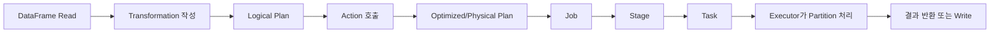
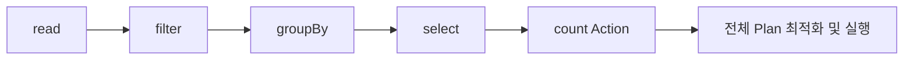
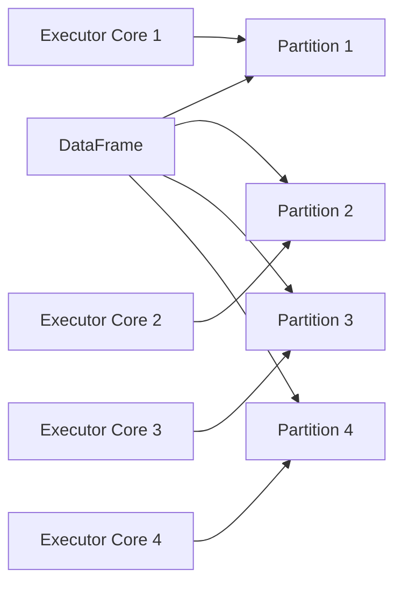
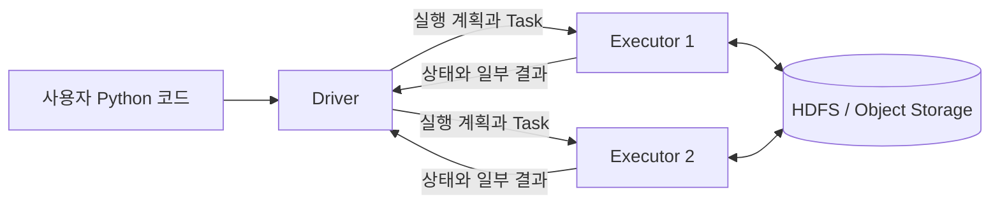
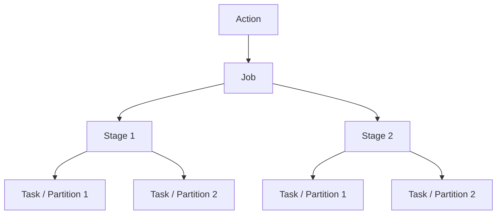
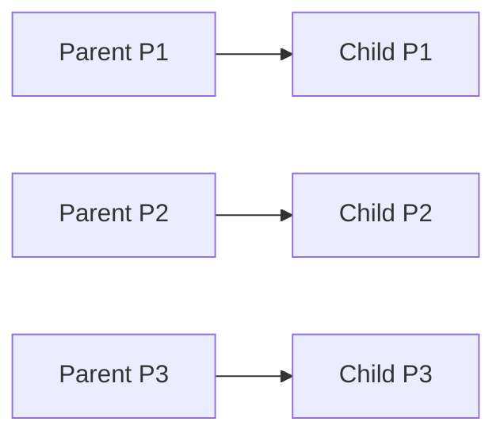
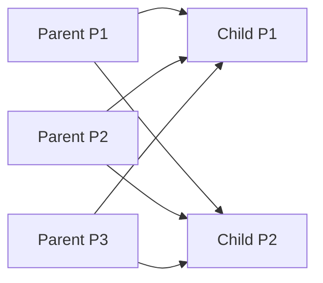
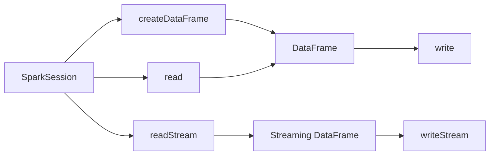

# ⚙️ Spark 실행 원리 이해

## 🎯 학습 목표

이번 장에서는 PySpark DataFrame API를 사용하는 방법부터 Spark가 코드를 실제 분산 작업으로 바꾸는 과정까지 학습한다. 함수 이름을 암기하는 데 그치지 않고, **Transformation과 Action**, **Lazy Evaluation**, **Partition과 Executor**, **Job·Stage·Task**, **Shuffle**, **Spark 실행 계획**을 하나의 흐름으로 연결하는 것이 목표다.

학습을 마치면 다음 내용을 설명할 수 있어야 한다.

- 자주 사용하는 DataFrame 함수와 반환값
- Transformation과 Action의 차이
- Lazy Evaluation이 성능과 Debugging에 미치는 영향
- Cache와 Persist가 필요한 상황과 해제 방법
- Partition 수와 Executor Core 수가 병렬성에 미치는 영향
- Driver와 Executor가 각각 처리하는 코드
- Job, Stage, Task가 생성되는 기준
- Narrow와 Wide Transformation 및 Shuffle 비용
- Logical Plan과 Physical Plan을 확인하는 방법
- CSV 등 외부 데이터를 읽고 Parquet으로 저장하는 방법

---

## 🗺️ 전체 실행 흐름



Spark 코드를 읽을 때는 다음 질문을 순서대로 던진다.

1. 데이터는 어디에서 읽는가?
2. 어떤 Transformation이 연결되는가?
3. 어떤 Action이 실행을 시작하는가?
4. Shuffle은 어디에서 발생하는가?
5. Partition은 몇 개이며 사용 가능한 Core는 몇 개인가?
6. 같은 계산을 반복한다면 Cache가 필요한가?
7. 실행 계획과 Spark UI에서 실제 동작을 확인했는가?

---

## 1. 자주 사용하는 DataFrame 함수

### 실습 DataFrame

```python
from pyspark.sql import SparkSession

spark = SparkSession.builder \
    .appName("spark-functions") \
    .master("local[*]") \
    .getOrCreate()

people = [
    ("KIM", "BUSAN", 15),
    ("CHOI", "SEOUL", 31),
    ("KIM", "SEOUL", 28),
    ("PARK", "DAEGU", 44),
    ("CHOI", "SEOUL", 52),
]

df = spark.createDataFrame(
    people,
    schema="name STRING, address STRING, age INT",
)
```

### 함수 분류

| 함수 | 용도 | 반환 또는 결과 | 일반적 분류 |
| --- | --- | --- | --- |
| `select`, `selectExpr` | 필요한 Column 선택 및 표현식 적용 | DataFrame | Transformation |
| `filter`, `where` | 조건에 맞는 Row 선택 | DataFrame | Transformation |
| `withColumn` | Column 추가 또는 교체 | DataFrame | Transformation |
| `dropDuplicates` | 지정한 기준의 중복 제거 | DataFrame | Transformation |
| `groupBy` | 집계 기준 생성 | `GroupedData` | Transformation 준비 단계 |
| `join` | 두 DataFrame 결합 | DataFrame | Transformation |
| `union` | 같은 위치의 Column을 기준으로 Row 결합 | DataFrame | Transformation |
| `persist`, `cache` | 계산 결과의 재사용을 위한 저장 지시 | DataFrame | Lazy Storage 지시 |
| `count` | Row 수 계산 | 정수 | Action |
| `show` | 일부 Row를 Driver 화면에 출력 | 없음 | Action |
| `collect` | 모든 Row를 Driver로 가져옴 | Python List | Action |

`persist()`는 DataFrame 내용을 바꾸는 일반 Transformation과는 성격이 다르다. 실행 계획에 저장 지점을 표시하며, 실제 Materialization은 Action이 호출될 때 일어난다.

### Column 선택

```python
df.select("name", "address").show()
df.select(["name", "address"]).show()
df.selectExpr("lower(name) AS lower_name", "age + 1 AS next_age").show()
```

- `select`는 Column 객체와 DataFrame API를 사용한다.
- `selectExpr`는 SQL 표현식을 문자열로 작성할 때 편리하다.
- 복잡한 문자열 표현식은 오타가 실행 시점까지 발견되지 않을 수 있으므로 Test가 필요하다.

### Row 필터링

```python
from pyspark.sql.functions import col

df.filter(col("name") == "KIM").show()
df.filter(
    (col("address") == "BUSAN") & (col("age") == 15)
).show()
df.filter(col("name").like("C%")).show()
df.filter(col("address").isin("BUSAN", "SEOUL")).show()
```

PySpark Column 조건에서 Python의 `and`, `or` 대신 `&`, `|`를 사용하고 각 조건을 괄호로 감싼다.

### Column 추가와 변경

```python
from pyspark.sql.functions import concat, lit

with_country = df.withColumn("country", lit("KOREA"))

with_full_address = with_country.withColumn(
    "full_address",
    concat(col("country"), lit(", "), col("address")),
)
```

DataFrame은 Immutable하다. `withColumn`은 원본을 직접 변경하지 않고 새로운 실행 계획을 가진 DataFrame을 반환한다.

### 중복 제거

```python
df.dropDuplicates(["name", "address"]).show()
df.distinct().show()
```

- `dropDuplicates(columns)`는 지정한 Column 조합을 기준으로 중복을 제거한다.
- `distinct()`는 전체 Column이 같은 Row를 제거한다.
- 중복 제거는 같은 Key의 데이터를 모아야 하므로 일반적으로 Shuffle을 유발한다.

### 집계

```python
from pyspark.sql.functions import avg, count, max, min, sum

summary = df.groupBy("name").agg(
    min("age").alias("min_age"),
    max("age").alias("max_age"),
    avg("age").alias("avg_age"),
    sum("age").alias("sum_age"),
    count("age").alias("age_count"),
)

summary.show()
```

`groupBy()`만 호출하면 DataFrame이 아니라 `GroupedData`가 반환된다. `agg`, `count`, `max` 같은 집계 연산을 연결해야 다시 DataFrame을 얻는다.

### Join

```python
joined = left_df.join(
    other=right_df,
    on=["company_id"],
    how="inner",
)
```

Join 전에는 다음을 확인한다.

- Key의 Data Type이 같은가?
- Key에 Null이 존재하는가?
- 한쪽 Key가 중복되어 Row가 예상보다 증가하지 않는가?
- 작은 Table을 Broadcast할 수 있는가?
- Join 후 같은 이름의 Column이 충돌하지 않는가?

### Union

```python
combined = first_df.union(second_df)
combined_by_name = first_df.unionByName(second_df)
```

`union()`은 SQL의 `UNION ALL`처럼 중복을 제거하지 않는다. 또한 Column 이름이 아닌 **위치**를 기준으로 결합하므로 순서가 다르면 값이 잘못된 Column에 들어갈 수 있다. 이름 기준 결합이 필요하면 `unionByName()`을 사용한다.

결과 Partition 수는 보통 입력 DataFrame Partition 수의 합에서 출발한다. 이후 작은 Partition이 과도하게 늘었다면 `coalesce()` 사용을 검토한다.

### Driver로 데이터를 가져오는 Action

```python
df.show(n=100, truncate=False)
row_count = df.count()
rows = df.limit(100).collect()
```

`collect()`는 전체 결과를 Driver Memory로 가져오므로 대용량 DataFrame에 사용하면 Driver OOM이 발생할 수 있다. 확인 목적이라면 `show`, `take`, `limit(...).collect()`처럼 범위를 제한한다.

---

## 2. Transformation과 Action

### Transformation

Transformation은 기존 DataFrame을 바탕으로 새로운 DataFrame과 실행 계획을 만든다. 호출 즉시 전체 데이터를 읽고 계산하는 것이 아니다.

```python
filtered_df = df.filter(col("address").isin("BUSAN", "SEOUL"))
grouped_df = filtered_df.groupBy("name").agg(avg("age").alias("avg_age"))
```

위 코드만으로는 Cluster 전체 데이터 연산이 시작되지 않는다. Driver가 DataFrame의 Lineage와 Logical Plan을 구성한다.

### Action

Action은 실제 계산을 요구하고 결과를 Driver에 반환하거나 외부 저장소에 기록한다.

```python
grouped_df.count()
grouped_df.show()
grouped_df.write.mode("overwrite").parquet(output_path)
```

`write` 계열도 최종 결과를 만들기 위해 전체 계획을 실행하므로 Action의 역할을 한다.

### Lazy Evaluation



Action을 만나기 전까지 계산을 미루는 방식을 Lazy Evaluation이라 한다.

**장점**

- 사용하지 않는 중간 결과를 매번 Memory에 저장하지 않는다.
- 전체 연산을 확인한 뒤 Column Pruning, Predicate Pushdown 등 최적화를 적용할 수 있다.
- 사용자가 작성한 여러 연산을 하나의 효율적인 Pipeline으로 합칠 수 있다.

**주의점**

- Transformation 호출 시간은 짧아도 실제 연산 비용이 사라진 것이 아니다.
- Action 전후의 시간만 측정하면 어떤 Transformation이 병목인지 알기 어렵다.
- 같은 Lineage에 여러 Action을 호출하면 공통 구간이 반복 계산될 수 있다.
- 오류도 Action 호출 시점에 늦게 나타날 수 있다.

### 반복 계산 예시

```python
base_df = source_df.filter(col("country") == "US")

state_count = base_df.groupBy("state").count().count()
unique_company_count = base_df.dropDuplicates(["company_id"]).count()
```

Cache가 없다면 두 Action이 `source_df → filter` 구간을 각각 다시 계산할 수 있다. 비용이 큰 공통 결과를 여러 번 사용할 때 Cache를 검토한다.

---

## 3. DataFrame Cache

### Cache가 필요한 경우

```python
from pyspark.storagelevel import StorageLevel

us_df = source_df.filter(col("country") == "US")
us_df.persist(StorageLevel.MEMORY_AND_DISK)

us_df.count()  # Cache를 실제로 채우는 Action

ny_count = us_df.filter(col("state") == "NY").count()
ca_count = us_df.filter(col("state") == "CA").count()

us_df.unpersist()
```

Cache 후보:

- 읽기와 전처리 비용이 큰 DataFrame을 여러 Action에서 재사용한다.
- 반복 Algorithm 또는 Interactive 분석에서 같은 기반 DataFrame을 반복 조회한다.
- 여러 Branch가 동일한 비싼 Lineage를 공유한다.

Cache를 피할 상황:

- 한 번만 사용하는 DataFrame
- 다시 읽거나 계산하는 비용이 매우 작은 DataFrame
- Cluster Memory가 부족하고 다른 Job을 밀어낼 가능성이 큰 경우
- Cache 이후 원본이 거의 사용되지 않는 경우

### `cache()`와 `persist()`

- `cache()`는 DataFrame의 기본 Storage Level을 사용한다.
- `persist(level)`은 저장 위치와 직렬화 방식 등을 명시할 수 있다.
- 둘 다 Lazy하며 Action이 수행되어야 Cache Block이 만들어진다.
- 사용이 끝나면 `unpersist()`로 해제한다.

```python
from pyspark.storagelevel import StorageLevel

df.persist(StorageLevel.MEMORY_AND_DISK)
df.persist(StorageLevel.DISK_ONLY)
df.persist(StorageLevel.OFF_HEAP)
```

| Storage Level | 특징 | 고려 사항 |
| --- | --- | --- |
| Memory 중심 | 읽기가 빠르다. | 데이터가 크면 Eviction과 재계산이 발생할 수 있다. |
| `MEMORY_AND_DISK` | Memory에 못 담은 Partition을 Disk에 저장한다. | 안정적인 일반 선택지다. |
| `DISK_ONLY` | Disk에 저장한다. | Memory를 절약하지만 I/O 비용이 크다. |
| `OFF_HEAP` | JVM Heap 밖의 Memory를 사용한다. | 관련 설정과 충분한 Off-heap Memory가 필요하다. |

Storage Level의 실제 기본값은 Spark 버전과 API에 따라 확인해야 한다. 강의의 표현이나 과거 버전의 기억에 의존하지 말고 `df.storageLevel`과 공식 API를 확인한다.

### Cache 확인

Spark UI의 **Storage** 탭에서 다음을 확인한다.

- Cached RDD/DataFrame
- Cached Partition 수와 전체 Partition 수
- Memory 및 Disk 사용량
- Executor별 RDD Block 분포

Cache를 선언했는데 Storage 탭이 비어 있다면 아직 Action을 호출하지 않았거나, Application이 종료됐거나, 이미 `unpersist()`됐을 가능성이 있다.

### 주의사항

1. `persist()`를 호출한 DataFrame 참조를 재사용해야 한다.
2. Cache 직후 작은 Action으로 Materialize하면 첫 실제 사용의 지연을 분리해 볼 수 있다.
3. Filter 결과가 원본보다 매우 작다면 Filter 이후를 Cache한다.
4. Memory 사용량과 재계산 비용을 함께 비교한다.
5. 장시간 Application에서는 사용이 끝난 Cache를 명시적으로 해제한다.

---

## 4. DataFrame Partition

### Partition이란?

Partition은 Spark가 분산 저장하고 병렬 처리하는 데이터 단위다. 하나의 Task는 하나의 Stage에서 보통 하나의 Partition을 처리한다.



Executor Core 하나는 같은 시점에 Task 하나를 실행한다. 따라서 한 Stage에서 동시에 처리 가능한 Partition 수는 사용 가능한 전체 Core 수의 영향을 받는다.

### Partition 수 확인

```python
partition_count = df.rdd.getNumPartitions()
print(partition_count)
```

DataFrame에서 RDD API로 내려가는 코드는 진단 목적으로 유용하지만, Business Logic에서는 DataFrame API를 유지하는 편이 Catalyst 최적화를 활용하기 좋다.

### Partition 수 변경

```python
repartitioned_df = df.repartition(6, "job_id")
smaller_df = repartitioned_df.coalesce(3)
```

| 함수 | 일반적 사용 | Shuffle |
| --- | --- | --- |
| `repartition(n)` | Partition을 늘리거나 데이터를 다시 고르게 분배 | 발생 |
| `repartition(n, columns...)` | 특정 Key를 기준으로 재분배 | 발생 |
| `coalesce(n)` | Partition 수를 줄임 | 일반적으로 전체 Shuffle 없이 병합 |

`coalesce()`는 기존 Partition을 좁게 병합하므로 빠를 수 있지만 데이터가 불균형해질 수 있다. 큰 폭으로 줄이거나 균등 분배가 중요하면 `repartition()`이 더 적절할 수 있다.

### Partition 수와 병렬성

- Partition 6개, 사용 가능 Core 6개라면 한 Wave에서 처리할 가능성이 있다.
- Partition 24개, Core 12개라면 최소 두 번 이상의 Scheduling Wave가 필요하다.
- Partition 4개, Core 20개라면 해당 Stage에서 최대 4개 Core만 유효하게 일할 수 있다.

Partition 수를 Core 수와 정확히 같게 해야 한다는 절대 규칙은 없다. Task 시간, 데이터 Skew, Cluster 공유 상황, Scheduling Overhead를 고려하면 Core보다 많은 Partition이 오히려 자원 활용과 Load Balancing에 유리할 수 있다.

### Partition 크기

강의에서는 Partition당 약 `128MB`를 출발점으로 제시한다.

```text
예상 Partition 수 ≈ 전체 입력 크기 / 목표 Partition 크기
```

예를 들어 입력이 `5GB`이고 목표 크기가 `128MB`라면 대략 40개를 출발점으로 생각할 수 있다. 다만 다음 요소 때문에 실제 적정값은 달라진다.

- 압축 전후 크기와 Record 크기
- 연산 중 데이터 증가 또는 감소
- File 개수와 File Format
- 전체 Executor Core와 Memory
- Key Skew와 Shuffle 크기
- Task 시작 비용과 외부 저장소 처리량

### Partition 제어 지점

1. **Read 시점**: File 크기, Block, Split 관련 설정에 따라 결정
2. **Transformation 시점**: `repartition`, `coalesce`, Wide Transformation
3. **Shuffle 이후**: `spark.sql.shuffle.partitions`
4. **Write 시점**: 출력 File 개수와 크기를 고려해 조정

출력 전에 무조건 `coalesce(1)`을 사용하면 전체 데이터를 한 Task에 몰아 병목과 장애 위험을 만들 수 있다. 단일 File이 정말 필요한지부터 검토한다.

---

## 5. Partition과 Executor

### Resource 관계

```text
전체 Executor Core = Executor 수 × Executor당 Core 수
```

예를 들어 Executor 10개에 각 4 Core를 할당하면 이론상 최대 40개 Task를 동시에 실행할 수 있다. 하지만 YARN이 요청 Resource를 모두 승인해야 하며, 다른 Application과 공유 중이면 실제 동시성은 낮아질 수 있다.

```bash
spark-submit \
  --master yarn \
  --num-executors 10 \
  --executor-cores 4 \
  --executor-memory 4g \
  app.py
```

### Executor 크기 결정 시 고려사항

- Executor당 Core가 너무 많으면 동시에 수행하는 Task의 Memory와 GC 경쟁이 커질 수 있다.
- Executor가 너무 작고 많으면 Process, Network Connection과 Scheduling 비용이 증가한다.
- 강의의 Executor당 4~5 Core는 흔히 사용하는 출발점이지 모든 Workload의 정답은 아니다.
- Large Join, Aggregation, Python UDF는 일반적인 Filter보다 Task당 Memory 요구가 클 수 있다.
- Dynamic Allocation 사용 여부에 따라 Executor 수는 실행 중 변할 수 있다.

### Data Skew

Partition 수가 충분해도 특정 Key에 데이터가 집중되면 한두 Task만 오래 실행된다.

Spark UI에서 다음 신호를 확인한다.

- 한 Stage에서 일부 Task Duration이 유난히 길다.
- 특정 Task의 Input 또는 Shuffle Read 크기가 매우 크다.
- 대부분의 Executor는 Idle인데 일부 Executor만 오래 실행된다.
- Spill, GC와 Fetch Wait가 특정 Task에 집중된다.

이 경우 단순히 Executor를 추가하기보다 Key 분포, Join 전략, Salting, AQE Skew Join 등을 검토한다.

---

## 6. Driver와 Executor

### 역할 구분



**Driver가 담당하는 일**

- Main Python Program 실행
- SparkSession과 SparkContext 생성
- DataFrame Lineage와 실행 계획 구성
- Job을 Stage와 Task로 분할하고 Scheduling
- Executor 상태와 결과 수집
- `collect()` 결과 보관 및 `show()` 출력

**Executor가 담당하는 일**

- Partition 데이터 읽기
- Filter, Projection, Join, Aggregation 등 Task 실행
- Shuffle 데이터 읽기와 쓰기
- Cache Block 저장
- Task 결과와 Metric을 Driver에 전달

### Python 코드가 실행되는 위치

일반적인 `if`, `for`, `while`, 외부 API 호출 등 Main Program 코드는 Driver에서 실행된다.

```python
for country in countries:
    country_df = df.filter(col("country") == country)
```

반면 UDF, `mapPartitions`, RDD `map`처럼 Record 또는 Partition에 적용하도록 전달한 함수는 Executor의 Python Worker에서 실행될 수 있다.

```python
from pyspark.sql.functions import udf
from pyspark.sql.types import StringType

normalize = udf(lambda value: value.strip().lower(), StringType())
result_df = df.withColumn("normalized", normalize(col("name")))
```

가능하면 Python UDF보다 Spark SQL Built-in 함수를 우선한다. Built-in 함수는 Catalyst가 이해하고 최적화할 수 있으며 JVM과 Python 사이의 직렬화 비용도 줄일 수 있다.

### 주요 Resource 설정

| 설정 | 의미 |
| --- | --- |
| `spark.driver.cores` | Driver CPU Core |
| `spark.driver.memory` | Driver JVM Heap Memory |
| `spark.executor.instances` | 고정 Executor 개수 |
| `spark.executor.cores` | Executor 하나의 Core 수 |
| `spark.executor.memory` | Executor JVM Heap Memory |
| `spark.dynamicAllocation.enabled` | Executor 동적 할당 사용 여부 |
| `spark.dynamicAllocation.minExecutors` | 동적 할당 최소 Executor 수 |
| `spark.dynamicAllocation.maxExecutors` | 동적 할당 최대 Executor 수 |

Resource 설정은 Application 코드보다 `spark-submit`이나 배포 설정에서 관리하는 것이 명확하다. 특히 Client Mode의 Driver Memory는 Driver JVM 시작 전에 정해야 하므로 코드 내부 설정이 늦을 수 있다.

---

## 7. Job, Stage, Task

### 계층 관계



### Job

Action이 호출되면 결과를 만들기 위한 Job이 시작된다. 학습 단계에서는 `하나의 Action ≈ 하나의 Job`으로 이해할 수 있지만 항상 정확히 일치하지는 않는다. 내부 구현, Cache Materialization, Subquery, AQE 등에 따라 여러 Job이 보일 수 있다.

### Stage

Job은 하나 이상의 Stage로 나뉜다. 핵심 경계는 **Shuffle**이다. Shuffle 전후의 Task는 데이터 의존성 때문에 같은 Pipeline에서 연속 실행할 수 없으므로 Stage가 분리된다.

### Task

Task는 Executor Core가 수행하는 가장 작은 Scheduling 단위다. 한 Stage의 Task 수는 일반적으로 해당 Stage가 처리할 Partition 수와 연결된다.

```text
Action → Job → Shuffle 경계로 Stage 분할 → Partition별 Task 생성
```

### Spark UI에서 확인

**Jobs 탭**

- Action별 Job 상태와 총 소요 시간
- 연결된 Stage
- 성공, 실패, 실행 중 Job

**Stages 탭**

- Task 수와 성공·실패 Task
- Input, Output, Shuffle Read/Write
- Scheduler Delay, Task Duration, GC Time
- DAG Visualization

**SQL/DataFrame 탭**

- DataFrame Query별 Physical Plan
- Operator별 Row와 시간 Metric
- Scan, Exchange, Join, Aggregate 흐름

Stage DAG만으로 모든 Business Logic을 해석하기는 어렵다. SQL/DataFrame 작업은 SQL 탭의 실행 계획과 함께 보는 것이 효과적이다.

### AQE와 관찰 결과

Adaptive Query Execution은 Runtime 통계를 이용해 Partition 병합, Join 전략, Skew 처리를 변경할 수 있다. 학습을 위해 AQE를 끄면 Job과 Stage 구조가 단순해질 수 있지만, 운영 성능을 판단할 때는 실제 운영 설정으로 다시 검증해야 한다.

```bash
pyspark --conf spark.sql.adaptive.enabled=false
```

---

## 8. Narrow와 Wide Transformation

### Narrow Transformation

출력 Partition이 하나의 입력 Partition 데이터만으로 계산될 수 있는 연산이다. Partition 간 데이터 이동 없이 같은 Executor Pipeline에서 이어서 처리하기 쉽다.

대표 예:

- `select`
- `filter`
- `withColumn`
- `map`, `mapPartitions`
- Partition 수를 줄이는 일반적인 `coalesce`



### Wide Transformation

출력 Partition을 만들기 위해 여러 입력 Partition의 데이터가 필요하다. 같은 Key를 모으거나 전체 순서를 정하기 위해 Network를 통해 데이터가 재분배된다.

대표 예:

- `groupBy`, `groupByKey`
- 일반적인 Sort Merge `join`
- `distinct`, `dropDuplicates`
- `orderBy`, `sort`
- `repartition`



### Shuffle 비용

Shuffle은 다음 비용을 포함할 수 있다.

1. 데이터를 Key 기준으로 Partitioning한다.
2. Map 쪽 Shuffle File을 Disk에 기록한다.
3. 다른 Executor가 Network로 Block을 가져간다.
4. 받은 데이터를 정렬, 병합 또는 집계한다.
5. Memory가 부족하면 Disk Spill이 발생한다.

따라서 Network I/O, Disk I/O, Serialization, Memory, GC 비용이 함께 증가한다.

### Shuffle 이후 Partition

Spark SQL의 Shuffle Partition 수는 기본적으로 다음 설정의 영향을 받는다.

```python
spark.conf.set("spark.sql.shuffle.partitions", "200")
```

`200`은 일반적인 기본값일 뿐 모든 데이터 크기에 알맞지 않다.

- 데이터가 작으면 Empty 또는 매우 작은 Task가 많아진다.
- 데이터가 크면 Partition당 데이터가 너무 커져 Spill과 긴 Task가 생긴다.
- AQE가 활성화되면 Runtime에 작은 Shuffle Partition을 병합할 수 있다.

### Wide Transformation 최적화

- Filter와 필요한 Column 선택을 Join·Aggregation 전에 수행한다.
- 작은 DataFrame은 Broadcast Join을 검토한다.
- Key Skew를 확인하고 필요하면 Salting 또는 AQE를 사용한다.
- 데이터 규모에 맞게 `spark.sql.shuffle.partitions`를 조정한다.
- 반복 사용하는 비싼 Shuffle 결과만 선택적으로 Persist한다.
- 불필요한 `repartition`, 전체 정렬과 중복 제거를 줄인다.
- Serialization 설정 변경은 측정 후 적용한다.

Kryo Serializer는 JVM 객체 직렬화가 많은 RDD 중심 작업에서 도움이 될 수 있지만, DataFrame 내부 Binary Format과 Tungsten 최적화가 적용되는 모든 상황에서 만능 해결책은 아니다. 실제 Metric으로 효과를 확인한다.

---

## 9. Spark Plan

### 실행 계획 단계


| Plan | 의미 |
| --- | --- |
| Parsed Logical Plan | 사용자가 작성한 표현식을 구조로 변환한 상태 |
| Analyzed Logical Plan | Catalog와 Schema를 이용해 Table, Column과 Type을 해석한 상태 |
| Optimized Logical Plan | Predicate Pushdown, Column Pruning, Constant Folding 등을 적용한 상태 |
| Physical Plan | Scan, Exchange, Join, Aggregate 같은 실제 실행 Operator를 선택한 계획 |

### `explain()` 사용

```python
result_df.explain()
result_df.explain(extended=True)
result_df.explain(mode="formatted")
result_df.explain(mode="cost")
result_df.explain(mode="codegen")
```

| Mode | 확인 목적 |
| --- | --- |
| `simple` | Physical Plan 요약 |
| `extended` | Parsed, Analyzed, Optimized, Physical Plan |
| `formatted` | Physical Operator와 세부 정보를 읽기 좋은 형식으로 표시 |
| `cost` | Plan 통계와 추정 비용 확인 |
| `codegen` | Whole-stage Code Generation 결과 확인 |

`extended=True`와 `mode`를 동시에 지정하지 않는다.

### Physical Plan 읽는 순서

Text Plan은 대체로 아래쪽 Leaf Operator에서 위쪽 최종 결과 방향으로 읽는다.

1. `Scan`: 어떤 File과 Column을 읽는가?
2. `Filter`: 조건이 Scan 가까이 내려갔는가?
3. `Project`: 필요한 Column만 남기는가?
4. `Exchange`: Shuffle 또는 Broadcast 경계가 어디인가?
5. `HashAggregate`: Partial과 Final 집계가 어떻게 나뉘는가?
6. `Join`: BroadcastHashJoin, SortMergeJoin 등 어떤 전략인가?
7. `Sort`: 전체 또는 Partition 내부 정렬이 발생하는가?

### 주요 키워드

| 키워드 | 의미 |
| --- | --- |
| `FileScan` / `Scan` | 외부 Source 읽기 |
| `PushedFilters` | Source까지 전달된 Filter |
| `Project` | Column 선택 및 표현식 계산 |
| `Exchange` | 데이터 재분배, 즉 Shuffle 경계 |
| `BroadcastExchange` | 작은 쪽 데이터를 Executor에 Broadcast |
| `HashAggregate` | Hash 기반 집계 |
| `SortMergeJoin` | 양쪽을 Key 기준으로 분배·정렬한 뒤 Join |
| `BroadcastHashJoin` | 작은 쪽을 Broadcast해 큰 쪽 Shuffle을 피하는 Join |
| `AdaptiveSparkPlan` | AQE가 적용되는 Plan |

Plan은 실행 가능성과 방향을 보여주지만 실제 병목을 모두 알려주지는 않는다. Spark UI의 Runtime Metric, Stage 시간, Shuffle 크기, Task 분포와 함께 판단한다.

---

## 10. DataFrame Read와 Write

### SparkSession과 DataFrame 생성

SparkSession은 DataFrame API의 진입점이다.



- `createDataFrame()`: Python Collection이나 Pandas DataFrame 등으로 생성
- `read`: CSV, JSON, Parquet, ORC, JDBC 같은 Batch Source 읽기
- `readStream`: Kafka, File Stream 등 Streaming Source 읽기
- `write`: Batch 결과 저장
- `writeStream`: Streaming 결과 지속 출력

### CSV 읽기

```python
schema = "company_id LONG, employee_count LONG, follower_count LONG, time_recorded TIMESTAMP"
path = "hdfs:///home/spark/sample/linkedin_jobs/companies/employee_counts.csv"

company_df = spark.read \
    .format("csv") \
    .option("header", "true") \
    .option("multiLine", "true") \
    .schema(schema) \
    .load(path)
```

간단한 전용 Method도 같은 목적에 사용할 수 있다.

```python
company_df = spark.read \
    .option("header", "true") \
    .schema(schema) \
    .csv(path)
```

운영 Pipeline에서는 가능하면 Schema를 명시한다. Schema 추론은 추가 Scan 비용이 들고, 입력 값 변화에 따라 Type이 달라질 수 있다.

### Reader 구성 요소

| Method | 역할 |
| --- | --- |
| `format()` | `csv`, `json`, `parquet`, `orc`, `jdbc` 등 Source 지정 |
| `option()` / `options()` | Header, Delimiter, Null 처리 등 Source별 옵션 |
| `schema()` | 입력 Schema 명시 |
| `load()` | 경로 또는 Source를 실제 DataFrame Lineage로 연결 |

DataFrame Read도 Lazy하다. `load()`가 반환됐다고 모든 데이터가 즉시 Executor Memory에 올라온 것은 아니다.

### Parquet 저장

```python
output_path = "hdfs:///home/spark/lesson/parquet/companies"

company_df.write \
    .format("parquet") \
    .mode("overwrite") \
    .save(output_path)
```

```bash
hdfs dfs -ls /home/spark/lesson/parquet/companies
```

Spark의 File Output은 보통 Directory이며 여러 `part-*` File과 성공 Marker가 생성된다. 출력 File 수는 Write 직전 DataFrame Partition 수와 밀접하다.

### Save Mode

| Mode | 대상이 이미 존재할 때 |
| --- | --- |
| `error` / `errorifexists` | 오류 발생, 일반적인 기본값 |
| `append` | 기존 데이터에 추가 |
| `overwrite` | 기존 대상을 교체 |
| `ignore` | 저장하지 않고 넘어감 |

`overwrite`는 편리하지만 잘못된 경로 또는 Partition 범위를 지정하면 기존 데이터를 잃을 수 있다. 운영에서는 Output Path, Partition Overwrite 방식과 재실행 정책을 명확히 한다.

### `partitionBy`와 `bucketBy`

```python
result_df.write \
    .mode("append") \
    .partitionBy("event_date") \
    .parquet(output_path)
```

`partitionBy("event_date")`는 일반적으로 다음과 같은 Directory 구조를 만든다.

```text
event_date=2026-08-04/
event_date=2026-08-05/
```

조회 조건으로 자주 사용하는 저 Cardinality Column을 선택하면 Partition Pruning에 도움이 된다. 사용자 ID처럼 값이 지나치게 많은 Column은 작은 Directory와 File을 대량 생성할 수 있다.

`bucketBy()`는 Hash 기준 Bucket을 만들며 `saveAsTable()` 같은 Table 저장 흐름과 제약을 확인해야 한다. 일반 File `save()`와 동일하게 사용할 수 있다고 가정하지 않는다.

### Small File 문제

Partition이 너무 많으면 Write 결과에도 작은 File이 많이 생긴다.

- NameNode Metadata 증가
- File Listing과 Task Scheduling 비용 증가
- 후속 Read Task가 지나치게 많아짐

Write 전에 목표 File 크기와 후속 Query Pattern을 고려해 `repartition()` 또는 `coalesce()`를 적용하되, 하나의 거대한 File로 몰지 않는다.

---

## 11. 실습 환경 점검

### HDFS 용량

Spark on YARN은 Application Resource를 HDFS의 Staging Directory에 올릴 수 있다. 비정상 종료가 반복되면 파일이 남아 용량이 증가할 수 있다.

```bash
df -h
hdfs dfs -du -s -h /user/spark/.sparkStaging
```

Staging 경로를 삭제하기 전에는 실행 중인 Application이 없는지, 대상 경로가 정확한지 확인한다. `-skipTrash`는 복구 기회를 없애므로 운영 환경에서 무조건 사용하지 않는다.

### Application 실행 전 Checklist

- [ ] HDFS와 YARN이 정상 실행 중이다.
- [ ] 입력 경로와 Schema가 실제 데이터와 일치한다.
- [ ] HDFS와 Local Disk에 충분한 여유 공간이 있다.
- [ ] Executor 수, Core, Memory가 Cluster 가용 자원 안에 있다.
- [ ] Shuffle Partition 수가 데이터 규모에 비해 과도하지 않다.
- [ ] 출력 경로와 Save Mode가 재실행 정책에 맞는다.

---

## 12. 성능 문제 진단 순서

1. **Job 확인**: 어떤 Action이 느린 Job을 만들었는지 찾는다.
2. **Stage 확인**: 어느 Stage에 시간이 집중됐는지 확인한다.
3. **Task 분포 확인**: 일부 Task만 긴지 전체가 느린지 구분한다.
4. **실행 계획 확인**: Exchange, Join 전략, Scan과 Filter 위치를 확인한다.
5. **I/O 확인**: Input, Output, Shuffle Read/Write와 Spill을 확인한다.
6. **Resource 확인**: Executor Core, Memory, GC와 유실 Executor를 확인한다.
7. **Partition 확인**: 수, 크기, Skew와 작은 File을 확인한다.
8. **변경 후 비교**: 동일 입력과 조건에서 Metric을 다시 측정한다.

| 증상 | 먼저 확인할 항목 |
| --- | --- |
| Core가 많이 놀고 있다 | Partition 수, Executor 등록 상태 |
| 일부 Task만 매우 느리다 | Data Skew, 큰 Partition, 느린 Host |
| Shuffle Stage가 오래 걸린다 | Shuffle 크기, Spill, Network, Partition 수 |
| Driver OOM | `collect`, 큰 Broadcast, Driver 결과와 Metadata |
| Executor OOM | Task당 Partition 크기, Join/Aggregation, Cache, Memory Overhead |
| 첫 Action만 느리다 | Source Read, Cache Materialization, Cluster 시작 비용 |
| 같은 계산이 반복된다 | 공통 Lineage와 Persist 적용 위치 |
| 출력 File이 너무 많다 | Write 직전 Partition 수와 Partition Column |

---

## ✅ 핵심 정리

1. Transformation은 실행 계획을 만들고 Action이 실제 계산을 시작한다.
2. Lazy Evaluation 덕분에 Spark는 전체 Plan을 최적화하지만, 실행 시간과 오류가 Action에 집중되어 보일 수 있다.
3. 공통 계산 결과를 여러 번 재사용할 때만 Cache를 적용하고 사용 후 해제한다.
4. Partition은 병렬 처리 단위이며 한 Task가 보통 한 Partition을 처리한다.
5. Partition 수, 크기와 전체 Executor Core를 함께 조정해야 한다.
6. Driver는 계획과 Scheduling을, Executor는 실제 Partition 연산을 담당한다.
7. Action이 Job을 만들고 Shuffle 경계에서 Stage가 나뉘며 Stage마다 Partition 기반 Task가 생성된다.
8. Wide Transformation은 Shuffle을 발생시켜 Network, Disk, Serialization 비용을 만든다.
9. `explain()`과 Spark UI를 함께 사용해 실행 계획과 Runtime Metric을 확인한다.
10. Read Schema, Write Partition과 Save Mode는 Pipeline의 성능과 안정성을 결정한다.

## 📝 스스로 확인하기

1. Transformation 호출 직후 Cluster 연산이 시작되지 않는 이유는 무엇인가?
2. 두 Action이 같은 Filter 결과를 사용할 때 어떤 계산이 반복될 수 있는가?
3. `persist()` 직후 Storage 탭이 비어 있을 수 있는 이유는 무엇인가?
4. Partition이 100개이고 Core가 20개라면 Task는 어떻게 처리되는가?
5. Core 수와 Partition 수를 항상 같게 맞추는 것이 정답이 아닌 이유는 무엇인가?
6. Driver와 Executor에서 실행되는 Python 코드는 어떻게 구분되는가?
7. Shuffle이 Stage 경계를 만드는 이유는 무엇인가?
8. `groupBy`, `repartition`, `filter` 중 Shuffle 가능성이 높은 함수는 무엇인가?
9. Physical Plan의 `Exchange`는 무엇을 의미하는가?
10. `union()`에서 Column 순서가 중요한 이유는 무엇인가?
11. `collect()`가 Driver 안정성에 위험할 수 있는 이유는 무엇인가?
12. `partitionBy()`에 Cardinality가 높은 Column을 사용하면 어떤 문제가 생길 수 있는가?
