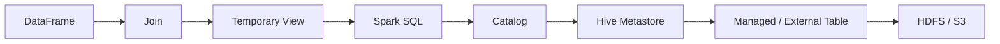
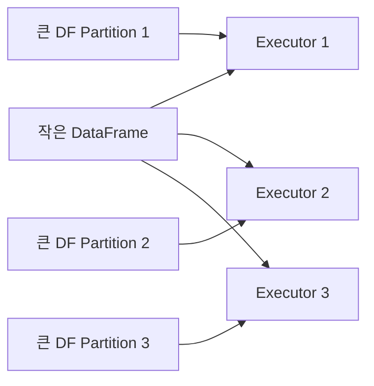
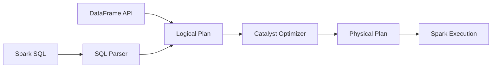
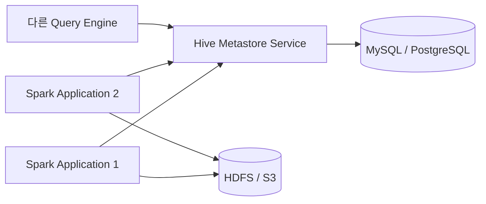

# 🧮 Spark SQL과 Catalog

## 🎯 학습 목표

이번 장에서는 여러 DataFrame을 Join하고, DataFrame을 View와 Table로 등록해 SQL로 처리하는 방법을 학습한다. 이어서 Spark Catalog의 역할과 기본 Derby Catalog의 한계를 이해하고, 여러 Spark Application이 공유할 수 있는 Hive Metastore를 구성한다. 마지막으로 Hive Metastore의 Table Metadata와 HDFS·S3의 실제 데이터가 어떻게 연결되는지 정리한다.

학습을 마치면 다음 내용을 설명할 수 있어야 한다.

- Inner, Outer, Cross, Semi, Anti Join의 결과 차이
- 중복 Column, Null, 중복 Key로 인해 Join 결과가 달라지는 이유
- Sort Merge Join과 Broadcast Hash Join의 차이
- Temporary View와 Global Temporary View의 범위
- DataFrame API와 Spark SQL이 같은 실행 Engine을 사용하는 이유
- Catalog가 관리하는 Database, Table, Column, Partition Metadata
- Embedded Derby Catalog가 다중 Application 환경에 부적합한 이유
- Hive Metastore Service와 Metastore Database의 역할 차이
- Managed Table과 External Table의 데이터 생명주기
- Spark가 `s3a://`를 통해 S3에 데이터를 저장하는 과정
- Row 기반 Format과 Columnar Format의 적합한 사용 사례

---

## 🗺️ 전체 학습 흐름



Spark SQL을 이해할 때는 **계산**, **Metadata**, **실제 데이터**를 구분한다.

| 영역 | 예 | 역할 |
| --- | --- | --- |
| 계산 Engine | Spark Driver, Executor, Catalyst | SQL과 DataFrame 연산 계획 및 실행 |
| Metadata | Spark Catalog, Hive Metastore | Database, Table, Schema, Partition, 저장 위치 관리 |
| 실제 데이터 | HDFS, S3 | Parquet 등의 File 저장 |

Hive Metastore가 Table을 안다고 해서 실제 Row가 MySQL에 저장되는 것은 아니다. MySQL에는 Table Metadata가, 실제 대용량 데이터는 HDFS나 S3에 저장된다.

---

## 1. DataFrame Join

### 기본 문법

```python
joined_df = left_df.join(
    other=right_df,
    on="join_key",
    how="inner",
)
```

`on`에는 같은 이름의 Column, Column 이름 List 또는 Boolean Join 조건을 전달할 수 있다.

```python
# 같은 이름의 Key
left_df.join(right_df, on="employee_id", how="inner")

# 복합 Key
left_df.join(right_df, on=["company_id", "event_date"], how="left")

# 서로 다른 이름의 Key
left_df.join(
    right_df,
    on=left_df.office_location == right_df.state,
    how="left",
)
```

### 예제 데이터

```python
employees = [
    (101, "Park", "Seoul"),
    (102, "Kim", "Seoul"),
    (103, "Choi", "Busan"),
]

offices = [
    ("A", "Seoul", "Blue"),
    ("B", "Seoul", "Green"),
    ("D", "Daegu", "Yellow"),
]

employee_df = spark.createDataFrame(
    employees,
    "employee_id INT, employee_name STRING, office_location STRING",
)

office_df = spark.createDataFrame(
    offices,
    "office_code STRING, state STRING, office_name STRING",
)
```

### Join 종류

| Join | 반환 범위 | 대표 용도 |
| --- | --- | --- |
| `inner` | 양쪽 Key가 일치하는 Row | 공통 데이터 결합 |
| `left` / `left_outer` | Left 전체와 일치하는 Right | 기준 데이터 보존 |
| `right` / `right_outer` | Right 전체와 일치하는 Left | Right 기준 보존 |
| `full` / `full_outer` | 양쪽 전체 | 전체 비교와 불일치 탐색 |
| `cross` | 양쪽 Row의 모든 조합 | 작은 후보 집합 조합 |
| `left_semi` | Right에 일치 항목이 있는 Left Row만 | 존재 여부 필터 |
| `left_anti` | Right에 일치 항목이 없는 Left Row만 | 누락·미처리 데이터 탐색 |

### Inner Join

```python
inner_df = employee_df.join(
    office_df,
    employee_df.office_location == office_df.state,
    "inner",
)
```

양쪽에 일치하는 Key가 있을 때만 결과에 포함된다. 예제에서 `Seoul`은 Office 쪽에 두 Row가 있으므로 Employee 한 Row가 Office 두 Row와 연결되어 결과가 증가한다.

### Left와 Right Join

```python
left_df = employee_df.join(
    office_df,
    employee_df.office_location == office_df.state,
    "left",
)

right_df = employee_df.join(
    office_df,
    employee_df.office_location == office_df.state,
    "right",
)
```

일치하지 않는 반대편 Column에는 Null이 들어간다. Outer Join 뒤 Filter를 잘못 배치하면 보존하려던 Null Row가 제거되어 사실상 Inner Join처럼 동작할 수 있다.

```python
# Left Join 뒤 이 조건을 적용하면 office_name이 Null인 Row가 제거된다.
left_df.filter(col("office_name") == "Blue")
```

Right 쪽 조건을 Join 조건에 포함할지, Join 결과에 Filter로 적용할지에 따라 의미가 달라지므로 요구사항을 먼저 정한다.

### Full Outer Join

```python
full_df = employee_df.join(
    office_df,
    employee_df.office_location == office_df.state,
    "full",
)
```

양쪽의 일치 Row와 불일치 Row를 모두 확인한다. 두 Dataset의 차이를 찾는 Reconciliation 작업에 유용하지만, 양쪽 데이터를 모두 Shuffle할 수 있어 비용이 크다.

### Cross Join

```python
cross_df = employee_df.crossJoin(office_df)
```

결과 Row 수는 `Left Row 수 × Right Row 수`다. 두 입력이 조금만 커져도 결과가 폭증하므로 명확한 의도와 크기 검증 없이 사용하지 않는다.

### Left Semi Join

```python
semi_df = employee_df.join(
    office_df,
    employee_df.office_location == office_df.state,
    "left_semi",
)
```

- Right와 일치하는 Left Row만 반환한다.
- 결과에는 Left Column만 포함된다.
- SQL의 `EXISTS`와 비슷한 용도로 사용할 수 있다.
- Right에 같은 Key가 여러 개 있어도 단순 Inner Join처럼 Left Row를 증식시키지 않는다.

### Left Anti Join

```python
anti_df = employee_df.join(
    office_df,
    employee_df.office_location == office_df.state,
    "left_anti",
)
```

- Right에 일치하는 Key가 없는 Left Row만 반환한다.
- 미등록, 미처리, 누락된 데이터를 찾는 데 유용하다.
- SQL의 `NOT EXISTS`와 비슷하다.

`NOT IN`은 Null이 포함될 때 예상과 다른 결과를 만들 수 있으므로 Null 의미가 중요한 경우 Anti Join이나 `NOT EXISTS` 형태를 검토한다.

---

## 2. Join 사용 시 주의사항

### 중복 Column 이름

조건식으로 Join하면 같은 이름의 Column이 양쪽에 모두 남을 수 있다.

```python
joined_df.select("name")
# AnalysisException: Reference `name` is ambiguous
```

#### 해결 1: Alias로 출처 명시

```python
employee = employee_df.alias("employee")
office = office_df.alias("office")

joined_df = employee.join(
    office,
    col("employee.office_location") == col("office.state"),
    "inner",
)

result_df = joined_df.select(
    col("employee.employee_name"),
    col("office.office_name"),
)
```

#### 해결 2: Join 전에 Rename

```python
renamed_office_df = office_df.withColumnRenamed("name", "office_name")
```

#### 해결 3: 같은 이름의 Key List 사용

```python
joined_df = left_df.join(right_df, on=["company_id"], how="inner")
```

같은 이름의 Key를 `on` List로 전달하면 결과에서 Join Key가 하나로 정리된다. 다만 다른 중복 Column은 여전히 정리해야 한다.

### 중복 Key로 인한 Row 증가

Join은 Lookup처럼 한 Row만 붙여 준다고 보장하지 않는다.

```text
Left의 Key A: 3 Rows
Right의 Key A: 4 Rows
Inner Join 결과: 12 Rows
```

Join 전후에 다음을 확인한다.

```python
left_df.groupBy("key").count().orderBy(col("count").desc()).show()
right_df.groupBy("key").count().orderBy(col("count").desc()).show()
```

Dimension Table의 Key가 Unique해야 한다면 Join 전에 중복을 검증하고, 임의의 `dropDuplicates()`로 문제를 숨기지 않는다.

### Null Join Key

일반적인 Equality Join에서 Null은 Null과 같다고 판단되지 않는다. Null끼리도 같은 값으로 취급해야 한다면 Null-safe Equality를 명시적으로 검토한다.

```python
joined_df = left_df.join(
    right_df,
    left_df.key.eqNullSafe(right_df.key),
    "inner",
)
```

### Data Type

Join Key의 Type이 다르면 암시적 Cast 또는 오류가 발생할 수 있다. String과 Long처럼 Type이 다르면 명시적으로 통일하고, Cast 실패로 Null이 생기지 않았는지 확인한다.

### Join은 항상 같은 방식으로 실행되지 않는다

Join은 논리적 연산이며 Catalyst가 데이터 크기, Join 유형, 통계와 Hint를 바탕으로 Physical Join 전략을 선택한다.

대표 전략:

- Broadcast Hash Join
- Sort Merge Join
- Shuffle Hash Join
- Broadcast Nested Loop Join

따라서 `join()`을 썼다는 사실만으로 Shuffle 여부를 단정하지 않고 `explain()` 또는 Spark UI에서 Physical Plan을 확인한다.

---

## 3. Broadcast Join

### 기본 원리

작은 DataFrame을 모든 Executor에 복제하면 큰 DataFrame을 Join Key로 Shuffle하지 않고 각 Executor에서 Local Join을 수행할 수 있다.



```python
from pyspark.sql.functions import broadcast

joined_df = employee_df.join(
    broadcast(office_df),
    employee_df.office_location == office_df.state,
    "left",
)
```

### 장점

- 큰 DataFrame 전체의 Shuffle을 피할 수 있다.
- Sort Merge Join의 정렬 비용을 줄일 수 있다.
- 작은 Dimension과 큰 Fact Table의 Join에 효과적이다.

### 위험

- 작은 쪽 데이터가 Executor Memory에 들어갈 수 있어야 한다.
- 예상보다 큰 데이터를 강제 Broadcast하면 Driver 수집, Network 전송, Executor Memory 문제가 발생할 수 있다.
- 여러 Broadcast Join을 동시에 수행하면 각 Executor의 Memory 사용량이 누적된다.
- Runtime Filter 이후 크기와 통계 정보가 실제와 다르면 잘못된 전략을 고를 수 있다.

### Join 유형과 Build Side

| Join 유형 | 일반적인 Broadcast 가능 방향 |
| --- | --- |
| Inner | Left 또는 Right |
| Left Outer | Right |
| Right Outer | Left |
| Full Outer | 일반적인 Broadcast Hash Join 불가 |
| Left Semi | Right |
| Left Anti | Right |

Outer Join에서는 보존해야 하는 쪽을 Build Side로 Broadcast하는 데 제약이 있다. 지원되지 않는 Hint는 무시되고 경고가 발생할 수 있다. Cross Join은 상황에 따라 Broadcast Nested Loop 전략을 사용할 수 있으므로 단순한 가능/불가능 표보다 실제 Physical Plan을 확인하는 편이 정확하다.

```python
joined_df.explain(mode="formatted")
```

Plan에서 `BroadcastHashJoin`, `BroadcastExchange`, `SortMergeJoin`, `Exchange`를 확인한다.

### 자동 Broadcast

Spark는 통계상 작은 Relation을 자동 Broadcast할 수 있다. 기준은 `spark.sql.autoBroadcastJoinThreshold` 등의 설정 영향을 받는다.

수동 `broadcast()` Hint는 강한 요청이지만 Join 의미상 불가능하거나 Runtime 조건이 맞지 않으면 기대와 다른 Plan이 나올 수 있다. 실행 전후의 데이터 크기와 Plan을 함께 기록한다.

---

## 4. View 활용

### Temporary View 생성

```python
postings_df.createOrReplaceTempView("postings")

short_df = spark.sql("""
    SELECT job_id, company_name, title
    FROM postings
    WHERE formatted_work_type = 'Full-time'
""")
```

- `createTempView()`는 같은 이름이 이미 있으면 오류가 발생한다.
- `createOrReplaceTempView()`는 기존 View를 교체한다.
- View는 데이터를 별도로 복사하는 Table이 아니라 DataFrame의 Logical Plan에 이름을 붙인다.
- 일반 Temporary View는 생성한 SparkSession/Application 범위에서만 사용할 수 있다.

### Global Temporary View

```python
postings_df.createOrReplaceGlobalTempView("postings")
spark.sql("SELECT * FROM global_temp.postings")
```

Global Temporary View는 Application 안의 여러 Session에서 공유할 수 있지만 Application이 종료되면 사라진다. 영구 Catalog Table과는 다르다.

### View와 Cache

```python
spark.catalog.cacheTable("postings")
spark.catalog.isCached("postings")

spark.sql("SELECT DISTINCT title FROM postings").show()

spark.catalog.uncacheTable("postings")
```

DataFrame을 Persist한 뒤 View를 만들거나 View를 Cache하면 같은 Logical Plan의 Cache가 재사용될 수 있다. 다만 Plan이 달라지거나 DataFrame을 새로 만들면 이름이 같아도 동일 Cache라고 가정하지 않는다. Spark UI Storage 탭과 `isCached()`로 확인한다.

### Catalog를 통한 View 관리

```python
spark.catalog.listTables()
spark.catalog.dropTempView("postings")
```

View를 삭제해도 원본 DataFrame이나 HDFS/S3 File이 삭제되는 것은 아니다. View 이름과 Session의 등록 정보만 제거된다.

---

## 5. DataFrame API와 Spark SQL

동일한 연산은 DataFrame API와 SQL 중 어느 방식으로도 작성할 수 있다.

### DataFrame API

```python
result_df = postings_df \
    .filter(col("formatted_work_type").isin("CONTRACT", "FULL_TIME")) \
    .join(broadcast(job_skills_df), on="job_id", how="inner") \
    .groupBy("skill_abr") \
    .count() \
    .orderBy(col("count").desc())
```

### Spark SQL

```python
postings_df.createOrReplaceTempView("postings")
job_skills_df.createOrReplaceTempView("job_skills")

result_df = spark.sql("""
    SELECT /*+ BROADCAST(j) */
           j.skill_abr,
           COUNT(*) AS job_count
    FROM postings p
    JOIN job_skills j
      ON p.job_id = j.job_id
    WHERE p.formatted_work_type IN ('CONTRACT', 'FULL_TIME')
    GROUP BY j.skill_abr
    ORDER BY job_count DESC
""")
```

### 성능 차이

DataFrame API와 SQL은 모두 Catalyst Optimizer를 거쳐 Logical Plan과 Physical Plan으로 변환된다. 논리적으로 같은 코드를 작성하고 같은 Plan이 선택되면 일반적으로 성능도 같다.



성능을 좌우하는 것은 문법 선택보다 다음 항목이다.

- Filter와 Projection Pushdown
- Join 순서와 Join 전략
- Broadcast 가능 여부
- Partition 수와 Data Skew
- 불필요한 Shuffle 및 Sort
- Cache 위치
- File Format과 Statistics

### 선택 기준

| DataFrame API가 편리한 경우 | SQL이 편리한 경우 |
| --- | --- |
| 조건과 Column이 Program Logic에 따라 동적으로 바뀜 | 복잡한 Join과 집계를 SQL로 명확히 표현 가능 |
| Type-aware한 함수 조합과 IDE 지원이 중요함 | SQL 사용자가 Query를 검토해야 함 |
| 재사용 가능한 함수와 Pipeline을 구성함 | 기존 SQL Logic을 Spark로 옮김 |

한 Application에서 두 방식을 섞어도 된다. 중요한 것은 팀이 읽기 쉽고 Test 가능한 구조를 유지하는 것이다.

---

## 6. Spark Catalog

### Catalog란?

Catalog는 데이터 자체가 아니라 데이터를 찾고 해석하기 위한 Metadata를 관리한다.

- Catalog와 Namespace/Database
- Table과 View 이름
- Column 이름과 Data Type
- Partition 정보
- Table 저장 위치
- Provider와 Table 유형
- Statistics

경로를 직접 읽는 방식:

```python
df = spark.read.parquet("hdfs:///data/linkedin/postings")
```

Catalog Table을 읽는 방식:

```python
df = spark.table("linkedin.postings")
df = spark.read.table("linkedin.postings")
```

Table 이름으로 읽으면 사용자 코드가 물리 경로와 Format을 매번 알 필요가 없다.

### Database 관리

```python
spark.catalog.listDatabases()
spark.sql("CREATE DATABASE IF NOT EXISTS linkedin")
spark.sql("USE linkedin")
```

```sql
CREATE DATABASE IF NOT EXISTS linkedin
LOCATION 'hdfs:///user/hive/warehouse/linkedin.db';
```

Database Location은 해당 Database에서 Managed Table을 만들 때 기본 저장 경로로 사용될 수 있다.

### Table 저장과 조회

```python
company_df.write \
    .mode("overwrite") \
    .saveAsTable("linkedin.company_employee")

spark.catalog.listTables("linkedin")

loaded_df = spark.table("linkedin.company_employee")
```

### Catalog의 장점

- 경로 대신 `database.table` 이름으로 데이터에 접근한다.
- 여러 Application과 Query Engine이 같은 Dataset을 찾을 수 있다.
- Schema와 Partition을 중앙에서 확인한다.
- Optimizer가 Statistics를 활용할 기반을 제공한다.
- 데이터의 논리적 이름과 물리 저장소를 분리한다.

### 기본 Embedded Derby의 한계

Spark의 단순 Local 환경에서는 Embedded Derby가 Metastore 역할을 할 수 있다. 일반적으로 Driver 작업 Directory에 `metastore_db`와 Warehouse Directory가 생긴다.

문제점:

- 동일 Derby Database에 여러 Process가 동시에 접근하기 어렵다.
- Driver Host와 Working Directory에 Metadata가 묶일 수 있다.
- Cluster의 여러 Spark Application이 안정적으로 공유하기 어렵다.
- Process 또는 Local Disk 수명에 운영 Metadata를 의존하게 된다.

두 번째 Spark Shell에서 `Another instance of Derby may have already booted the database`와 같은 오류가 발생할 수 있다. 운영 환경에서는 Remote Hive Metastore나 Cloud Catalog를 사용한다.

---

## 7. Hive와 Hive Metastore

### Hive의 등장 배경

Hive는 HDFS 데이터를 SQL과 유사한 HiveQL로 처리하기 위해 등장했다. 초기에는 Query를 MapReduce Job으로 변환했고 이후 Tez 등 다른 실행 Engine도 활용했다.

Spark가 Hive Metastore를 사용한다고 해서 HiveServer나 Hive의 Query Engine을 반드시 사용하는 것은 아니다. Spark는 Hive Metastore의 **Catalog 기능**만 독립적으로 사용할 수 있다.

### Hive의 주요 구성 요소

| 구성 요소 | 역할 |
| --- | --- |
| HiveServer2 | Client SQL Session과 Query 요청 처리 |
| Hive Metastore Service | Catalog API 제공, Metadata 요청 처리 |
| Metastore Database | Database, Table, Column, Partition Metadata를 실제 저장하는 RDBMS |

Metastore Database로 MySQL이나 PostgreSQL 등을 사용할 수 있다.

### 배포 방식

| 방식 | 구조 | 한계 또는 용도 |
| --- | --- | --- |
| Embedded | Hive Process 안에 Metastore와 Derby | 단일 Process 실습 |
| Local Metastore | Metastore Logic은 Client Process, 외부 RDB 사용 | Client 의존성과 Library 관리 필요 |
| Remote Metastore | 별도 Thrift Metastore Service와 외부 RDB | 여러 Spark/Hive/Query Engine이 공유 |

운영 환경에서는 일반적으로 Remote Metastore 방식을 사용한다.



---

## 8. Hive Metastore 구성과 연결

### 강의 실습 구조

실습에서는 `spark03`에 Hive Standalone Metastore `3.1.2`와 MySQL `8.0`을 구성한다. Spark Application은 별도의 Hive Metastore Service에 접속하고, Service가 MySQL의 `hms` Database를 사용한다.

Version은 강의 재현을 위한 값이다. 실제 환경에서는 Spark의 Hive Client 호환 Version과 Dependency 충돌을 먼저 확인한다.

### Metastore Schema 초기화

```bash
cd /engine/apache-hive-metastore-3.1.2-bin/bin
./schematool -initSchema -dbType mysql
```

Schema 초기화는 최초 한 번 수행한다. 기존 Metadata Database에서 반복 실행하거나 잘못된 Database를 대상으로 실행하지 않는다.

초기화 후 MySQL에서 `DBS`, `TBLS`, `SDS`, `COLUMNS_V2`, `PARTITIONS` 같은 Metadata Table을 확인할 수 있다.

### Spark 연결 설정

대표적으로 다음 설정이 필요하다.

```properties
spark.sql.catalogImplementation hive
spark.sql.hive.metastore.version 3.1.2
spark.sql.hive.metastore.jars path
spark.sql.hive.metastore.jars.path file:///path/to/hive-jars/*
spark.hadoop.hive.metastore.uris thrift://spark03:9083
spark.sql.warehouse.dir hdfs:///user/hive/warehouse
```

환경에 따라 `hive.metastore.uris`를 `hive-site.xml`에 배치하거나 `spark.hadoop.hive.metastore.uris`로 전달한다. 설정 이름과 적용 위치는 실제 Spark Version에서 확인한다.

필요한 Hive Client Jar를 수동으로 복사할 경우 다음 위험이 있다.

- Hive와 Spark가 요구하는 Guava, Jackson, Thrift 등의 Version 충돌
- 일부 Transitive Dependency 누락
- Driver에는 Jar가 있지만 Executor에는 없는 문제
- Spark Upgrade 이후 오래된 Jar가 남는 문제

가능하면 검증된 배포 Artifact와 Dependency 관리 방법을 사용하고, 모든 Node의 Checksum을 비교한다.

### 연결 검증

```python
spark.catalog.listDatabases()
spark.sql("CREATE DATABASE IF NOT EXISTS linkedin")
spark.sql("USE linkedin")

postings_df.write.mode("overwrite").saveAsTable("postings")
spark.catalog.listTables()
```

다른 서버에서 새 Spark Application을 실행한 뒤 같은 Database와 Table이 보이는지 확인한다.

```python
spark.table("linkedin.postings").show(5)
```

이 검증이 성공하면 Catalog가 특정 Driver Local Derby가 아니라 Remote Metastore를 통해 공유되고 있음을 확인할 수 있다.

### Spark Database와 MySQL `hms` Database 구분

```text
Spark Catalog Database: linkedin
  └─ Table: postings

MySQL Database: hms
  └─ DBS, TBLS, SDS, COLUMNS_V2 ...
```

- `linkedin`은 사용자가 데이터를 논리적으로 분류하는 Catalog Namespace다.
- `hms`는 Hive Metastore 자체 Metadata Schema가 저장된 MySQL Database다.
- 실제 `postings` Row는 MySQL `hms`가 아니라 HDFS 또는 S3에 저장된다.

### 연결 장애 점검

1. Metastore Service Process와 `9083` Port를 확인한다.
2. Spark Node에서 Metastore Hostname을 해석하고 Port에 연결할 수 있는지 확인한다.
3. Metastore Service가 MySQL에 연결 가능한지 확인한다.
4. MySQL 사용자 권한과 JDBC URL을 확인한다.
5. Spark와 Hive Metastore Client Version 호환성을 확인한다.
6. Driver Log에서 `ClassNotFound`, `NoSuchMethodError`, Thrift 오류를 확인한다.
7. `spark.sql.catalogImplementation` 최종 적용값을 확인한다.

MySQL `3306`을 개인 PC에 직접 노출하는 방식은 실습 외에는 피한다. Private Network, SSH Tunnel, VPN과 최소 권한을 사용한다.

---

## 9. Managed Table과 External Table

### Managed Table

```python
postings_df.write \
    .mode("overwrite") \
    .saveAsTable("linkedin.postings")
```

별도 Path를 지정하지 않으면 Database Location 또는 `spark.sql.warehouse.dir` 아래에 Managed Table로 저장되는 것이 일반적이다.

### External Table

```python
postings_df.write \
    .mode("overwrite") \
    .option("path", "hdfs:///data/linkedin/postings") \
    .saveAsTable("linkedin.postings_external")
```

물리 Path를 명시하면 Metastore가 해당 위치를 가리키는 External Table로 생성되는 흐름이 일반적이다.

### 차이

| 구분 | Managed Table | External Table |
| --- | --- | --- |
| Metadata 관리 | Metastore | Metastore |
| 데이터 위치 | Warehouse 아래 기본 위치 | 사용자가 지정한 HDFS/S3 위치 |
| 소유권 개념 | Catalog가 Metadata와 데이터 생명주기를 함께 관리 | Catalog는 주로 Metadata만 관리 |
| `DROP TABLE` | 일반적으로 Metadata와 데이터 모두 삭제 | 일반적으로 Metadata만 삭제하고 File 유지 |
| 적합한 경우 | Spark/Hive가 데이터 생명주기를 전담 | 여러 Engine 공유, Data Lake 원본·공용 데이터 |

삭제 동작은 Catalog 구현, Spark/Hive Version과 Table Provider에 따라 검증해야 한다. 운영 데이터에서 `DROP TABLE`을 실행하기 전에 Table Type, Location과 별도 Backup을 확인한다.

### Table Load 방법

```python
df1 = spark.table("linkedin.postings")
df2 = spark.read.table("linkedin.postings")
df3 = spark.sql("SELECT * FROM linkedin.postings")
```

세 방식 모두 Catalog Table을 DataFrame으로 읽을 수 있으며, 논리적으로 같은 Query라면 같은 Engine과 Optimizer를 사용한다.

---

## 10. Spark에서 S3로 저장하기

### S3를 사용하는 이유

HDFS는 Cluster Node에 DataNode를 운영해야 하지만 S3는 Compute와 Storage를 분리할 수 있는 Object Storage다. AWS 기반 Data Lake에서는 Spark 결과를 S3에 저장하고 여러 Engine이 공유하는 구성이 흔하다.

다만 S3는 POSIX FileSystem이 아니다.

- Directory Rename과 Commit 동작이 HDFS와 다르다.
- Request 수와 전송량에 따른 비용이 발생한다.
- 작은 File이 많으면 Listing과 Query 비용이 증가한다.
- IAM, Encryption, Bucket Policy와 Endpoint를 함께 설계해야 한다.

### S3A Connector

Spark/Hadoop에서 S3는 일반적으로 `s3a://` Scheme으로 접근한다.

```text
s3a://bucket-name/path/to/table
```

필요 요소:

- Spark와 Hadoop Version에 맞는 `hadoop-aws` Library
- 호환되는 AWS SDK Dependency
- `org.apache.hadoop.fs.s3a.S3AFileSystem` 구현
- IAM 자격 증명과 Bucket 권한
- Region 또는 Endpoint 설정

Library Version이 Hadoop 배포판과 맞지 않으면 `ClassNotFoundException`, `NoSuchMethodError` 등이 발생할 수 있다.

### 자격 증명 관리

강의 실습처럼 Access Key와 Secret Key를 `spark-defaults.conf`에 평문으로 저장하는 방식은 운영 환경에 사용하지 않는다.

권장 우선순위:

1. EC2 Instance Profile 또는 IAM Role
2. EKS IRSA 같은 Workload Identity
3. 임시 STS Credential
4. 조직의 Secret Manager를 통한 주입

장기 Access Key를 Repository, Ansible Template, Log 또는 Shell History에 남기지 않는다. 권한도 `S3FullAccess` 대신 필요한 Bucket과 Prefix의 Read/Write/List 권한으로 제한한다.

### 대표 설정

```properties
spark.hadoop.fs.s3a.impl org.apache.hadoop.fs.s3a.S3AFileSystem
spark.hadoop.fs.s3a.endpoint s3.ap-northeast-2.amazonaws.com
spark.hadoop.fs.s3a.fast.upload.buffer bytebuffer
```

`path.style.access`는 Endpoint와 Bucket 이름 규칙에 따라 필요 여부가 달라진다. AWS S3에서는 기본 Virtual-hosted Style이 일반적이며, S3 호환 Storage에서 Path Style을 요구할 수 있다.

### S3 External Table 저장

```python
spark.sql("USE linkedin")
postings_df = spark.table("postings")

postings_df.write \
    .mode("overwrite") \
    .option(
        "path",
        "s3a://datalake-spark-sink/sample/linkedin/postings",
    ) \
    .saveAsTable("postings_s3")
```

Path를 명시했으므로 Metastore에는 External Table Metadata가 등록되고 실제 Parquet File은 S3에 저장된다.

### 검증

```python
spark.catalog.listTables("linkedin")
spark.table("linkedin.postings_s3").count()
```

함께 확인할 내용:

- Catalog의 Table Type과 Location
- S3 Prefix의 `part-*` File 및 성공 Marker
- MySQL Metastore의 Table과 Storage Descriptor Metadata
- Spark UI의 Output Record, File 수와 Task 실패
- 다른 Spark Application에서 같은 Table 조회 가능 여부

### 운영 주의점

- `overwrite` 대상 Prefix를 반드시 검증한다.
- Output Partition 수를 조절해 Small File을 줄인다.
- SSE-S3 또는 KMS Encryption을 적용한다.
- Bucket Versioning과 Lifecycle 정책을 결정한다.
- Committer가 실패·재시도 상황에서 중복이나 부분 결과를 어떻게 처리하는지 확인한다.
- Table Metadata 등록과 File 저장 중 하나만 성공했을 때의 복구 절차를 준비한다.

---

## 11. Row 기반과 Columnar Format

### 저장 방식

**Row 기반**은 한 Row의 여러 Column 값을 가까이 저장한다.

```text
[id=1, name=Kim, age=30]
[id=2, name=Lee, age=28]
```

**Column 기반**은 같은 Column의 값을 모아 저장한다.

```text
id:   [1, 2]
name: [Kim, Lee]
age:  [30, 28]
```

### 비교

| 기준 | Row 기반 | Columnar |
| --- | --- | --- |
| 적합한 처리 | 개별 Row 조회·변경, OLTP | 대량 Scan, 집계, OLAP |
| 일부 Column 조회 | 불필요한 Column도 함께 읽을 수 있음 | 필요한 Column Block만 읽기 쉬움 |
| 압축 | 서로 다른 Type이 섞여 상대적으로 불리 | 같은 Type과 유사 값이 모여 유리 |
| Insert/Update | Row 단위 변경에 유리 | 잦은 소규모 변경에 불리할 수 있음 |
| Spark 활용 | CSV, JSON 등 | Parquet, ORC |

### Parquet와 ORC

| Format | 특징 |
| --- | --- |
| Parquet | Spark와 다양한 Data Lake Engine에서 폭넓게 지원되는 범용 Columnar Format |
| ORC | Hive 생태계에서 강한 통합과 높은 압축 효율을 제공하는 Columnar Format |

둘 다 다음 이점을 제공할 수 있다.

- Column Pruning
- Predicate Pushdown
- Schema와 Statistics 저장
- 효율적인 Encoding과 Compression

Columnar가 항상 빠른 것은 아니다. 한 Row 전체를 자주 수정하는 Transaction 처리에는 Row 기반 저장이 더 적합할 수 있다.

---

## 12. 단계별 검증 Checklist

### Join

- [ ] Join Key의 Type과 Null 비율을 확인했다.
- [ ] 양쪽 Key의 중복도를 확인했다.
- [ ] Join 전후 Row 수가 예상 범위에 있다.
- [ ] 중복 Column 이름을 Alias 또는 Rename으로 정리했다.
- [ ] Physical Plan의 Join 전략과 Shuffle을 확인했다.
- [ ] Broadcast 대상이 Executor Memory에 충분히 작다.

### View와 SQL

- [ ] Temp View의 Session/Application 범위를 이해했다.
- [ ] View 삭제와 원본 데이터 삭제를 구분한다.
- [ ] Cache가 실제 Materialize됐는지 Storage 탭에서 확인했다.
- [ ] DataFrame API와 SQL의 Physical Plan을 비교했다.

### Catalog와 Hive Metastore

- [ ] 다른 Spark Application에서 같은 Database와 Table을 조회할 수 있다.
- [ ] Metastore Service와 MySQL의 역할을 구분한다.
- [ ] Table Metadata의 Location이 실제 HDFS/S3 경로와 일치한다.
- [ ] Managed와 External Table의 Drop 동작을 Test 데이터로 검증했다.
- [ ] Metastore DB Backup과 복구 방안이 있다.

### S3

- [ ] `s3a` Connector와 AWS SDK Version이 Hadoop과 호환된다.
- [ ] 장기 Access Key를 설정 File에 저장하지 않았다.
- [ ] IAM 권한이 대상 Bucket/Prefix로 제한되어 있다.
- [ ] Output File 수와 크기가 적절하다.
- [ ] Encryption, Versioning과 Lifecycle 정책을 확인했다.
- [ ] 다른 Application에서 Catalog Table을 다시 읽을 수 있다.

---

## 13. 문제 상황별 점검

### `AMBIGUOUS_REFERENCE`

Join 양쪽에 같은 이름의 Column이 존재한다. DataFrame Alias로 출처를 지정하거나 Join 전에 Rename한다.

### Join 결과가 예상보다 많다

양쪽 Key가 모두 중복된 Many-to-many Join인지 확인한다. Key별 Count와 Join 전후 Row 수를 비교한다.

### Broadcast Hint가 무시된다

Join 유형에서 해당 Build Side가 지원되는지, Hint가 Plan에 적용됐는지 확인한다. Driver Log의 Hint 경고와 `explain()` 결과를 함께 본다.

### 두 번째 Spark Application이 Catalog에 접근하지 못한다

Embedded Derby를 공유하려는지 확인한다. Remote Hive Metastore URI, Client Jar, Network와 Version 호환성을 점검한다.

### Table은 보이지만 데이터를 읽을 수 없다

Metastore Metadata는 존재하지만 Location의 File이 삭제됐거나 권한이 없을 수 있다. Table Location, HDFS/S3 권한과 실제 Object를 확인한다.

### S3에서 `ClassNotFoundException`이 발생한다

`hadoop-aws`와 AWS SDK Jar가 없거나 Version이 맞지 않을 가능성이 크다. Driver와 Executor Classpath를 모두 확인한다.

### S3 `AccessDenied`

IAM Role/User Policy, Bucket Policy, KMS Key Policy, Prefix와 `ListBucket` 권한을 확인한다. Credential Provider Chain에서 어떤 Identity가 실제 사용됐는지도 확인한다.

### `DROP TABLE` 후 데이터가 남아 있다

External Table이라면 정상일 수 있다. Metadata만 제거되고 실제 File은 별도 생명주기로 관리한다.

---

## ✅ 핵심 정리

1. Join 유형은 일치하지 않는 Row와 결과 Column을 어떻게 보존할지 결정한다.
2. Join 전에는 Key Type, Null, 중복도와 예상 Cardinality를 반드시 확인한다.
3. Broadcast Join은 작은 Relation을 복제해 큰 쪽 Shuffle을 줄이지만 Memory와 Join 유형 제약이 있다.
4. Temporary View는 DataFrame의 Logical Plan에 SQL 이름을 붙이며 영구 Table이 아니다.
5. DataFrame API와 Spark SQL은 Catalyst와 같은 실행 Engine을 사용하므로 문법보다 Plan이 중요하다.
6. Catalog는 실제 데이터가 아니라 Database, Table, Schema, Partition과 Location Metadata를 관리한다.
7. Embedded Derby는 다중 Application 공유에 한계가 있어 운영에서는 Remote Metastore나 Cloud Catalog를 사용한다.
8. Hive Metastore Service와 Metadata RDBMS, HDFS/S3 실제 데이터를 구분해야 한다.
9. Managed Table과 External Table은 데이터 소유권과 `DROP TABLE`의 의미가 다르다.
10. S3 연결에는 호환되는 S3A Library와 안전한 IAM 자격 증명 관리가 필요하다.
11. Parquet과 ORC 같은 Columnar Format은 분석 Query의 Column 선택과 압축에 유리하다.

## 📝 스스로 확인하기

1. Left Semi Join과 Inner Join의 결과 Column과 Row 수는 어떻게 다를 수 있는가?
2. Join Key가 양쪽에서 각각 세 번과 네 번 등장하면 결과는 몇 Row가 될 수 있는가?
3. Left Outer Join에서 Right 쪽을 Broadcast하는 이유는 무엇인가?
4. Broadcast Hint가 있어도 실제 Plan을 확인해야 하는 이유는 무엇인가?
5. Temporary View와 Catalog Table의 수명은 어떻게 다른가?
6. DataFrame API와 SQL이 같은 Plan을 만들 수 있는 이유는 무엇인가?
7. Embedded Derby가 운영 환경의 공유 Catalog로 적절하지 않은 이유는 무엇인가?
8. Hive Metastore의 MySQL과 Spark Catalog의 `linkedin` Database는 어떻게 다른가?
9. Managed Table을 삭제할 때 External Table보다 더 주의해야 하는 이유는 무엇인가?
10. S3 Access Key를 `spark-defaults.conf`에 저장하면 어떤 위험이 있는가?
11. S3에 Table Metadata만 남고 Object가 사라지면 어떤 문제가 발생하는가?
12. 분석 Pipeline에서 CSV보다 Parquet이 유리한 이유는 무엇인가?
